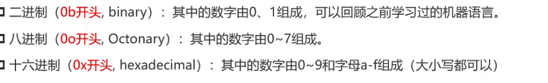
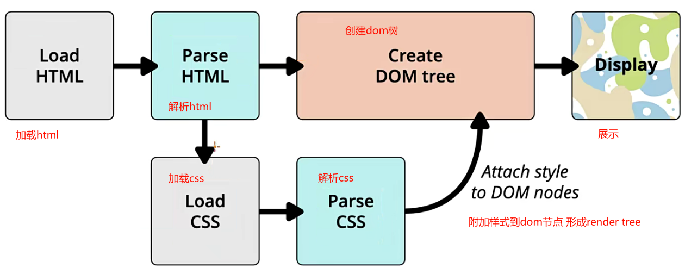

### CSS官方文档

w3.org/TR/?tag=css

### mdn文档

[CSS 参考 - CSS：层叠样式表 | MDN (mozilla.org)](https://developer.mozilla.org/zh-CN/docs/Web/CSS/Reference#索引)

### 浏览器能否支持查询

[Can I use... Support tables for HTML5, CSS3, etc](https://caniuse.com/)

### 字体

网页端浏览器字体不小于12px

### vscode快捷输入简写

fz font-size

bgc back-ground-color

.box div且class为box

### 块级元素

独占一行空间

### 宽高

盒子或者图片的宽高

### link元素

通常在head中

链接外部资源

最常见link css资源 和站点图标

属性

href :url

rel

指定链接类型

icon:站点图标

stylesheet:css样式

dns-prefetch 提前解析域名为ip地址提升性能

### dns

域名解析服务器

### 进制

10->2 二进制

11->9 八进制

十六进制abcdef表示10-15

### RGB颜色空间

光三原色

取值范围0-255

0表示没有颜色255表示满色

黑色rgb(0,0,0)

白色reb(255,255,255)

十六进制表示:#ffffff白色

255转16进制刚好是ff

### 浏览器渲染流程

