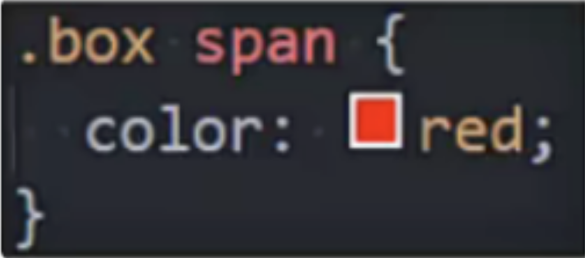

## 文本

### text-decoration

装饰线
属性值:
underline 下划线
line-through 中间线 删除线
line-through 上划线
none 无装饰线

### text-transform

文本大小写转化
属性值:
capitalize:首字母大写
upercase:全部字母大写
lowercase:全部字母小写
none:无影响

### text-indent

设置文本缩进
属性值
text-indent:2em 2倍文字大小

### text-align(重要)

行内级元素(文字/图片/input框)在div盒子中的对齐方式
left 左(默认)
right 右
center对齐
justify 两端对齐 文字换行使用,最后一行默认不换行

### letter-spacing

字母之间的缝隙
word-spacing
单词之间的缝隙
属性值
10px

## 字体

### font-size

具有继承性
单位:em 父元素继承字体的2倍
px
%相对于父元素的百分比

### font-family

可以继承
设置文字的字体名称
可以设置多个字体
优先使用靠前的字体
字体间用,分割
多个单词或者字符编码的字体要用识包裹

### font-weight

文字粗细
nomal 默认

### font-style

italic字体本身支持才生效
oblique让字体倾斜

### font-variant

small-caps小写字母转大写,但是高度还是小写字母时的高度

### line-height

两行文本基线的距离
1.5表示1.5倍字体大小

行高和元素高度一样文本就能上下居中

### font简写

## 选择器

### 通用选择器

*选中所有元素
消耗性能,需要遍历所有元素

### 简单选择器

类名选择器

.{}

元素选择器

div{}
id选择器
#id{}

### 属性选择器(了解)

### 后代选择器

空格分隔
隔代也能选中

大于号>
直接子代选中

### 兄弟选择器

+连接 最相邻的兄弟被选中

~所有兄弟都被选中

### 交集选择器

不加空格 表示两种都要满足

### 并集选择器

用,分隔,表示选中多个元素

### 伪类

:hover
当元素处于某种特殊状态时,浏览器自动添加的标识
元素状态

:focus
用在tab键选中聚焦
inpu或者a标签都可以
顺序

### 伪元素

