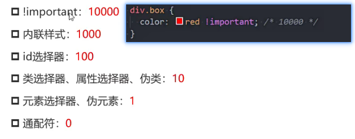

## css属性

### 继承性

一般和文本字体相关的属性都具有继承性
文档中会标注
继承的是计算值 不是设置值 如em

### 层叠性

一:权重判断
二:权重相同靠后设置的生效

### 权重

权重可以累加

## display

### 块级元素

div/p/h
重要元素
独占父元素的一行
可以设置宽高
display:block

### 行内级元素

span/伪元素::after默认是行内级元素/a/strong

display:inline

和其他行内级元素在父元素的同一行显示
不能设置宽高

### 行内块元素

行内替换元素
和其他行内元素在同一行显示
可以设置宽度和高度
input/img/video
display:inline-block

### 隐藏元素和透明度

display:none 元素还是存在 不占据空间
visibility:hidden 元素不可见 但是占据空间 默认是visible
rgba设置a为0 占据空间
字体颜色或者背景设置透明 背景默认是rgba(0,0,,@)或transparent
opacity 设置所有子元素透明度

### 元素使用注意事项

不要在p元素中放div元素
行内级元素一般只包含行内级元素

### overflow

内容溢出边框时的设置
属性值
visible默认值 内容溢出依然可见
hidden内容溢出隐藏
scro11显示滚动条
auto 内容溢出就出现滚动条

## 盒模型

### 宽高

宽高也就是content
line-height也是属性content
width默认值是auto(交给浏览器来决定)
auto在块级元素中是独占一行 在行内和行内块中由内容撑开
max-width 块级元素独占一行会随浏览器的宽度放大,这个值可以设置最大值
min-width宽度超过最小值 会出现滚动条

### 内边距padding

padding简写
顺序:上右下左(顺时针方向)
三个值相当于省略的右 和左一致
两个值表示上右 下和上一样 右和左一样
一个值 上下左右一样

### border

样式

border-top-width
border-top-style
border-top-color

缩写
border:10px solid red 顺序任意 style不能省略

### border-radius

设置百分比
半径为(content+border宽度)*10%
圆形 设置为50%

### margin

用来设置元素与元素之间的距离

### margin和padding的使用场景

父子元素的间距使用padding更合适

666