05 01上午

### git查看历史

https://blog.csdn.net/weixin_44741639/article/details/132075209

开发linux系统的人开发的git

### 集中式版本控制

中央服务器不能出现故障

1.cvs和svg

中心数据库出现问题时就丢失了历史版本了

### 分布式版本控制

每次克隆都会备份代码库的完整代码

本地仓库也能记录所有历史

### git官网

https://git-scm.com/downloads

### Bash- CMD- GUI区别

git bash集合了cmd和shell，还有新增的好用的命令


## git安装

安装都默认即可

### 默认主分支更改

有的master改为了main


### gitbash快捷键

ctrl+放大界面

### 配置个人信息


配置个人信息的命令

```cmd
git config --global user.name "zhongyan"
git config --global user.email "970623544@qq.com"
```


q 退出查看

### vscode设置默认终端

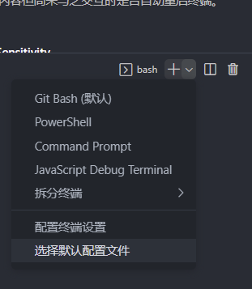

### 命令

git init初始化仓库

git add .所有文件添加到暂存区

git commit -m "提交命名"提交到本地仓库

> git log 查看提交记录 内容多可以按空格显示全部 
>
> git log --pretty=oneline 一行显示提交信息
>
> git log --pretty=oneline --graph 图表查看
>
> 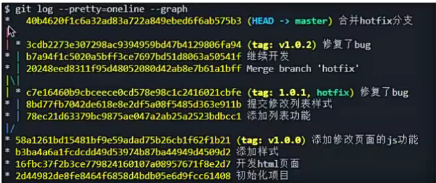

git clone 克隆代码

q 退出

git commit -am "提交名称"暂存和提交一起完成

> git status文件状态查看（查看修改过的文件发生了什么状态改变）
>
> git status -s简洁状态查看

  

clear 清理

#### 版本回退

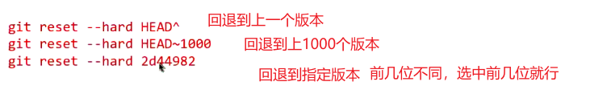

git reflog 查看包括回退的版本信息

### git 文件状态

未跟踪：没有add 新建文件

已跟踪：1.暂存状态 add过的文件

2.提交状态 commit过的文件

3.修改状态 修改了某个文件

### git暂存

```
# 暂存当前分支的未提交更改
git stash

# 查看已暂存的更改
git stash list

# 恢复暂存的更改并将其应用到当前分支
git stash apply stash@{0}

# 删除已恢复的stash
git stash drop stash@{0}

# 或者一步完成恢复和删除
git stash pop stash@{0}

```

git add 

```
git reset HEAD -- .撤销所有add
```

## git历史

cvs svn的前身

svn 集中式版本控制工具

git linus的作品

集中式版本控制 所有代码由中心服务器保存 服务器出现问题就无法提交更新了 如果磁盘损坏，提交记录就丢失了

分布式版本控制工具 任何电脑都会备份完整的历史记录

## git忽略文件

新建.gitignore文件到根目录

.gitignore文件在提交到git就生效了

后面修改了，不提交也是会有效果的

### 校验和

也就是commit id

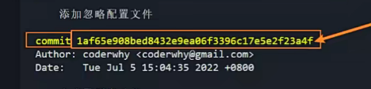

## 远程仓库

大多数公司服务器用gitlab软件搭建git服务器

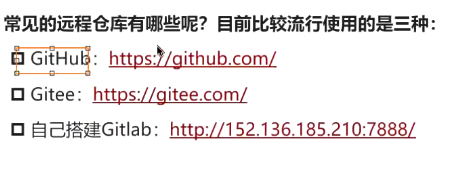：

### 验证身份

#### 凭证验证


记录远程仓库的密码的工具

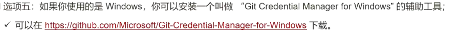 

> git config credential.help

编辑凭证的位置

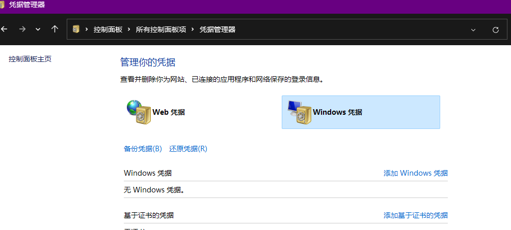

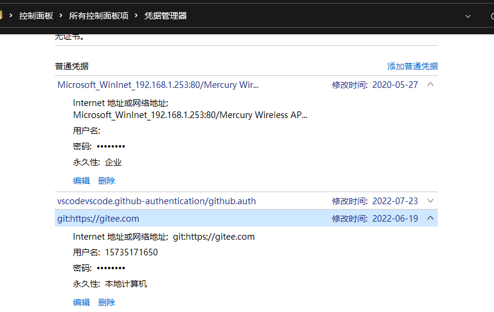

#### ssh验证

公钥：服务器

私钥：本地

公钥私钥都是在本地电脑生成的

> 生成公钥
>
> ssh-keygen -t ed25519 -C "970623544@qq.com"
>
> 一直回车
>
> 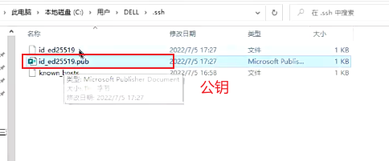

### 推送到远程仓库

git push

### 查看是否有对应的远程仓库

 git remote
打印origin 说明有远程仓库

git remote -v 详细的远程仓库信息

下面说明可以拿代码(fetch)和推代码(push)

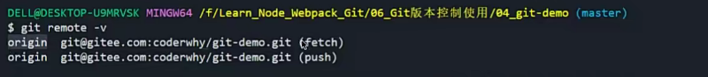


### 远程拉取到本地

```js
git pull origin devlop(远程分支名称)
git pull 相当于git fetch(拉取）然后git merge（合并）
```

### 开源协议

开源的许可证

MIT最流行,最宽泛

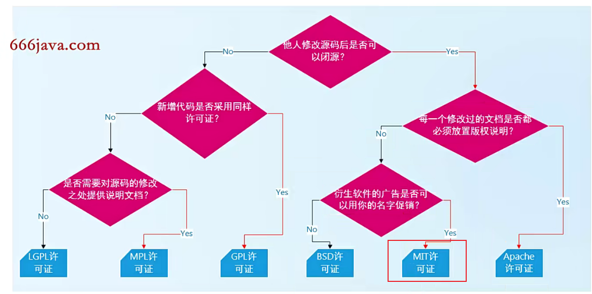

## git标签

重要的版本打标签

某次提交后是一个重要的内容可以打tag,方便后面查找

git tag v1.1.0

git tag 查看tag

git tag -a v1.2.0 -m '标签信息' 给标签打信息

git show v1.2.0 查看标签信息

git push origin v1.0.0 将某个便签推动到远程

git push origin --tags 将所有本地标签推送到远程

git tag -d v1.0.0 删除某个tag

git push origin -d v1.0.0 删除远程某个tag

git checkout v1.0.0 切换到某个tag

### git原理

每一次提交对应一个提交对象

提交文件中有tree文件对应

tree文件是每个文件的对应

### git分支

分支切换本质就是head指针移动

git branch 查看所有分支

创建分支

git branch dev 新建分支

git checkout dev切换分支

git checkout -b dev 创建并且切换至该分支

合并分支

git merge 被合并的分支 当前在哪个分支就是要合并到的分支

* 如git merge dev 当前在master分支,就是将dev分支合并到master分支上

删除分支

git branch -d hotfix 移除hotfix分支

git push origin -d dev 删除远程dev分支

### 分支合并冲突

两个不同的分支对同一个文件进行了修改会在合并时产生冲突

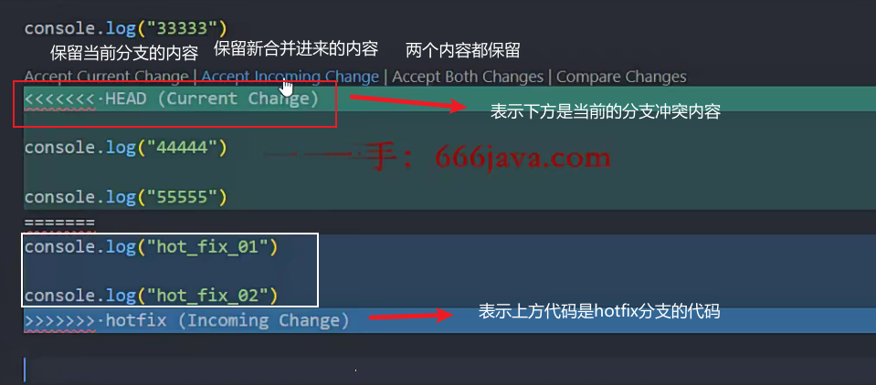

### 分支使用场景

发布的版本tag出现bug 

在这个tag的基础上新建分支hotfix(热更新)

在这个分支上进行开发,开发完成打上新的tag,发布这个tag

将tag合并到主分支上

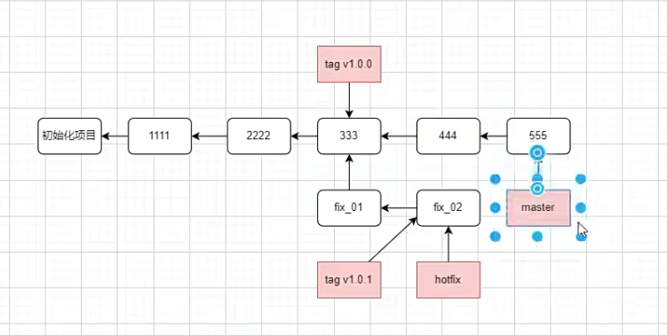

### git的工作流

小公司

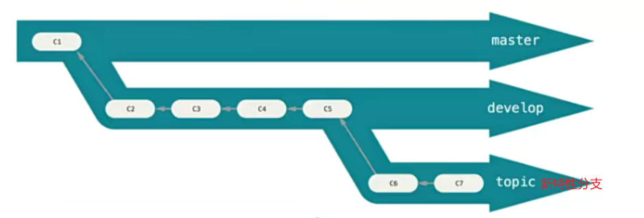

大公司(流行的)

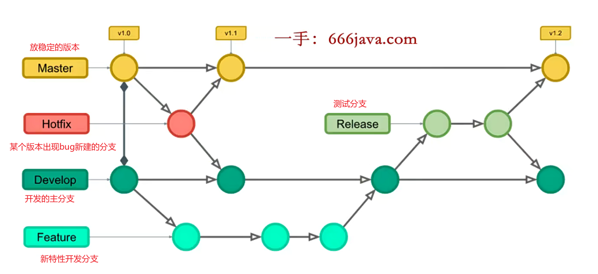

### git push配置

* git config push.default upstream

默认状态 simple 将当前分支推送到同名的远程分支

upstream 推送到上游分支(推荐)

current 找相同的名字的上游分支 没有就新建一个

### 远程仓库和本地仓库连接

远程分支实际也是一个分支,和本地合并也会出现冲突

> git remote add origin(默认仓库名称) url与远程仓库连接
>
> git fetch origin main拿到远程的main分支到本地(origin/main)`这有这里使用origin main`
>
> git branch --set-upstream-to=origin/main将本地和远程连接 也就是设置上游分支
>
> git merge 默认合并上游分支
>
> git merge --allow-unrelated-histories 上游分支和当前分支没有共同的base  
>
> git push 要改默认的push配置为upstream 也就是上游分支为要push的分支
>
> 
>
> 或git push origin master:main/head:main将本地的master分支推送到远程的main分支上

方法二

在本地新建一个main分支

> git checkout --track origin/main 创建新的main分支,并且将main分支跟踪到远程的main分支

### 远程分支

推送本地分支到远程

git push origin develop


组员clone下来要获取其他分支

git checkout develop(简写)

git checkout --track origin/main

相当于三步操作

1.先检查是否远程有origin/develop分支

2.本地创建develop分支

3.develop分支直接跟踪develop分支


删除远程分支

git push origin -d dev 删除远程dev分支

### git rebase

分支不会出现交叉,而是线性的

* 黄金原则:不要在主分支上使用rabase 因为会导致主分支大量的提交历史改变

git rebase master 在feature分支执行 以master分支的提交为base 将feature分支的提交以master分支为base

git merge feature 在master分支 合并feature到master

### git速查表

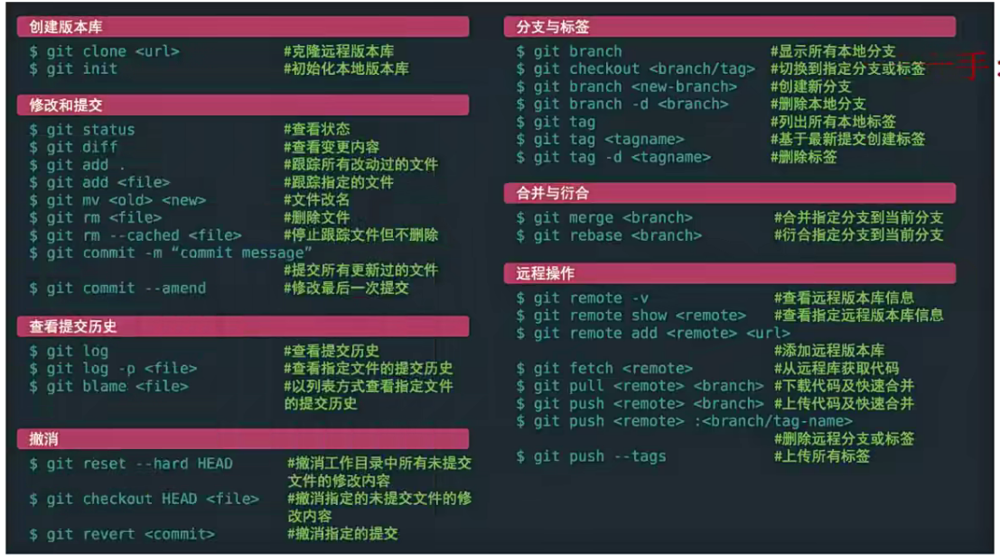

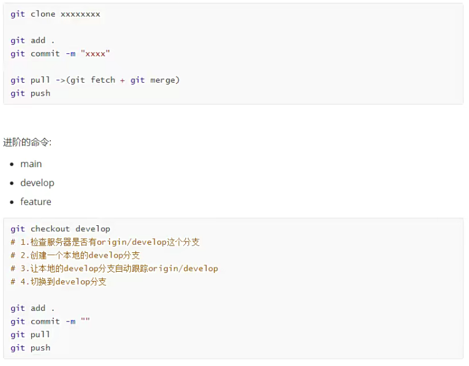

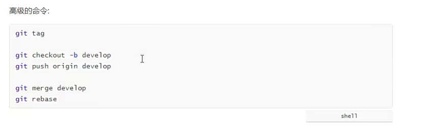