### 超文本标记语言的定义

* 标记语言

  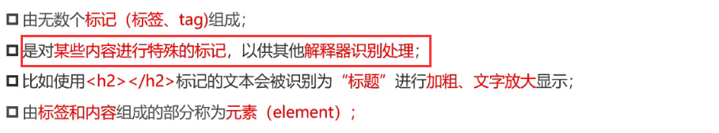

* 超文本

  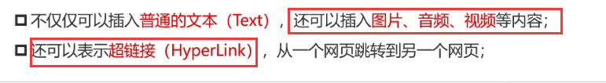

### html和htm

因历史遗留问题，Win95\Win98系统的文件拓展名不能超过3字符，所以使用.htm

### 开发工具

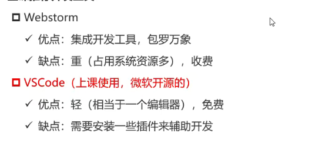

### vscode插件

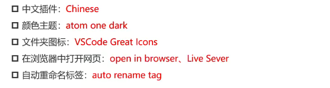

ai插件

ChatGPT GPT-4 - Bito AI Code Assistant

### vscode配置

在设置中搜索

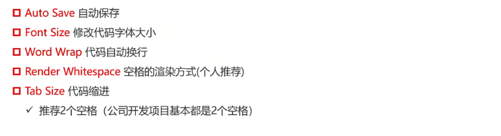   

### html元素查询网站

https://developer.mozilla.org/zh-CN/docs/Web/HTML/Element

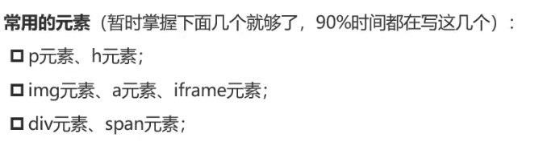

### 元素的组成

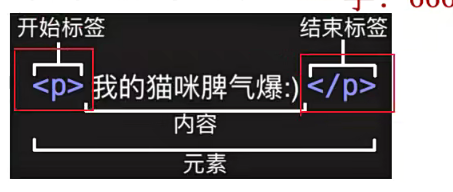

### vscode快捷键

向下复制 ctrl+shift+d

!+回车 或doc html骨架生成

**移动到定义处:   F12**

**查看定义处缩略图(只看一眼而不跳转过去):    Alt+F12**

**找到所有的引用:   Shift+F12**

**下一个匹配的也被选中:   Ctrl+D**

侧边栏显示或隐藏： Ctrl+B

### 单标签元素

单标签不需要再添加/

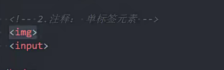

### url

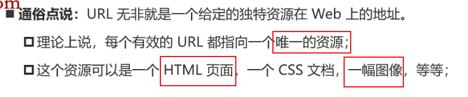

### url格式

端口：帮助找到服务器中提供某个服务的应用 程序

查询：向服务器提供数据

片段id：锚点

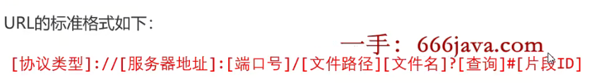

### URI和URL的区别

URL是URI

URI不一定是URL

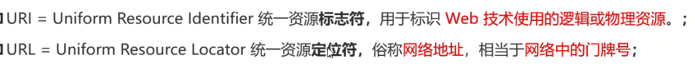

### 搜狗中文使用英文标点

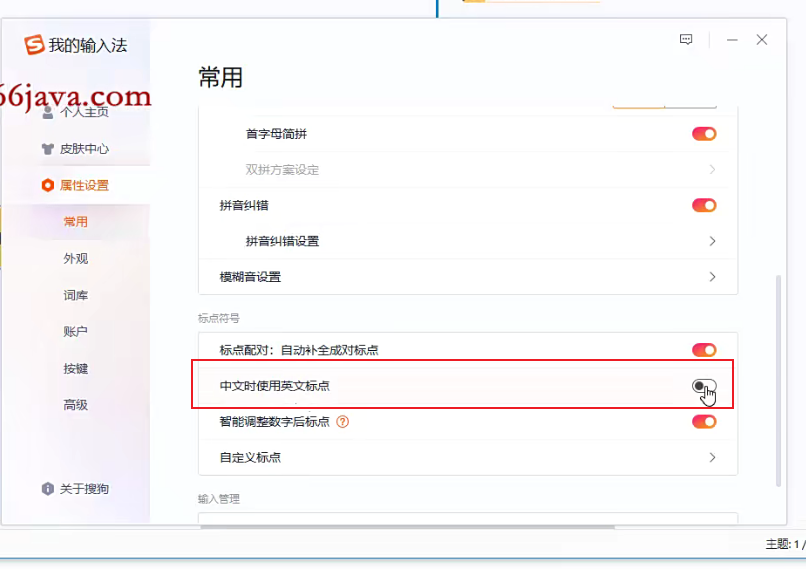

### 文档声明

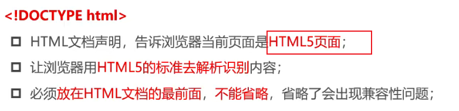

### html元素

所有HTML元素的根元素

CSS通过:root选择html元素

#### lang属性

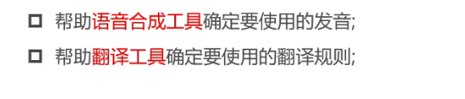

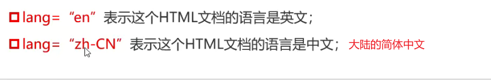

### head元素

 规定文档相关的`配置信息`（也叫元数据：描述数据的数据）

  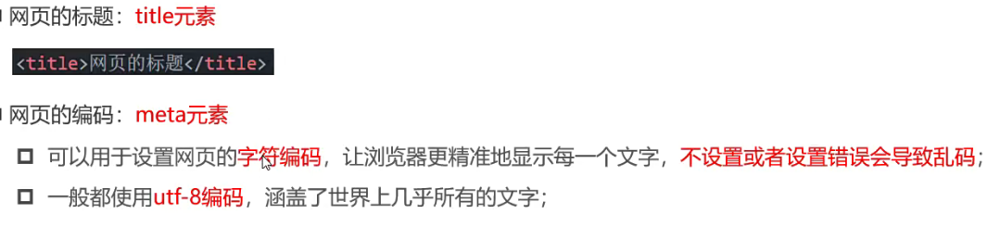

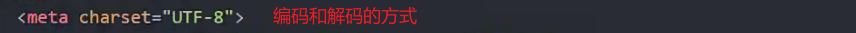

### h元素

h1-h6标签的样式由css设置才不一样

### p元素

表示段落

段落与段落之间有空隙,设置了margin

### img元素

src:source源的缩写

* 绝对路径 根盘符开始查找
* 相对路径 
  * ./当前文件 可以省略
  * ../上一级文件 /斜杠-更推荐 \反斜杠

img是`可替换元素`  src请求到的资源会替换img元素

alt属性 1.资源加载不成功时显示的文字 2.阅读时图片的描述

### a元素

跳转锚

用于打开新的地址 

* href属性放url
  * 可以放本地地址或者网络地址
* target属性
  * _blank 打开新页面
  * _self 覆盖本页面

### 跳转锚点实现

* 设置id

* 创建超链接

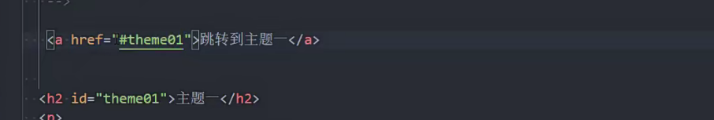

### iframe元素

* src要内嵌的网页地址

* frameborder:0显示边框 1不显示边框

禁止内嵌网页设置

在响应头中设置

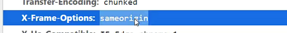

a元素的target属性,需要结合iframe使用

_parent:在嵌套页面的父页面打开页面

_top:多层嵌套,在最外层打开内嵌的页面

### div元素

可以全是div或者全不是div

在不同行显示

盒子,用来包裹和分割

### span

同一行显示

## 不常用元素

strong强调加粗

i内容倾斜 有时会用来做字体图标

code元素 用来显示代码 显示的是等宽字体

br换行

### 全局属性

HTML元素共有的属性

https://developer.mozilla.org/zh-CN/docs/Web/HTML/Global_attributes

w3.org

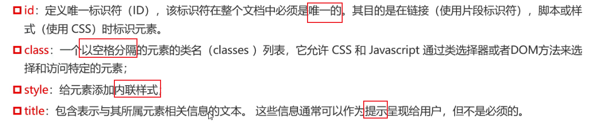

### 字符实体

保留字符:浏览器需要使用的字符

这些保留字符和难以键入的字符使用字符实体

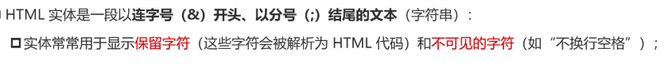

常见的字符实体

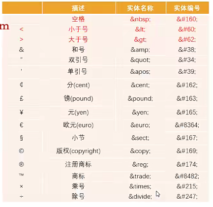