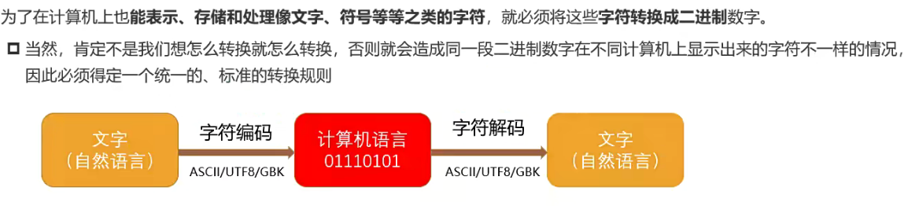
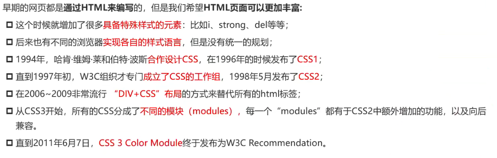
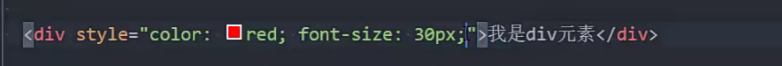
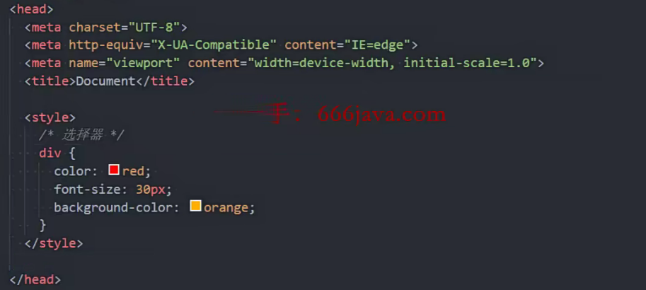
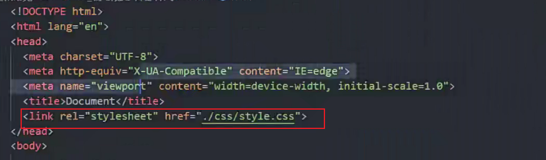
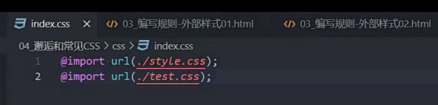
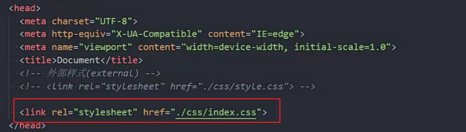

### 元素语义化

用正确的元素做正确的事

* 标签语义化的好处

方便代码维护;
减少让开发者之间的沟通成本;
能让语音合成工具正确识别网页元素的用途，以便作出正确的反应; .
有利于SEO;

### SEO

搜索引擎优化

通过了解搜索引擎的运作规则来调整网站，以及提高网站在有关`搜索引擎内排名`的方式。

* 搜索引擎原理

  搜索引擎爬取网站,存到临时库中,索引区进行分类 排名

h元素很重要(概要)

### 字符编码

计算机的底层硬件实现就是用`电路的开和闭两种状态`来表示0和1两个数字的。

https://www.jianshu.com/p/899e749be47c

### css

层叠样式表

样式表语言

是一种计算机语言

* css历史

  css3开始模块发布,不再发布整个版本

### css三种编写方式

* 内联样式(行内样式)

  写在style属性上

  ;分割多个样式

  属性名:属性值

* 内部样式

  放在head中

* 外部样式表

### 多个css文件用共同的css文件管理

index.css引入多个css文件

使用index.css

