### ts等级

1.anyscript

2.大多数用any，普通类型可以把握

3.大多数使用正确，极少使用any

4.封装高级类型，封装库

可以类型检测

### 定义

TypeScript是拥有类型的JavaScript超集,它可以编译成`普通、干净、完整`的JavaScript代码

编译时可以使用bable/tsc

TypeScript = JavaScript + 类型 + Babel

提前让你能使用这些 JS 还没完全支持的语法，然后编译的时候跟 Babel 一样

TypeScript 也引入了自己的配置文件 tsconfig.json

### 特点

始于js，归于js，是js的增强，最终也会编译为js，es6以后的js都支持

用于构建大型项目，项目更加健壮

vue3使用ts

解决js设计缺陷

### 编译环境


编译为js代码再引入


### 自动编译的方案

1.webpack

2.ts-node

安装

```ts
npm install ts-node -g//全局安装ts-node
npm install tslib @type/nodde -g//ts-node的依赖包
```

使用

```js
ts-node 文件名.ts
```

### 声明变量


### 声明数组

一个数组中只应该存一种数据类型

一般写string[]的写法

### 对象


### 函数

返回值会推断出来


匿名函数不用添加类型注解

### 函数中传入对象

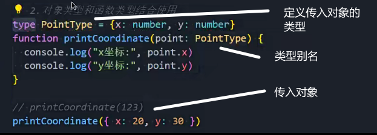

对象的分割

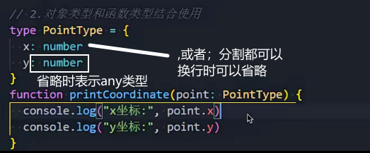

?的作用

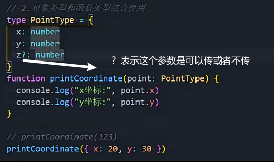

### any

进行任何操作都是合法的

数据特别复杂时使用any

引用三方库也使用any进行适配

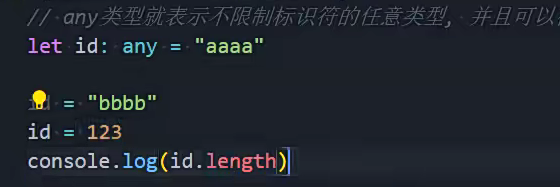

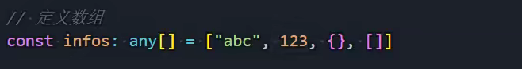

### unknown类型

任何操作都是不合法的

需要进行类型缩小

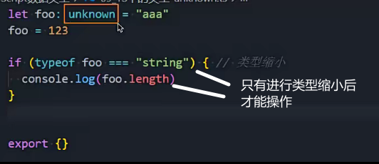

### void类型

函数没有返回值时

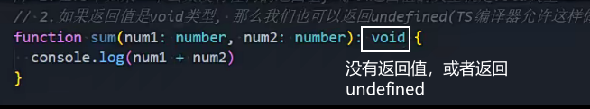

常用在指定函数类型时使用

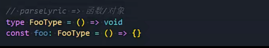

### never类型

类型推导时使用

封装工具库时使用

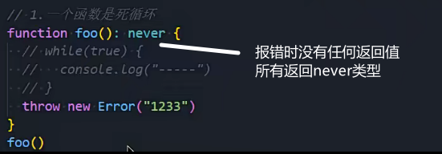

返回空数组，类型推导的返回值就是never[]

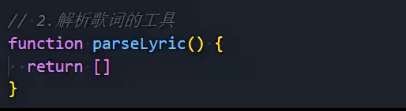


封装工具库，没有case时直接报错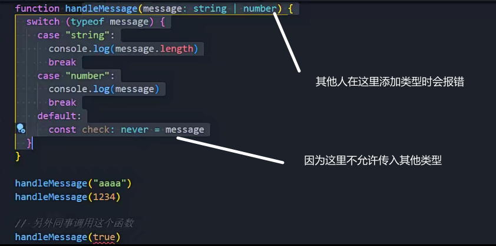