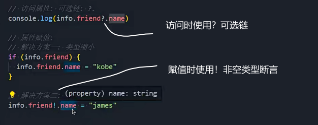

### 类型断言as

只能断言成更加具体的类型，或者不太具体的类型

### interface

可以多次声明同一个声明

两次声明都要满足

继承

声明对象类型建议使用interface

### 交叉类型和联合类型

交叉类型 &

联合类型 |

### 非空类型断言

访问某个可能不存在的属性时

### 字面量类型

### 类型缩小

typeof

类型判断

===或!==

instanceof

是否是某个类的实例

in

判断对象是否有某个属性

## 函数类型

函数类型表达式

ts对传入函数类型的参数格式不校验

函数调用签名

 函数既有自身的属性，也要对函数类型定义时使用

构造签名

### 函数的参数

默认值

### 函数的重载签名

实现只能是两个数字相加或者两个字符串相加的函数

可以使用联合类型时，尽量使用联合类型实现

对象类型实现

### this的内置工具使用

获取函数参数中this的类型

剔除this类型以外的函数类型

对象中的函数this绑定，ThisType

### 面向对象

声明成员类型

初始化值

类的修饰符

public

默认就是public，外部可以直接访问和调用

private

私有，只能在类的内部使用，子类也不能访问

protected

子类和自身内部可以访问，外部不能访问