### readonly

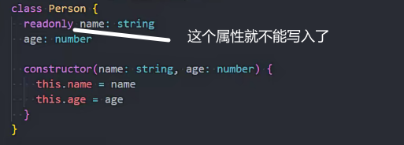

getter和setter

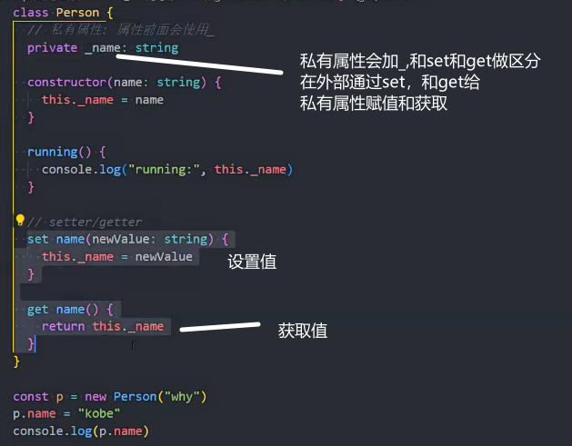

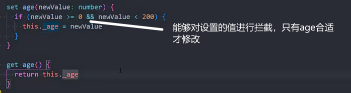

### 类的参数属性使用

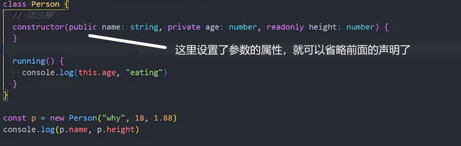

### 抽象类

抽象类的特点

1.不能new

2.可以有实现体

3.抽象方法的类一定是抽象类

多态：多个对象用一个对象去校验

父类

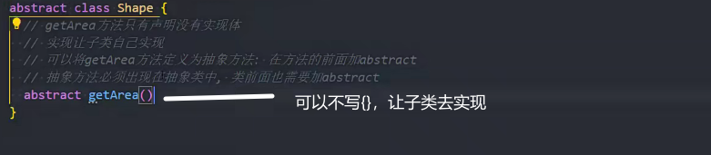

子类

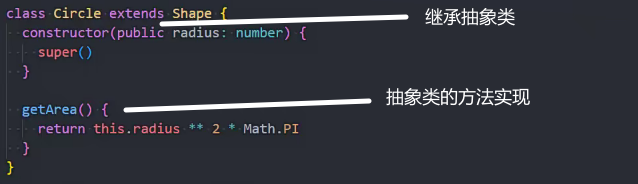

要实现的函数

### 鸭子类型

ts检测用的鸭子类型

只关心属性和行为，不关心你具体是不是对应的类型

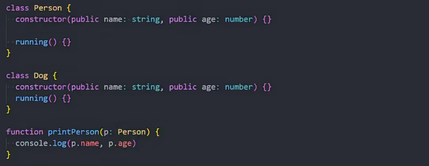

ts中只要传入对象属性和方法符合即可，不关心是传入的是对象，或者实例化的类名是否一致

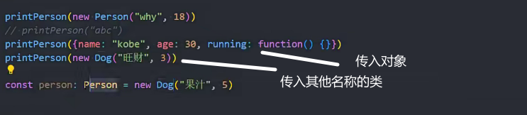

### 对象类型的修饰符

？可选参数

readonly 只读的

interface和type都可以使用

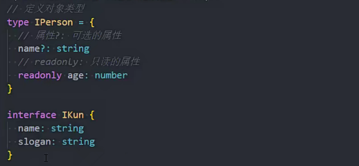

### 索引签名

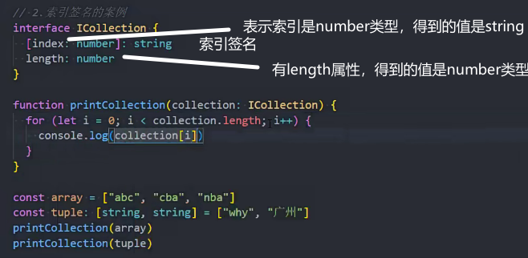

索引的类型只能是number或者string中的一个

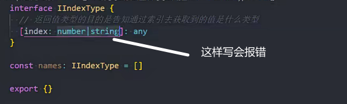

number和string两种类型都要写时，应该写两个索引签名

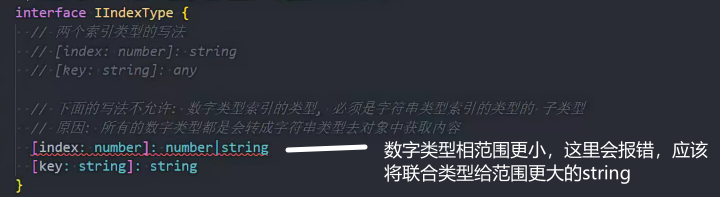

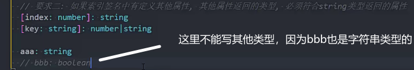

### 接口

继承

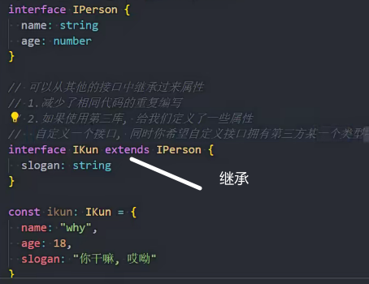

接口用类实现

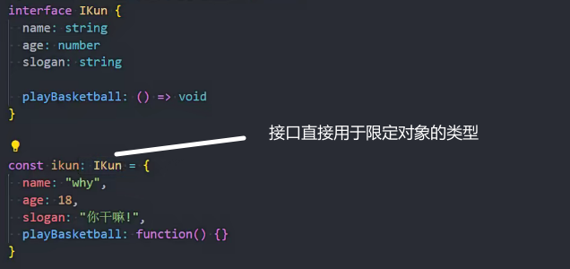

同时实现多个接口

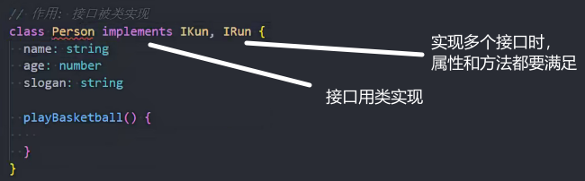 

### 严格字面量赋值检测

要检测的内容通过变量赋值，再检测时就不会报错了（不新鲜的，不进行严格的字面量检测）

### 抽象类和接口的区别

抽象类是对事物的抽象，接口通常是行为的描述

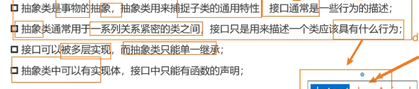

### 枚举类型

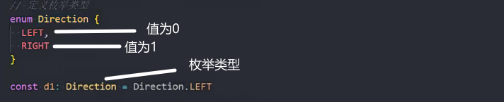

配合位运算

### 泛型

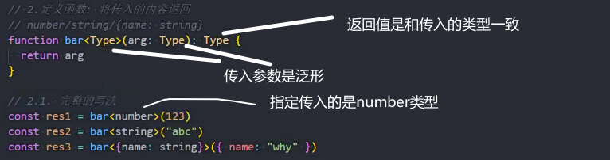

泛型的简写

能够自动进行类型推导

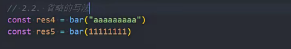

支持传入多个泛型

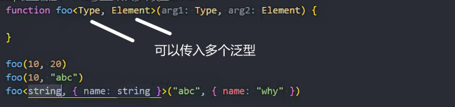

常用缩写

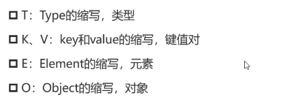

泛型接口和默认值

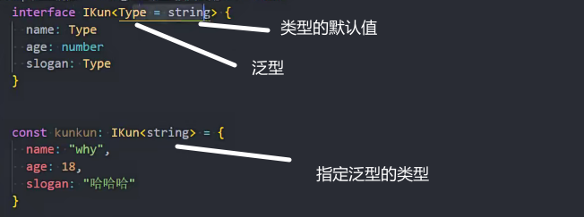

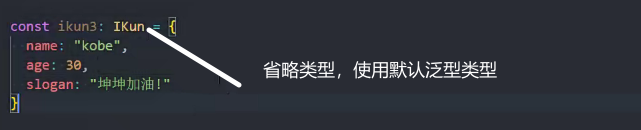

泛型类

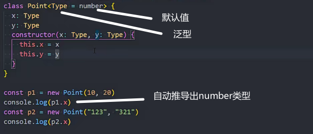