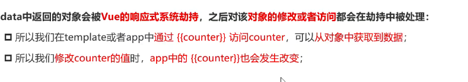
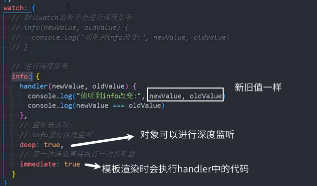

###   1.渐进式框架

渐进式表示我们可以一点点来引入和使用 vue

### vue引入方式

CDN地址

```js
<script src="https://unpkg.com/vue@next"></script>
```


lib 库的意思

### 2.遍历数组

v-for `重要`


### 3.没有 template时

没有 template时会渲染 id为app 中的内容

有template时会渲染template的内容


### textContent 和 innerText 的区别

innerHTML 设置或获取标签内的内容(包括`标签和内容`)
nodeValue 只有当`当前节点为纯文本`时,可以设置或者获取文本内容，否则会返回`null`
textContent 设置或获取标签内的文本内容(会忽略内部标签，`只获取文本`)

### 命令式编程

命令式编程,一步步命令执行实现功能 jquery

声明式,声明好数据就可以,怎么实现不用自己处理 vue react angular 小程序

### 4.mvc 和 mvvm

948


model 数据模型

view 界面也就是 dom

vm =viewModel 来实现 dom 监听和数据绑定 比如 vue 框架 vue只需要设置好view和model 由viewModel来实现数据绑定和dom监听

MVC ios开发 jqury controller控制器(js驱动)

MVVM vue 

### 5.响应式原理



vue2 是方式 defineProperty

vue3 是 proxy


data 中的 return 的对象放响应式的数据

methods 用对象：里面放函数 `不能写成箭头函数`

### split

```js
"123456".split(""); //['1','2','3','4','5','6']
```

### mustache 语法/差值语法


调用函数返回值会展示出来，并且可以传入 data 的中的数据

### 6.指令

v-once 标签内容所有的数据内容只会渲染一次，后面不再改变 可用于性能优化

v-test 和插值语法一样

v-html 以 html 解析渲染


v-pre 子元素内容中的{{}}不被解析


v-cloak '斗篷' 斗篷标签中的内容如果没编译完就不显示


！v-memo '备忘录' 数组中的数据发生改变时才重新渲染这个标签和子标签的内容,否则就不改变 用作性能优化


#### `重要指令`

v-bind 绑定属性的 缩写 `：`


1.绑定对象


```js
{类名：布尔值}布尔值为 true 时添加这个类名
```

class 和：class 同时出现时，不会替换前面的，两者会结合到一起

2.绑定数组


v-bind 动态绑定 style属性


动态绑定属性名 :[属性名]


绑定对象 h2 的两种绑定方法是一样的，但是直接绑定对象更简洁 `重要`


### 7.v-on (02)

v-on:click 简写语法糖 @click="方法名"

绑定表达式


其他事件 mousemove 鼠标移动


事件传递参数：

没有传递参数时


传递参数时

模板中


* 修饰符

阻止冒泡 @click.stop="事件名" `重要`


### 8.条件渲染 v-if

空对象转布尔依然是 true，判断是否是空对象使用 

条件不成立时展示一段内容


v-if 和 v-eles-if


> 判断对象是否为{}空对象
>
> Object.keys(info).length

### v-show

v-if 的 dom 结构是不存在的

不能搭配 template 使用，因为 template 的dom不存在

原理：style 属性设置为 display：none

频繁切换使用 v-show

### 9.template 元素

vue3 支持，不可见的包裹多个元素，类似小程序的 block

### 10.v-for

在需要重复的元素上写


解构写法


#### 值-键-索引

对象


### 改变数组的如下方法能触发视图更新

改变原数组的方法是可以被侦听到的


不改变原数组的方法不被侦听到


### v-for 的 key 的作用

key一般绑定id

有 key 的操作:
。根据 key 找到之前的 VNode 进行复用:
。没有 VNode 可以复用,再创建新的 VNode
没有 key 的操作:
。diff 算法 后续 VNode 复用性就不强

-

key 是用于虚拟 dom 的算法的

在新旧 nodes 对比时辨识 VNodes

结合 diff 算法 尽可能的复用节点，提升性能

### 11.VNode

virtual Node 虚拟节点

VNode 本质是 javascript 的对象、


### 虚拟 dom

多个元素嵌套会形成 VNoed Tree 也就是虚拟 dom

虚拟 dom 是 js 对象，可以转换为真实 dom 渲染到浏览器，也可以渲染到 vr、桌面端、移动端

虚拟 dom 是为了方便`跨平台`

也方便结合 key，进行 diff 算法判断，尽可能的进行`复用节点`


## Options API

### 12.计算属性


包含响应数据的复杂逻辑应该使用计算属性

多次使用相对于 methods 优点是只会执行一次

计算属性是`有缓存的`，基于依赖关系进行缓存，依赖的数据变化才会重新计算

计算属性性能更好

### 计算属性的 get 和 set


get 和正常写法，也就是语法糖的写法一样

set 的 value 也就是计算值的 value 属性，当 value 值变化时，set 会执行，get 也会执行

### 13.watch 侦听器


回调函数的第一个值是新值，第二个值是旧值

如果数据是对象，回调函数中传入的是 proxy 对象（代理对象）

原始对象使用 Vue.toRaw(newValue)获取原始对象


### 数据更新深度问题

模板语法是深度侦听的

watch 默认不是深度侦听

imediate 是否`初始化时执行一次`

deep 是否`深度侦听`

`这里的新旧值是一样的`



### $watch 侦听


### 14.v-model

一种语法糖

双向绑定的完整写法

双向绑定:数据变化,输入内容变化,输入内容变化,数据同步更新


### v-model 绑定 texarea 多行文本框


### checkbox


#### 单选按钮

用 v-model 默认绑定布尔值

#### 多选按钮

绑定的数据是数组


#### 互斥按钮 radio

数据为字符串

下面的 name 在 v-model 绑定同一值的情况下可以省略


### select下拉选择

都是用 value 传递值

单选绑定 value 值


多选绑定的是数组


### v-model 的修饰符


.lazy input事件切换为 change 事件，只有在`回车或失去焦点`时才触发

v-model 绑定的数字类型默认是`字符串类型`

.number 转换为数字类型，如果 input 的 type设置number，就不用加.number修饰符了


浏览器中空格会默认合并为一个

.trim 去除首尾空格


多个修饰符可以同时使用


