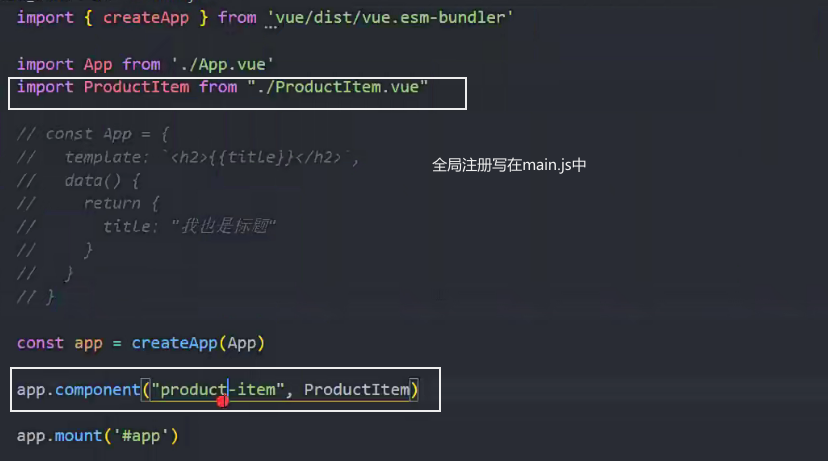
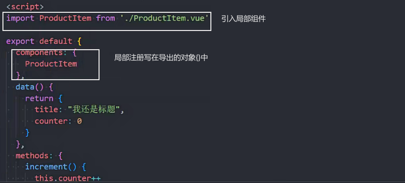

### 全局组件

根组件app注册 全局组件

可以直接在其他组件的template中使用


使用全局组件


为了方便，组件内容可以改写到 template 中

使用时直接写#id即可


### 组件名称

1.使用 kebab-case (短横线分割符)更常用


2.PascalCase (驼峰标识符)

html 中标签不区分大小写


3.使用


4.推荐使用时用 kebab-case

### 局部组件

更加常用

注册局部组件时用"kebab-case"或 PascalCase

使用局部组件，`必须在父组件中注册`

使用components:{组件名:组件}在组件中注册局部组件


下面是局部组件,写错了


### 局部组件

```js
<template>
    //使用组件
  <HelloWorld />
</template>

<script>
 //引入组件
import HelloWorld from "./components/HelloWorld.vue";

export default {
  name: "App",
  components: {
     // 注册组件
    HelloWorld,
  },
};
</script>

<style></style>
```

### 3.1 全局注册组件



### 3.2 注册局部组件

