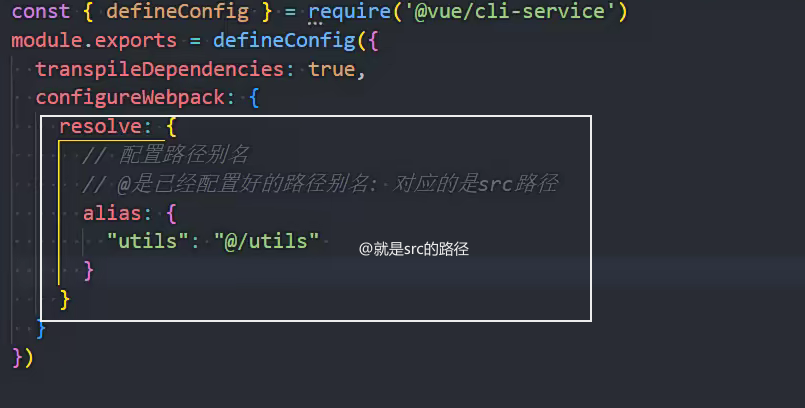

### VueCLI

CLI 是 Command-Line Interface,翻译为命令行界面;

### 1.全局安装脚手架

```js
npm install @vue/cli - g
```

cnpm --version 判断 cnpm 是否安装成功

查看 vue 脚手架的版本 vue --version

升级脚手架 

### 2.创建 vue 项目(999)

vue create 项目名称


### 2.2package.json 文件


### 2.3vue.config.js

webpack.config.js 默认的配置文件隐藏起来了

vue.config.js 里面的内容会覆盖 webpack.config.js 的配置

### 2.4.browserslistrc

浏览器适配的设置，高版本 es8/9/10 是否需要转换为 es5 的代码在此配置


### 2.5jsconfig.json

给 vscode 读的

给更友好的代码提示


### 配置路径别名及提示

在 vue.config.js 中配置别名路径



jsconfig.json 配置别名，才能有路径提示

*通配


### vue 对不同 template 的处理


.vue 使用 vue-loader 编译

### vue的vscode 插件

vetur：vue2 好用，vue3 可能报错

volar：vue3

### sytle 的作用域

添加 scoped


不同 vue 文件同名的样式不会影响

### vite 

> 安装create-vue工具 
>
> 使用create-vue安装一个vue项目(vite打包)
>
> npm init vue@latest
> 
>
> 
>
> yarn create vite 项目名

使用的 vite 打包

