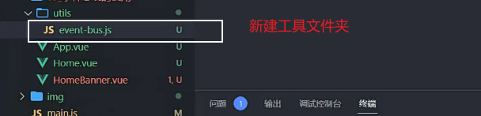
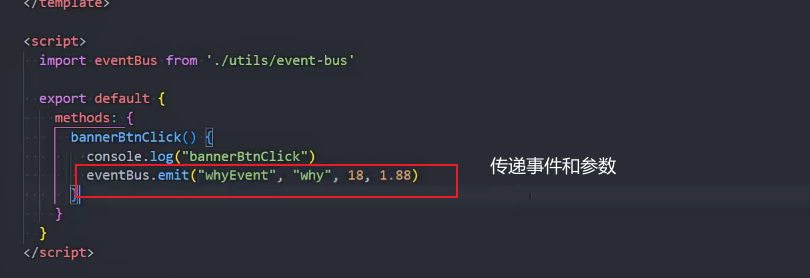
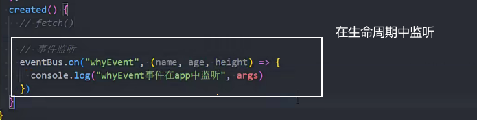
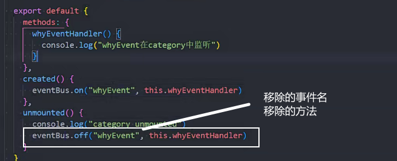

### 路径提示插件


## 父传子

父组件


子组件

```js
export default {
  props: ["name", "age", "height"],
};
```

对象写法(最多的写法)


```js
// 重要的原则: 对象类型写默认值时, 需要写成函数, 函数返回默认值
      friend: {
        type: Object,
        default() {
          return { name: "james" }
        }
      },
     hobbies: {
        type: Array,
        default: () => ["篮球", "rap", "唱跳"]
      },
```


命名规则

接收时必须写驼峰 传值时驼峰和-都可以


### prors 没接收的数据


默认会添加到子组件的根元素上


没接收的数据不添加到根元素


没接收的数据 $attrs 对象能拿到数据


多个根节点会造成报错


### 子传父

子组件


父组件


常用payload代表传递过来的值


emits 注册（常用），代码提升，`子组件`中发出自定义事件时注册


vue3 新增自定义事件验证数据


# 插槽

子组件

slot 代替父组件的内部的内容


父组件

能根据需要定制子组件内容


父组件没有传内容时，插槽默认内容写在slot中


### 具名插槽

能够给子组件插入多个插槽

父组件

v-slot:可以简写为#(重要)


子组件


插槽在哪编写就是使用的哪的数据

### 作用域插槽

插槽能在父组件使用子组件时在`父组件中自定义内容`

而作用域插槽能够在父组件中使用`子组件传递的数据`

子组件


父组件


独占默认插槽


最终简写-省略 template


## 非父子组件通信

provide

爷组件


响应式写法


inject

孙组件


### 事件总线bus

任意组件的通讯


新建event-bus.js


发出数据


接受数据


销毁bus


https://juejin.cn/post/7106311753717252132?searchId=20231114112001882A3A56C881CCBABB9B

### vue3 bus总线

mitt或tiny-enutter

```js
npm install hy-event-store
```



传递事件

多个参数要一一对应

接收事件



移除监听的事件和方法，只移除当前的这个监听

