生命周期函数--在组件的某个时期执行的回调函数

beforeupdated `数据更新且页面中使用了这个数据触发了页面更新`


### $refs获取节点或者组件


```js
this.$refs.命名//获取dom

//父组件能调用子组件的方法
this.$refs.子组件名称.子组件的方法//调用 子组件的方法
this.$refs.子组件名称.$el//获取子组件的根节点
```

```js
this.$parent//获取父组件
this.$root//获取根组件 app组件
```

### 动态组件1030

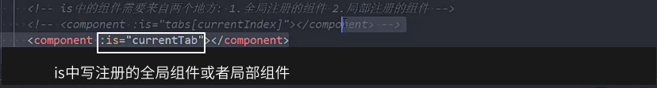

动态组件也支持父子相互传递数据

### keep-alive

keep-alive包裹的组件都被缓存起来了

组件不会被销毁

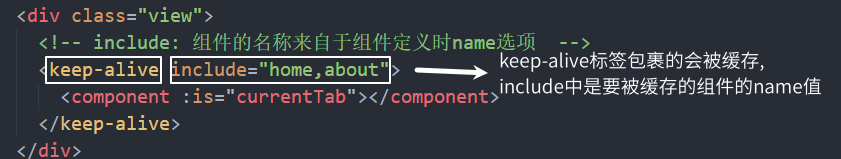

keep-alive的生命周期函数

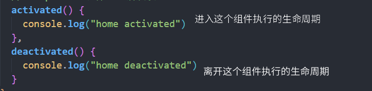

### 组件的name

有两个作用

1.配合keep-alive 的include使用

2.配合vue的浏览器插件使用

### webpack打包和异步组件

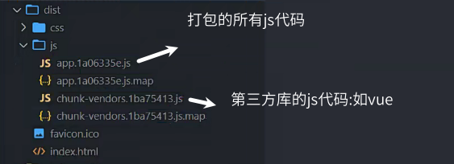

import函数可以让webpack对导入文件进行分包处理

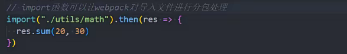

异步组件的使用

异步组件的作用:能够在打包时,组件打包成单独的js文件

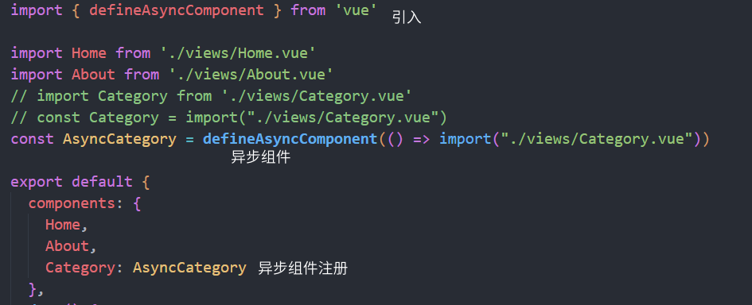

### 组件的v-model

实现父子组件数据双向绑定的简写

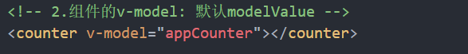

`是以下写法的简写`

父组件中代码

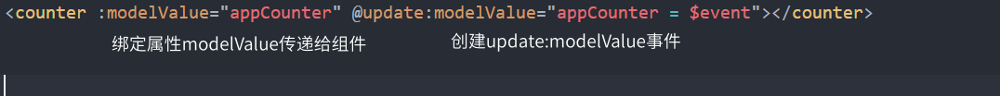

子组件中代码

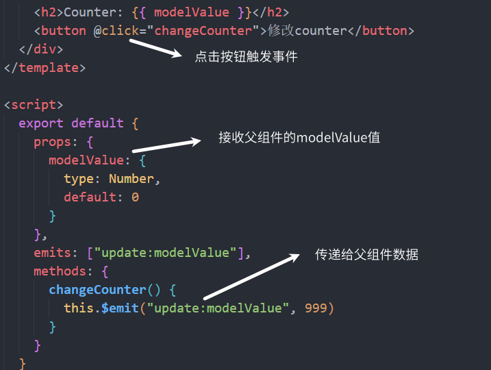

自定义 修改modelValue的名称

```html
<    counter2 v-model:counter="appCounter" v-model:why="appWhy"></counter2>
```

同步修改子组件的名称

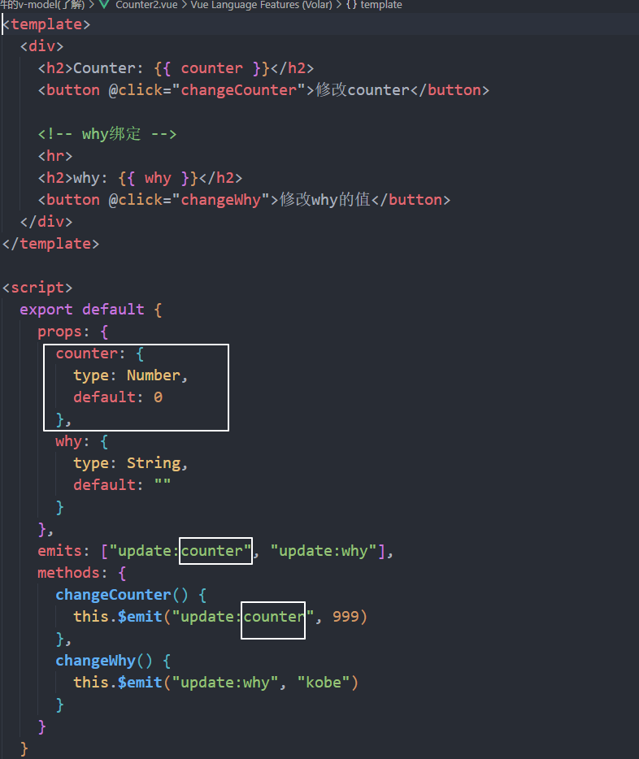

### mixin

混入的内容会和组件中的内容混合,都会执行,数据都会存在

如果数据冲突了,以组件中的为准

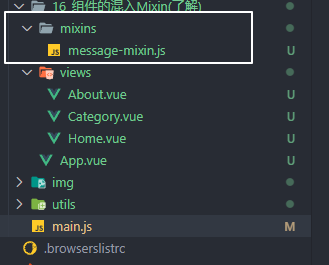

要混入的js文件

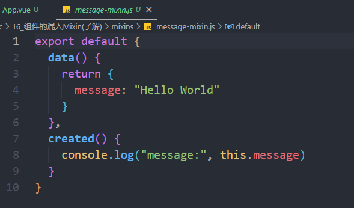

在组件中使用混入

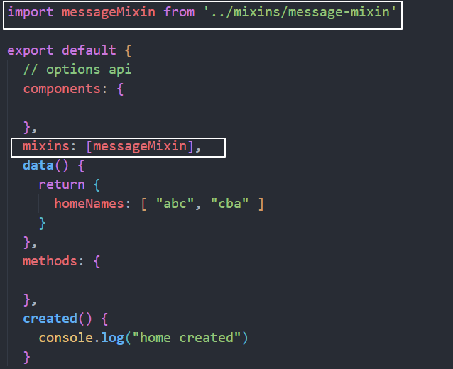

全局混入

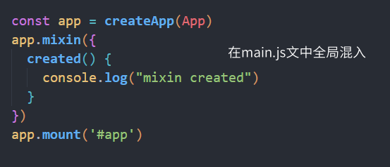