pinia相当于vueX5的升级

状态管理 变量的数据状态

状态的英文state

vuex数据是响应式的

### vuex安装

npm install vuex

### vuex创建

目录

store文件夹

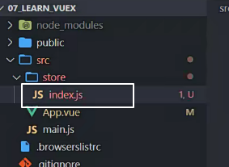

index.js

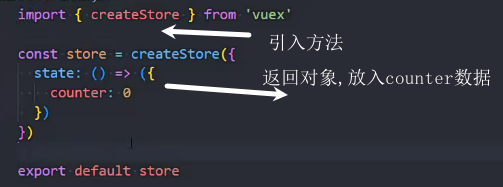

main.js

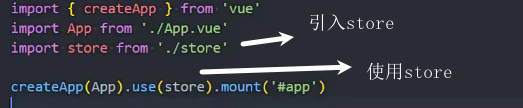

使用vuex的数据

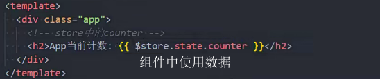

### 修改数据mutations

mutations原则:不要执行异步操作

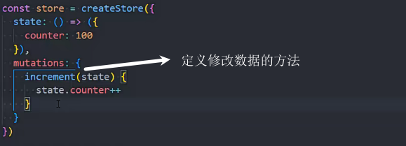

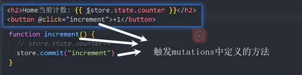

传参修改数据

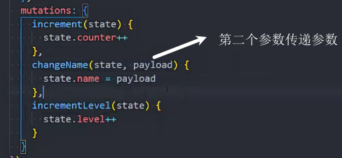

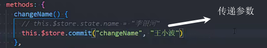

用变量的方式定义mutations

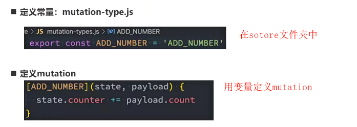

使用常量

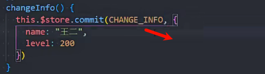

展开mutations中的函数 mapMutations

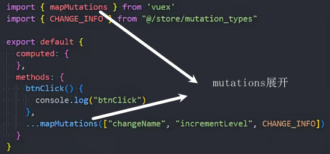

### Actions

Actions提交的是mutation,不能直接改变state

Actions中可以执行异步操作

actions的context

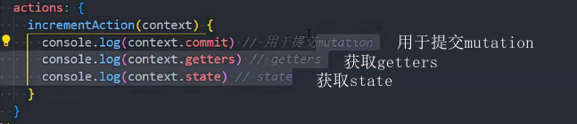

actions的使用

1.派发

2.接收数据,派发更改

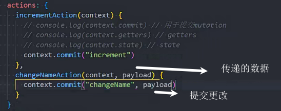

3.mutations中改变数据

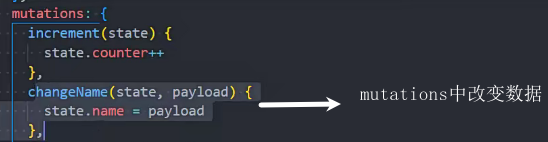

mapActions

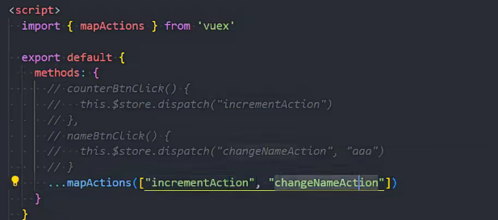

### Actions异步

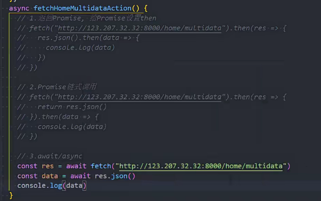

###  两种数据管理方式

1.页面的数据放在这个页面的vue文件中进行网络请求和数据管理

2.在vuex中进行网络请求和数据管理

### 展示数据  

optionsAPI

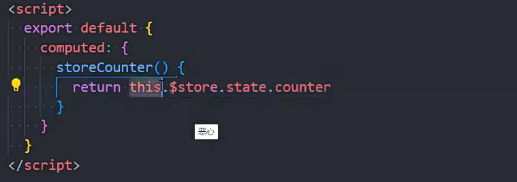

conpositionApi

解构reactive的toRefs方法来解构数据,让展示的数据具有响应式

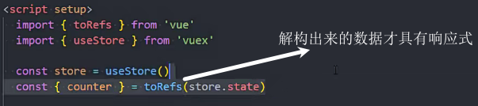

### 单一状态树

只有一个store实例

### 数据在组件中使用

optionsAPI

用computed结合mapState()将数据暴露给模块方便使用

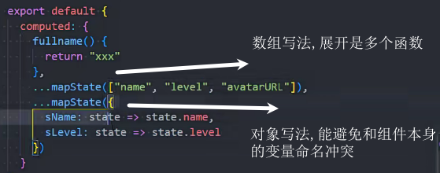

模板中使用数据

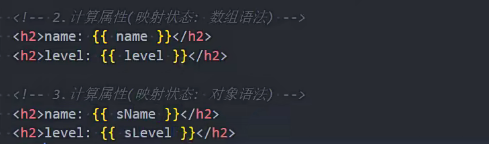

conpositionApi

别名(解构),避免命名冲突

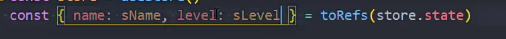

### getters

用法和computed类似

定义getters

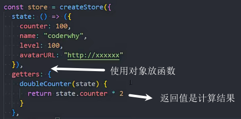

使用getters

在getters中使用getters的数据

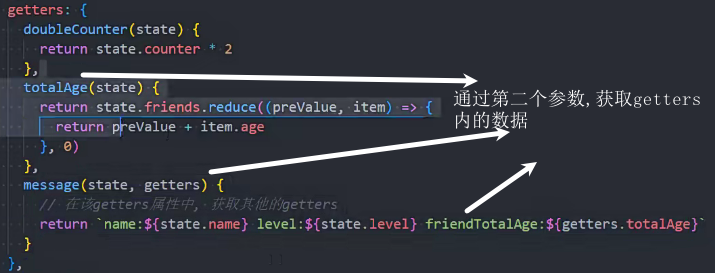

在getters中返回函数

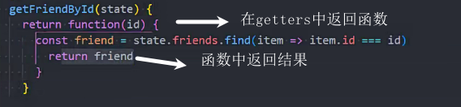

getters传参

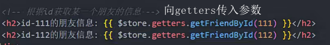

### mapGetters

对数据进行映射

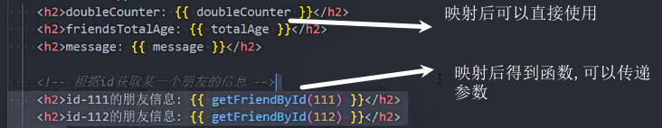

在optionsApi中使用映射

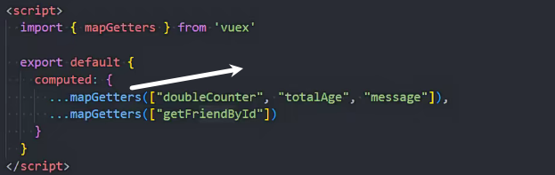

在setup中使用toRefs解构

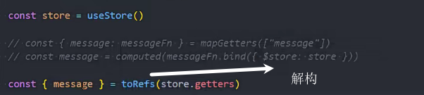

使用computed使用

解构出来不是reactive对象,需要computed

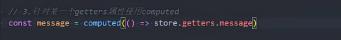

###  03网络请求,后续学习

### module

对state和mutation\actions\getter抽离

新建文件

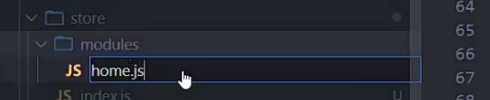

home.js抽离

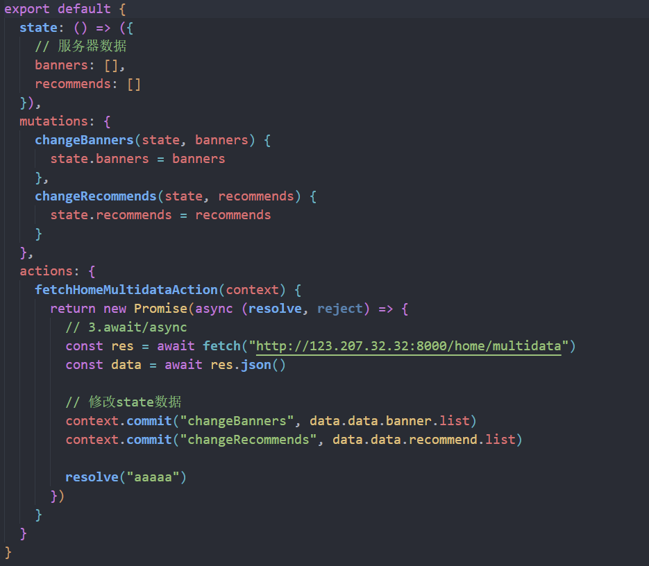

引入

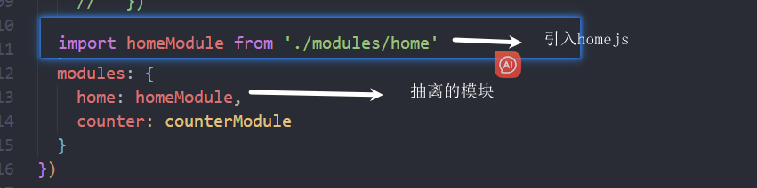

使用数据

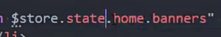

### 空间命名