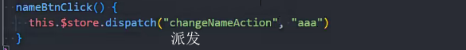
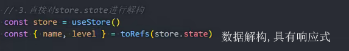

pinia相当于vueX5的升级

状态管理 变量的数据状态

状态的英文state

vuex数据是响应式的

### vuex安装

npm install vuex

### vuex创建

目录

store文件夹

index.js

main.js

使用vuex的数据

### 修改数据mutations

mutations原则:不要执行异步操作

传参修改数据

用变量的方式定义mutations

使用常量

展开mutations中的函数 mapMutations

### Actions

Actions提交的是mutation,不能直接改变state

Actions中可以执行异步操作

actions的context

actions的使用

1.派发

2.接收数据,派发更改

3.mutations中改变数据

mapActions

### Actions异步

###  两种数据管理方式

1.页面的数据放在这个页面的vue文件中进行网络请求和数据管理

2.在vuex中进行网络请求和数据管理

### 展示数据  

optionsAPI

conpositionApi

解构reactive的toRefs方法来解构数据,让展示的数据具有响应式

### 单一状态树

只有一个store实例

### 数据在组件中使用

optionsAPI

用computed结合mapState()将数据暴露给模块方便使用

模板中使用数据

conpositionApi

别名(解构),避免命名冲突

### getters

用法和computed类似

定义getters

使用getters

在getters中使用getters的数据

在getters中返回函数

getters传参

### mapGetters

对数据进行映射

在optionsApi中使用映射

在setup中使用toRefs解构

使用computed使用

解构出来不是reactive对象,需要computed

###  03网络请求,后续学习

### module

对state和mutation\actions\getter抽离

新建文件

home.js抽离

引入

使用数据

### 空间命名