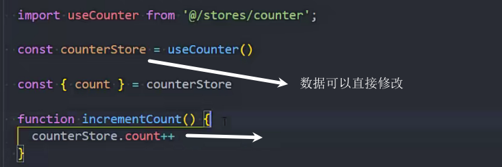

### pinia是什么

状态管理库

兼容vue2和vue3

vuex5的替代

和ts结合更好

### pinia和vuex的区别

mutation不在存在

不在有modules,可以创建多个store

### 安装pinia

yarn add pinia

或

npm install pinia

### pinia的基本使用

创建index文件

在main.js中使用pinia

创建counter.js仓库,在stores文件夹下

使用

### 修改store中的数据

### 解构数据 

pinia提供的解构方法

### 重置store中的数据

### 一次修改多个数据

### 替换state

会对数据做合并,原始数据没有变化的依旧存在

### 订阅

## getters使用

### 基本使用

### 在getter中使用getter

### 使用getter返回函数

查找id符合的数据

### 使用其他store中的数据

 

## Actions

### actions异步网络请求

