### axios的特点

浏览器中发送的是XMLHttpRequests请求

在node中发送http请求

支持promise

### 安装axios

> npm install axios

### 常见请求

1. 发送request请求
   1. res这里是被axios包装过的数据,res.data才是真实数据

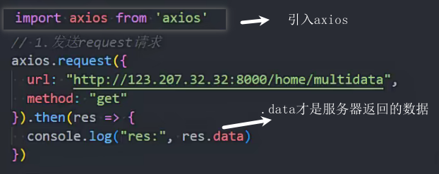

配置选项

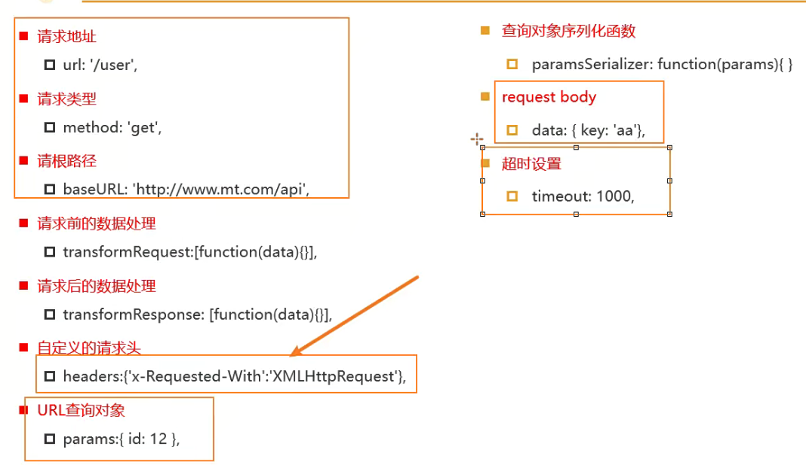

2. get发送请求

url拼接数据

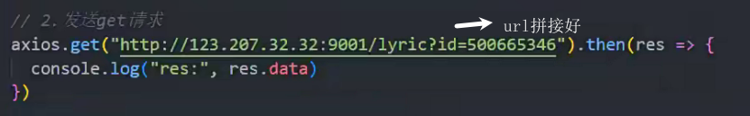

params传参

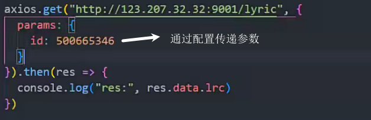

3. 发送post请求

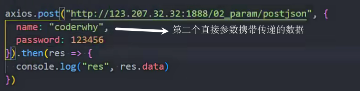

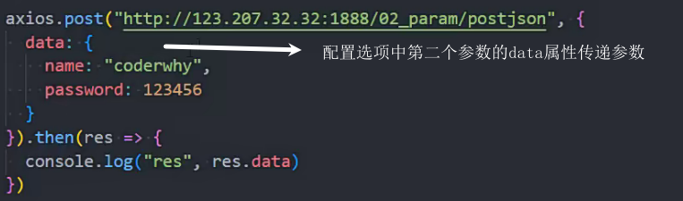

### 公用的基础配置

baseURL如果是完整地址,是不会添加的,只有缺失的才会补全

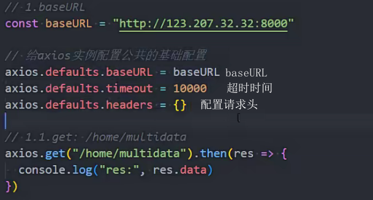

### axios.all

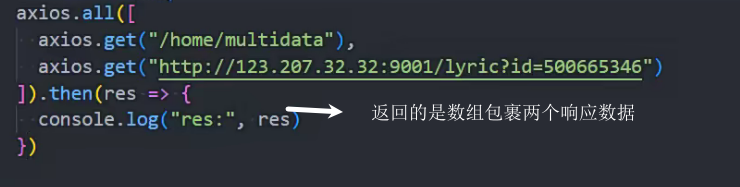

### axios实例

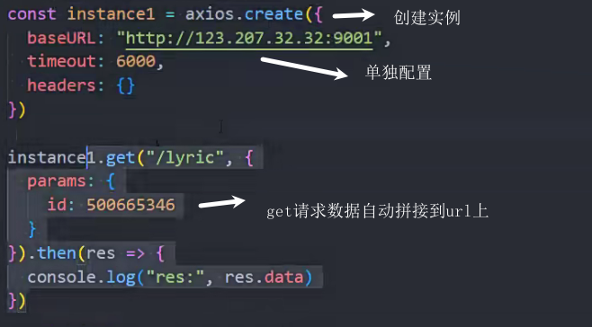

### axios拦截

请求拦截

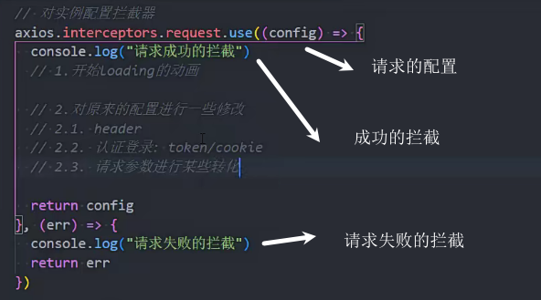

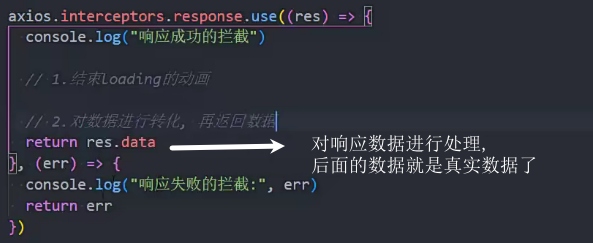

### axios封装

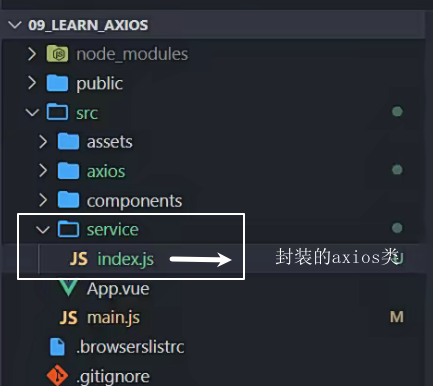

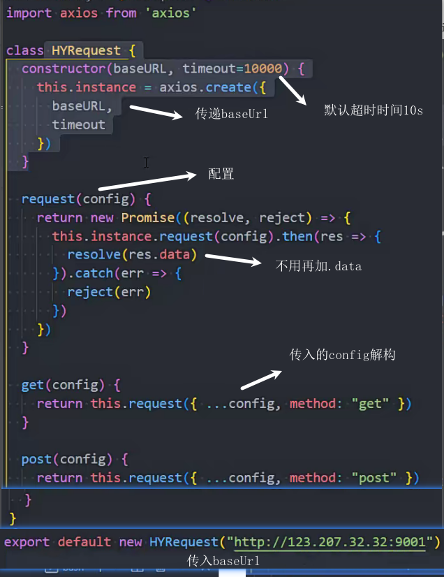

使用封装

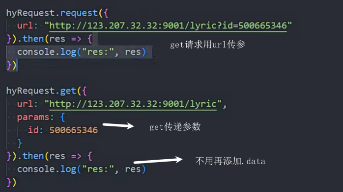