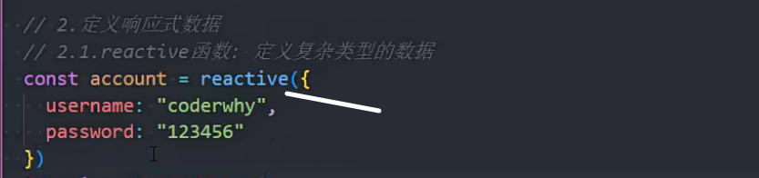
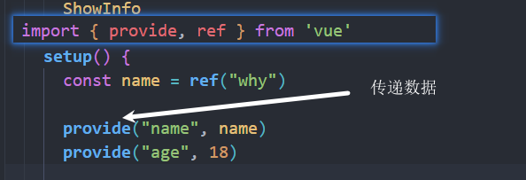

### 6setup 

setup() :开始创建组件之前，在beforeCreate和created之前执行


### ref和reactive的使用

引入


reactive

用来定义复杂类型数据




ref(更加常用)

定义简单类型数据


在js中使用


模板中使用,不用加.value


ref是浅层解包


两个使用场景

reactive：1.应用于本地数据2.多个数据间是有联系的

ref:网络数据,本地简单数据


### readonly 

单向数据流：父组件传递给子组件的内容不能在子组件中直接修改

子组件如果想修改父组件的数据推荐使用emit触发事件，让父组件修改自己的数据


普通对象，reactive和ref数据都可以用

readonly包裹的内容修改也是具有响应式的

用readonly在父组件中包裹数据再传递出去就避免了被修改


### isProxy

判断是否是proxy对象

用法

```js
	isProxy(info)->true
```

### isReactive

判断是不是由reactive返回的数据

readonly包裹reactive的数据也会返回true

### toRaw

返回readonly和reactive的原始数据

### toRefs和toRef

解构响应式数据

toRefs解构reactive的多个数据

toRef解构reactive的单个数据


### unRef方法

如果参数是ref,返回其.value值

如果参数不是ref,就返回这个参数

用法:

unRef(参数)


### isRef

判断是否是ref对象

isRef(要判断的值)

### shallowRef

创建浅层的ref响应数据

用法:

```js
 const info=shallowRef({name:"zjx"})
 info.value.name修改不具有响应式
```

### triggerRef

让shallowRef在没有响应式的情况下,手动去触发响应式


### computed

setup中的计算属性写法

使用


set和get


修改computed的值


### ref获取dom或组件

获取dom

.value值就是dom


获取子组件


### 生命周期

vue2和vue3对照


### provide




### watch

可以侦听props和data中的数据

侦听简单数据


侦听复杂数据


proxy数据转普通对象侦听


### watchEffect

Effect作用

默认会执行一次编写的代码

代码中的数据发生变化就会再次执行(自动收集依赖)


### hooks

回调函数,钩子

### 修改html标题在vue中

document.title=''

### setup语法糖

组件不用再注册


顶层编写的内容不再需要返回

定义响应式数据


script更推荐放在顶部 

父传子


子传父


用ref使用子组件内的方法

