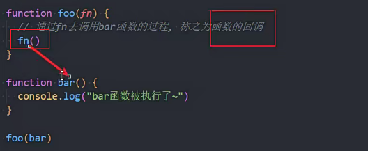

### null和undefined区别

null转化为数字是0，undefined转化为数字是NaN

含义

`null`是一个表示“空”的对象

undefined表示"此处无定义"的原始值

用法

undfined表示在场景中未定义

某个函数的某个参数没有设置任何值，可以传如null

### js头等函数

函数可以作为一等公民(函数可以被赋值给变量 )

### 函数式编程

使用函数来作为头等公民使用函数，这种编程方式(范式).

### 函数回调

 

### 匿名函数

没有名字的函数

### 高阶函数

接收函数作为输入或输出一个函数