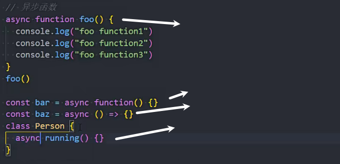
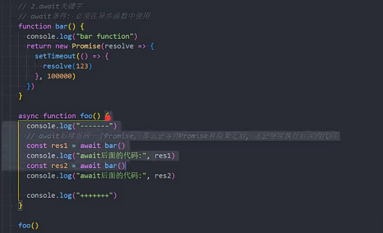
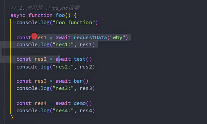

### 传统的获取数据的方法

### 连续网络请求，且等待前面结果再请求

回调地狱

promise链式调用

### es8中的async和await

### async函数的几种写法

### async函数的返回值

1.普通值

2.返回promise

产生错误

### await

必须在异步函数中使用，在async函数中使用 

await错误

### 结合使用

await后面等待promise的结果

可以等待一个async函数，因为async函数的return本身就会是promise

09进程线程