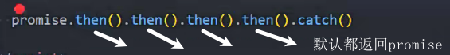

### es5之前处理异步的代码

### promise基本代码结果

resolve多次调用只相当于调用了一次

resolve和reject都调用了，只有前面的生效，因为状态确定下来就不能再改变了

### promise的三种状态

pending待定状态

fulfilled成功态或resolved

rejected失败态

### Executor

promise中会`立即执行`的回调函数

### 了解部分

resolve中传入promise

## then方法

### 多次调用

### uncatch报错

多次调用catch也都会执行 7

### then方法的返回值

默认返回值

* 返回一个普通值

then方法的返回值`也是一个promise`

这个promise的决议结果由返回值决定

* 返回自定义的promise

* thenable

### catch

promise链式调用时reject，会就近执行catch

抛出异常会中断函数

### finally

es9新增        

不论是执行then还是执行catch，finally中的回调函数`都会执行 `   

## 类方法

### resolve

相当于new Promise并且立即执行resolve

### reject方法

相当于new Promise并且立即执行reject

### all方法

多个promise一起等待结果，只有`都resolve`才执行.then()

并传递数据到一个数组中

如果有一个reject了，就会执行catch()

使用场景，当要获得多个网络请求时可以使用

### allSettled

成功或者失败都能获得`所有的结果`

es11（es2020）

### race方法

`先有结果`的就会先获得数据

不论结果是成功还是失败

### any方法

es12的方法

如果有成功的，`先成功的`结果会给.then，先有失败的结果会被舍弃

如果`都失败了`，就会执行.catch,只会给下列的信息

