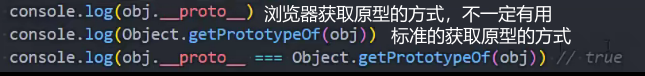
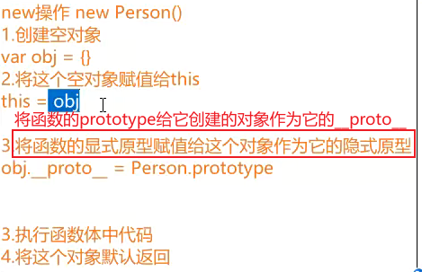
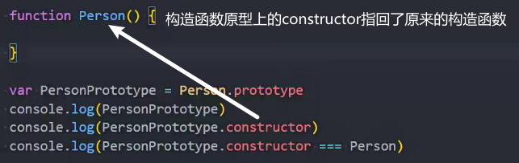

### 对象的原型

```
__proto__隐式原型
```

原型本身也是一个对象，相当于对象的内置属性



当我们通过[[get]]方式获取一个属性对应的value时
1>: 它会优先在自己的对象中查找，如果找到直接返回
2> 如果没有找到.那么会在原型对象中查找

### 函数的原型

函数才具有

prototype是显示原型

new的过程



### 原型分类

```
__proto__隐式原型 对象的原型
prototype显示原型 构造函数或者类的原型
```

### constructor

构造函数的显示原型上的属性

