### 早期

服务端渲染SSR

服务器返回html文档

某个按钮发送请求,服务器要对整个页面进行重绘,再发送给浏览器,会给带宽带来不必要的开销

### 前后端分离

API服务器监听接口 后端服务器

静态资源服务器 前端服务器

客户端渲染

### HTTP

超文本传输协议

客户端(用户代理程序)和服务端请求和响应的协议

HTTPS增加了安全层

### 请求信息

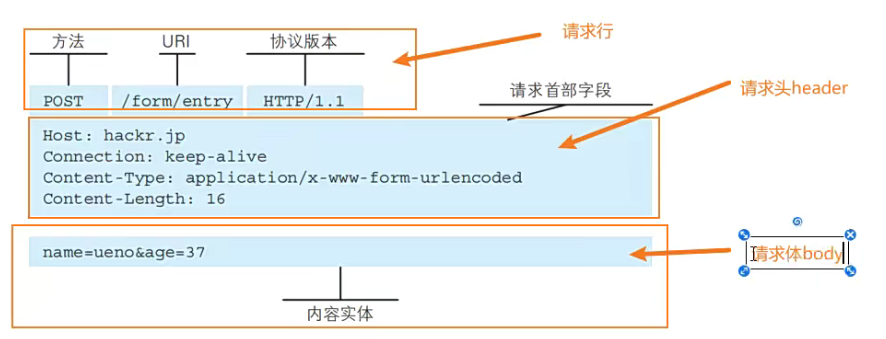

### 响应信息

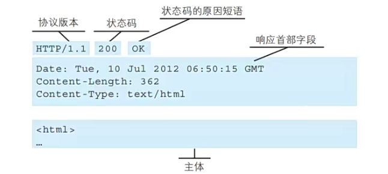

### HTTP协议版本

HTTP/0.9

发布于1991年

只支持get请求获取文本数据

HTTP/1.0

发布于1996年

支持POST/HEAD等请求方法,支持多种数据类型

每次请求都需要与服务器建立tcp连接,请求完成立即断开tcp连接

HTTP/1.1(使用最广泛)

发布于1997年

增加了PUT/DELETE等请求方法

采用持久连接 多个请求可以共用一个tcp连接

2015年HTTP/2.0

### HTTP请求方式

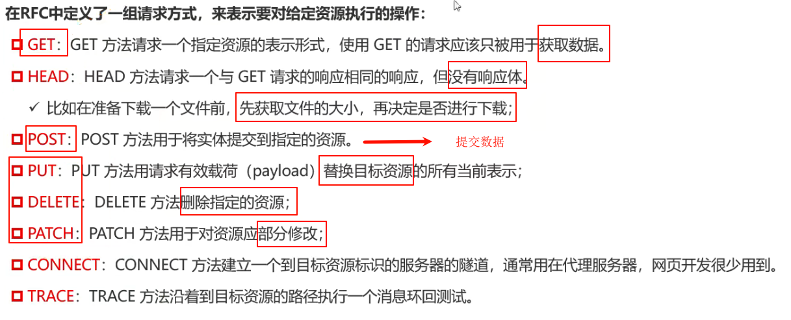

### 请求携带数据类型content-type

默认的content-type是formData格式

也就是传递给服务器数据的类型

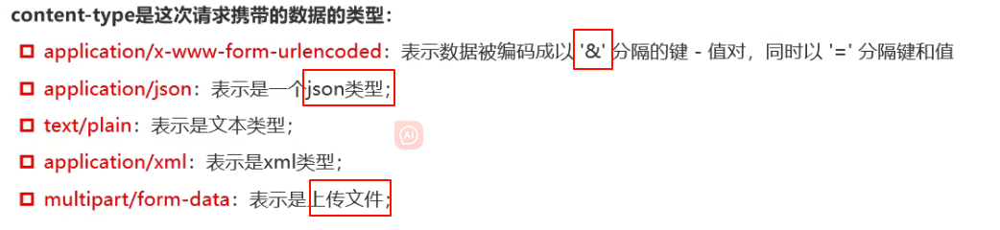

### 请求头

content-length：文件的大小长度

connection:keep-alive 默认开启,保持一会,否则会立刻断开tcp通道 node是保持5s

可以提高网络请求性能

accept-encoding 告知服务器浏览器支持的文件压缩格式 gzip 对应.gz文件(用于向服务器请求文件)

accept 告知服务器客户端可接收文件的格式类型(向服务器请求数据)

user-Agent客户端相关信息

### 响应状态码

也叫http状态码

状态码查询网址:

https://developer.mozilla.org/zh-CN/docs/web/http/status

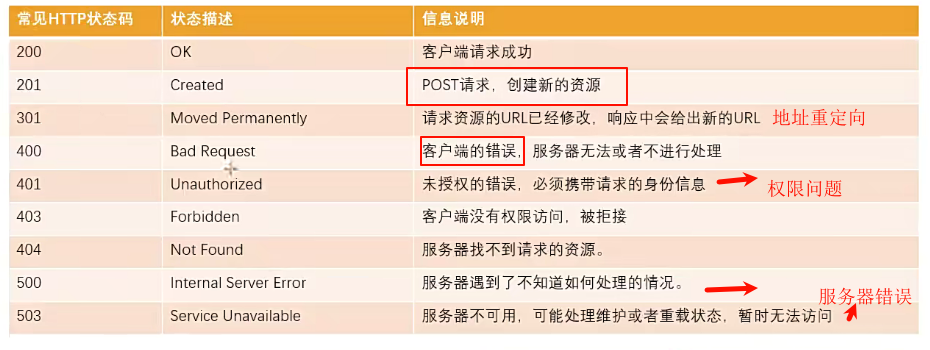

### fehelper

https://github.com/zxlie/FeHelper/tree/master/apps/static/screenshot/crx

前端助手

## XHR网络请求

### xhr基本使用

XMLHttpRequest.DONE对应常量4

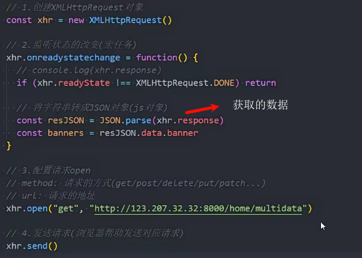

### xhr的状态

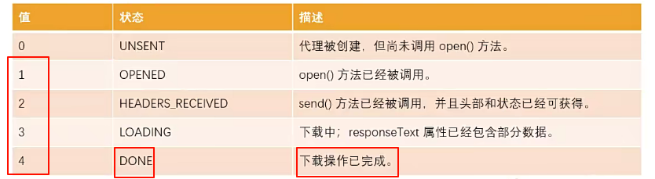

### xhr同步请求

open第三个参数设置false为同步请求

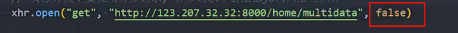

会阻塞后续代码执行

### onload事件监听

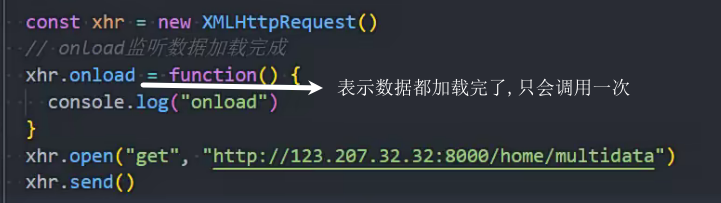

### responseType响应数据的格式

如果设置responseType为json类型(重要)

xhr.response会被解析为js对象

如果不设置responseType,默认是空字符串,也就是text

xhr.response只会被解析为字符串

使用xhr.responseText来接收文本数据

如果设置responseText为"xml"

使用xhr.responseXML接收xml数据

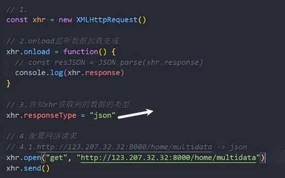

### 响应状态码

xhr.status

请求成功才能打印响应状态码

xhr.onerror

请求连接服务器错误,域名错误.或者跨域请求错误

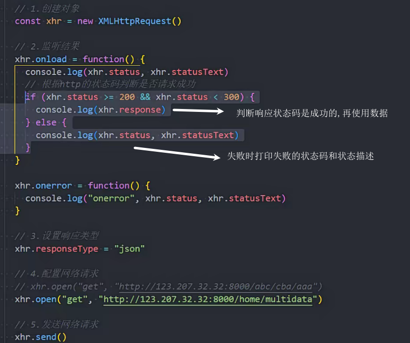

### 请求传参

1. get请求,通过url的query传递(常用)

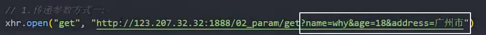

2. post请求

使用请求体传递urlencoded数据

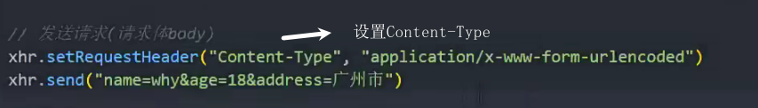

3. form表单发送post请求

请求体传递formData数据

默认的content-type是formData格式

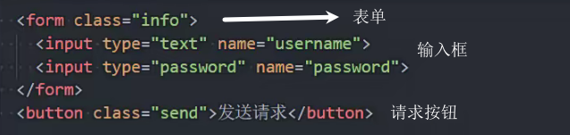

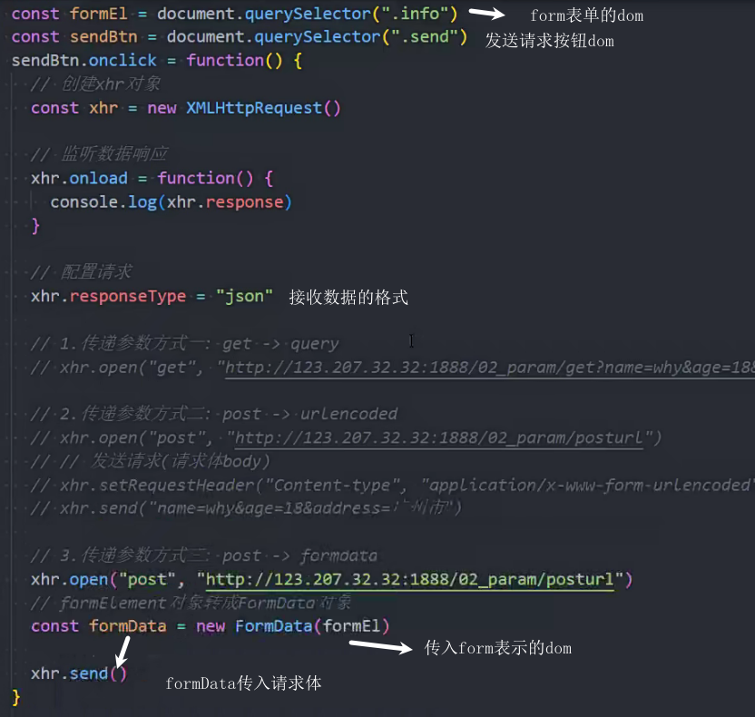

4. post请求传递json数据(常用)

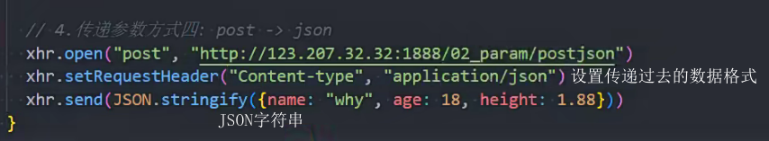

### 对象函数增强

### ajax封装

### 请求超时timeout

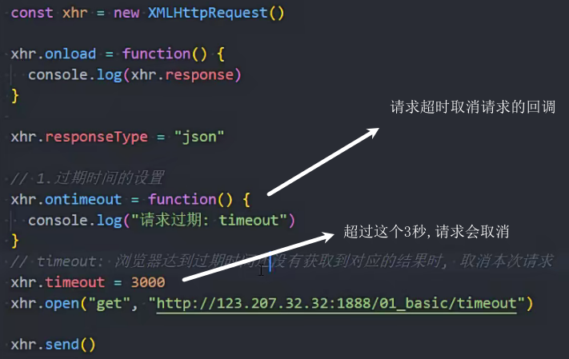

### 取消请求abort

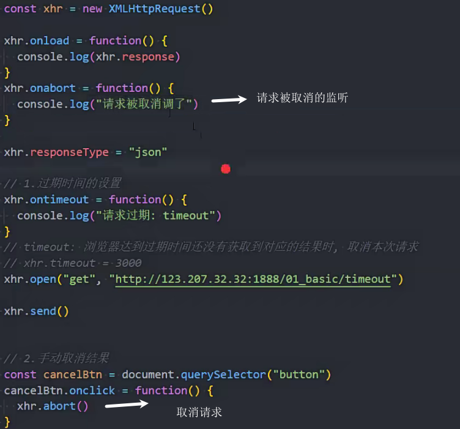

## Fetch

获取的意思

### get请求

1. 原始方法 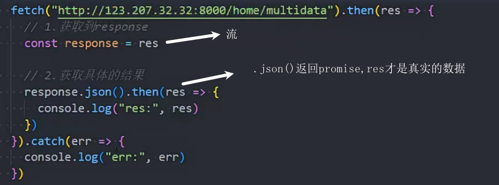

2. 优化一

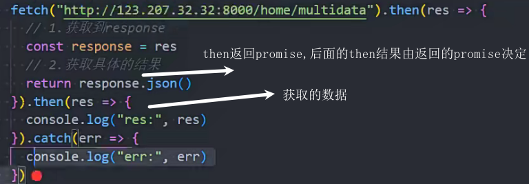

3. await方式

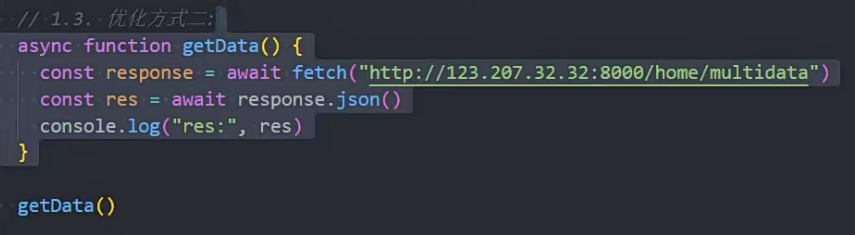

### post请求

发送json格式数据

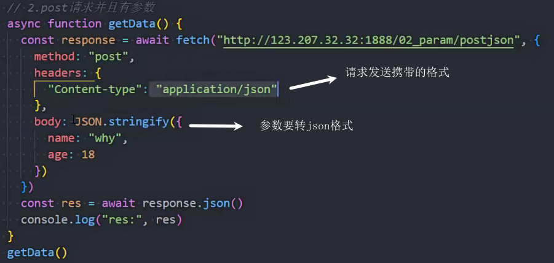

发送formData格式数据

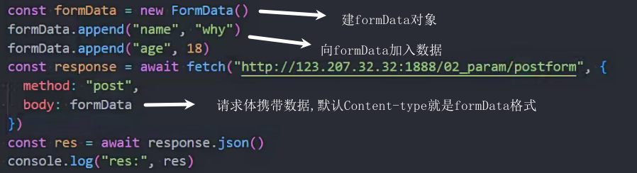

response.ok

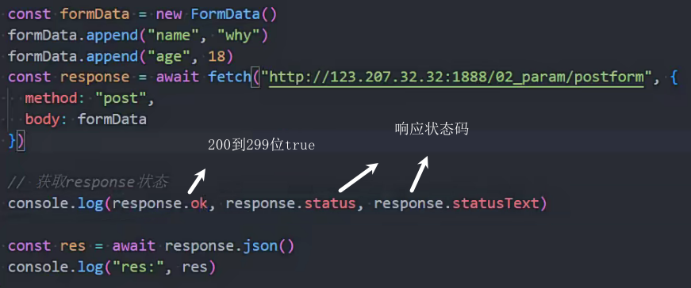

## 文件上传

### xhr文件上传

xhr可以查看进度

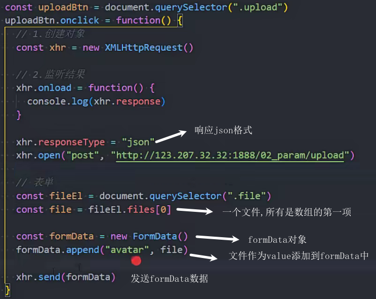

### fetch文件上传

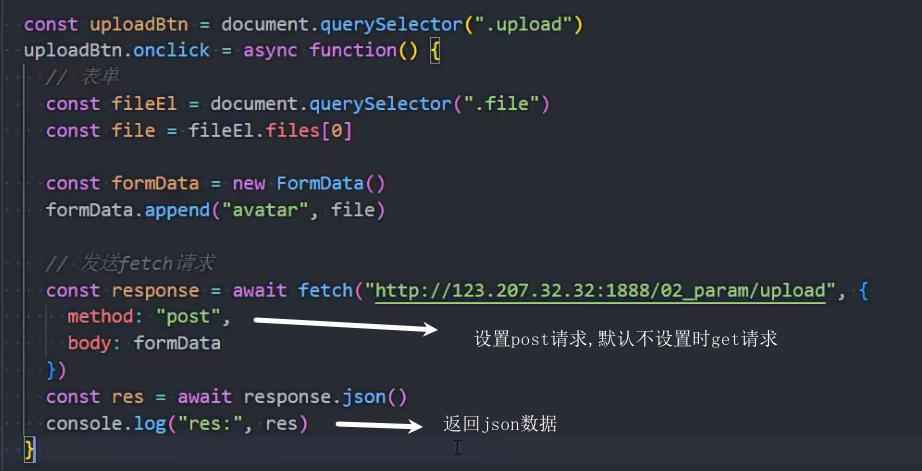