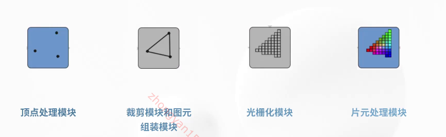

 

### 渲染管线

  渲染的流程也就是渲染管线 

因为处理流程是源源不断的，所以称为渲染管线

### 裁剪和图元组装

相机的视域是有限的，视域外的区域会被裁剪掉，

图元组装就是将顶点组装成线段和多边形这样的图元

### 光删化

确定帧缓存中图元内部的像素

### 片元处理

利用光栅化对像素进行填色

> 片元也就是像素

## openGL和webGL

openGL跨平台、跨语言

webGL只实现了openGL的大部分功能

### webgl坐标系

x横轴

y纵轴 朝上

z屏幕内外深度，向外为正

### 缓冲区

