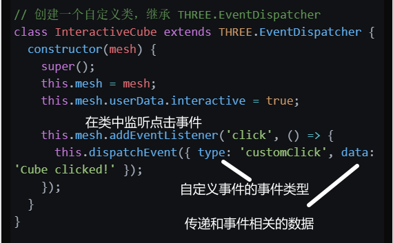
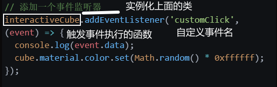
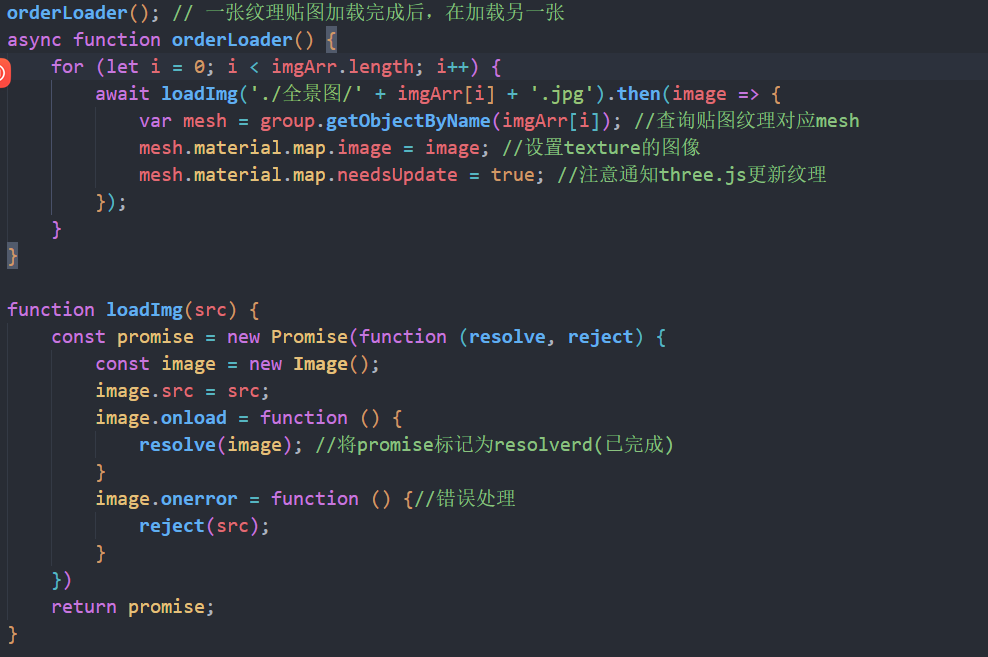

### THREE.EventDispatche

### dispatchEvent

可以调用事件的函数，但是不用触发事件

事件分发和监听功能




触发事件执行函数



demo

```js
import * as THREE from 'three';

// 创建一个场景
const scene = new THREE.Scene();

// 创建一个相机
const camera = new THREE.PerspectiveCamera(75, window.innerWidth / window.innerHeight, 0.1, 1000);
camera.position.z = 5;

// 创建一个渲染器
const renderer = new THREE.WebGLRenderer();
renderer.setSize(window.innerWidth, window.innerHeight);
document.body.appendChild(renderer.domElement);

// 创建一个立方体
const geometry = new THREE.BoxGeometry();
const material = new THREE.MeshBasicMaterial({ color: 0x00ff00 });
const cube = new THREE.Mesh(geometry, material);
scene.add(cube);

// 创建一个自定义类，继承 THREE.EventDispatcher
class InteractiveCube extends THREE.EventDispatcher {
  constructor(mesh) {
    super();
    this.mesh = mesh;
    this.mesh.userData.interactive = true;

    this.mesh.addEventListener('click', () => {
      this.dispatchEvent({ type: 'customClick', data: 'Cube clicked!' });
    });
  }
}

const interactiveCube = new InteractiveCube(cube);

// 添加一个事件监听器
interactiveCube.addEventListener('customClick', (event) => {
  console.log(event.data);
  cube.material.color.set(Math.random() * 0xffffff);
});

// 添加灯光
const light = new THREE.PointLight(0xffffff);
light.position.set(1, 1, 2);
scene.add(light);

// 渲染循环
const animate = () => {
  requestAnimationFrame(animate);

  cube.rotation.x += 0.01;
  cube.rotation.y += 0.01;

  renderer.render(scene, camera);
};

animate();
```

### distanceTo

计算两个点的距离

```js
// 创建两个 Vector3 对象表示两个点的位置
const point1 = new THREE.Vector3(1, 2, 3);
const point2 = new THREE.Vector3(4, 6, 8);

// 使用 distanceTo 方法计算两个点之间的距离
const distance = point1.distanceTo(point2);

console.log("距离为：" + distance);
```

### 异步加载



### layer

只有与相机的图层关系一样的才能被渲染出来

相机可以设置查看多个图层

默认图层为0

```js
//在0图层的物体会展示或者隐藏
camera.layers.toggle( 0 );//相机开启或者关闭0图层
camera.layers.enableAll();//所有图层都能被相机看见
camera.layers.disableAll();//所有图层都不被相机所见
camera.layers.set(7)//删除已有的所有对应关系并设置7图层可见
camera.layers.enable(7)//增加7图层可见关系
camera.layers.disable(7)//删除7图层可见关系
```

