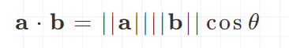

### 标量和向量的乘法

用标量乘以矢量的每个分量即可

##### 几何意义

将向量的长度按照因数|k|缩放，如果k < 0,则翻转向量的方向

### 向量加法

两个向量相加等于它们相应的分量相加得到的向量

向量不能和标量相加或者相减,

不能和不同维度的向量进行加减运算

向量的减法可以理解为加一个负向量

##### 几何意义

### 向量的长度

### 两点到距离

两点组成向量的绝对值

### 向量的点积

**向量点积等于两个向量的长度相乘再乘以两向量夹角的余弦**

**两个向量的点积是相应分量的乘积之和，得到的结果是一个标量**

满足交换律 结合律 分配率

公式

夹角推导

单位向量的夹角计算

##### 几何意义

点积a.b等于b投影到平行于a的直线上的有符号长度,乘以a的长度

求夹角

### 向量叉积

叉积的结果是一个向量

该向量垂直于原始的两个向量，即垂直于原始两个向量所构成的平面

这样的向量可能有两个，彼此方向相反

定义

a x b的长度等于a和b长度的乘积再乘以a和b之间角度的正弦值。

**a**×**b**的长度等于由两个边`ab`所形成的平行四边形的面积

##### 性质

##### 右手螺旋定则

先将两向量移动到同一起点，右手四指从A转动到B，则拇指所指方向，即为结果向量的方向。 符合右手螺旋定则的坐标系称之为右手坐标系

##### 几何意义

1. 判定两向量的相对位置关系

2. 判定点是否在三角形内

分别使用三角形的三边向量

叉乘三角形每个顶点与P点构成的向量，如果得到的三个结果向量方向一致

3. 构造三维直角坐标系

