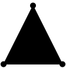
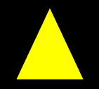
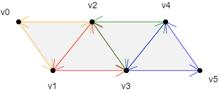
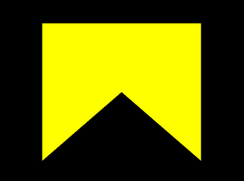

## 前言

三角形是一个最简单、最稳定的面，webgl 中的三维模型都是由三角面组成的。咱们这一篇就说一下三角形的绘制方法。


### 课堂目标  

1. 理解多点绘图原理。
2. 可以绘制三角形，并将其组合成多边形。


### 知识点  

1. 缓冲区对象
2. 点、线、面图形


## 第一章 webgl 的绘图方式

我们先看一下webgl是怎么画图的。


1. 绘制多点

   

2. 如果是线，就连点成线

   

3. 如果是面，那就在图形内部，逐片元填色

   


webgl 的绘图方式就这么简单，接下咱们就说一下这个绘图方式在程序中是如何实现的。


## 第二章 绘制多点

在webgl 里所有的图形都是由顶点连接而成的，咱们就先画三个可以构成三角形的点。

这里大家还要注意一下，我现在要画的多点是可以被webgl 加工成线、或者面的，这和我们上一篇单纯的想要绘制多个点是不一样的。

### 1-绘制多点的整体步骤

1. 建立着色器源文件

   ```java
   <script id="vertexShader" type="x-shader/x-vertex">
       attribute vec4 a_Position;
       void main(){
           gl_Position = a_Position;
           gl_PointSize = 20.0;
       }
   </script>
   <script id="fragmentShader" type="x-shader/x-fragment">
       void main(){
           gl_FragColor=vec4(1.0,1.0,0.0,1.0);
       }
   </script>
   ```

   

2. 获取webgl 上下文

   ```js
   const canvas = document.getElementById('canvas');
   canvas.width=window.innerWidth;
   canvas.height=window.innerHeight;
   const gl = canvas.getContext('webgl');
   ```

    

3. 初始化着色器

   ```js
   const vsSource = document.getElementById('vertexShader').innerText;
   const fsSource = document.getElementById('fragmentShader').innerText;
   initShaders(gl, vsSource, fsSource);
   ```

   

4. 设置顶点点位

   ```js
   const vertices=new Float32Array([
       0.0,  0.1,
       -0.1,-0.1,
       0.1, -0.1
   ])
   const vertexBuffer=gl.createBuffer();
   gl.bindBuffer(gl.ARRAY_BUFFER,vertexBuffer);
   gl.bufferData(gl.ARRAY_BUFFER,vertices,gl.STATIC_DRAW);
   const a_Position=gl.getAttribLocation(gl.program,'a_Position');
   gl.vertexAttribPointer(a_Position,2,gl.FLOAT,false,0,0);
   gl.enableVertexAttribArray(a_Position);
   ```

   

5. 清理画布

   ```js
   gl.clearColor(0.0, 0.0, 0.0, 1.0);
   gl.clear(gl.COLOR_BUFFER_BIT);
   ```

   

6. 绘图

   ```js
   gl.drawArrays(gl.POINTS, 0, 3);
   ```

   

实际效果：


上面的步骤，主要是先给大家一睹为快，其具体原理，咱们后面细说。


### 2-绘制多点详解

首先咱们先从概念上疏通一下。

我们在用js定点位的时候，肯定是要建立一份顶点数据的，这份顶点数据是给谁的呢？肯定是给着色器的，因为着色器需要这份顶点数据绘图。

然而，我们在js中建立顶点数据，着色器肯定是拿不到的，这是语言不通导致的。

为了解决这个问题，webgl 系统就建立了一个能翻译双方语言的缓冲区。js 可以用特定的方法把数据存在这个缓冲区中，着色器可以从缓冲区中拿到相应的数据。

接下来咱们就看一下这个缓冲区是如何建的，着色器又是如何从其中拿数据的。

1. 建立顶点数据，两个浮点数构成一个顶点，分别代表x、y 值。

```js
const vertices=new Float32Array([
    //x    y
    0.0,  0.1, //顶点
    -0.1,-0.1, //顶点
    0.1, -0.1  //顶点
])
```

现在上面的这些顶点数据是存储在js 缓存里的，着色器拿不到，所以咱们需要建立一个着色器和js 都能进入的公共区。


2. 建立缓冲对象。

```js
const vertexBuffer=gl.createBuffer();
```

现在上面的这个缓冲区是独立存在的，它只是一个空着的仓库，和谁都没有关系。接下来咱们就让其和着色器建立连接。


3. 绑定缓冲对象。

```js
gl.bindBuffer(gl.ARRAY_BUFFER,vertexBuffer);
```

gl.bindBuffer(target,buffer)   绑定缓冲区

- target  要把缓冲区放在webgl 系统中的什么位置
- buffer 缓冲区

着色器对象在执行initShaders() 初始化方法的时候，已经被写入webgl 上下文对象gl 中了。

当缓冲区和着色器建立了绑定关系，我们就可以往这块空间写入数据了


4. 往缓冲区对象中写入数据   

```js
gl.bufferData(gl.ARRAY_BUFFER,vertices,gl.STATIC_DRAW);
```

bufferData(target, data, usage) 将数据写入缓冲区

- target 要把缓冲区放在webgl 系统中的什么位置
- data  数据
- usage 向缓冲区写入数据的方式，咱们在这里先知道 gl.STATIC_DRAW 方式即可，它是向缓冲区中一次性写入数据，着色器会绘制多次。

现在着色器虽然绑定了缓冲区，可以访问里面的数据了，但是我们还得让着色器知道这个仓库是给哪个变量的，比如咱们这里用于控制点位的attribute 变量。这样做是为了提高绘图效率。


5. 将缓冲区对象分配给attribute 变量

```js
const a_Position=gl.getAttribLocation(gl.program,'a_Position');
gl.vertexAttribPointer(a_Position,2,gl.FLOAT,false,0,0);
```

gl.vertexAttribPointer(local,size,type,normalized,stride,offset)   将缓冲区对象分配给attribute 变量   

- local  attribute变量
- size 顶点分量的个数，比如我们的vertices 数组中，两个数据表示一个顶点，那咱们就写2
- type 数据类型，比如 gl.FLOAT 浮点型
- normalized 是否将顶点数据归一
- stride 相邻两个顶点间的字节数，我的例子里写的是0，那就是顶点之间是紧挨着的
- offset 从缓冲区的什么位置开始存储变量，我的例子里写的是0，那就是从头开始存储变量

到了这里，着色就知道缓冲区的数据是给谁的了。因为咱们缓冲区里的顶点数据是数组，里面有多个顶点。所以我们得开启一个让着色器批量处理顶点数据的属性。默认着色器只会一个一个的接收顶点数据，然后一个一个的绘制顶点。


6. 开启顶点数据的批处理功能。

```js
gl.enableVertexAttribArray(a_Position);
```

- location attribute变量

好啦，现在已经是万事俱备，只欠绘图了。


7. 绘图

```js
gl.clearColor(0.0, 0.0, 0.0, 1.0);
gl.clear(gl.COLOR_BUFFER_BIT);
gl.drawArrays(gl.POINTS, 0, 3);
```

drawArrays(mode,first,count)

- mode 绘图模式，比如 gl.POINTS 画点
- first 从哪个顶点开始绘制
- count 要画多少个顶点


关于绘制多点，我就说到这，接下来咱们说一下基于多点绘制图形。


## 第三章 绘制图形

在数学中，我们知道，三个点可以确定一个唯一的三角面。接下来咱们画一下。


### 1-绘制三角面

我们在之前绘制多点的基础上做一下修改。

1. 顶点着色器中的gl_PointSize = 20.0 不要，因为这个属性是控制顶点大小的，咱们已经不需要显示顶点了。

```js
<script id="vertexShader" type="x-shader/x-vertex">
    attribute vec4 a_Position;
    void main(){
        gl_Position = a_Position;
        //gl_PointSize = 20.0;
    }
</script>
```


2. 在js 中修改绘图方式

```js
// gl.drawArrays(gl.POINTS, 0, 3);
gl.drawArrays(gl.TRIANGLES, 0, 3);
```

上面的gl.TRIANGLES 就是绘制三角面的意思。

看一下效果：




webgl 既然可以画面了，那它是否可以画线呢，这个是必须可以，我们可以在gl.drawArrays() 方法的第一个参数里进行设置。


### 2-基本图形

gl.drawArrays(mode,first,count)  方法可以绘制一下图形：

- POINTS 可视的点
- LINES 单独线段
- LINE_STRIP 线条
- LINE_LOOP 闭合线条
- TRIANGLES 单独三角形
- TRIANGLE_STRIP 三角带
- TRIANGLE_FAN 三角扇


上面的POINTS  比较好理解，就是一个个可视的点。

线和面的绘制方式各有三种，咱们接下来就详细说一下。


#### 2-1-点的绘制

POINTS 可视的点


上面六个点的绘制顺序是：v0, v1, v2, v3, v4, v5


#### 2-2-线的绘制

1. LINES 单独线段


​	上面三条有向线段的绘制顺序是：

​	v0>v1

​	v2>v3

​	v4>v5


2. LINE_STRIP 线条


​	上面线条的绘制顺序是：v0>v1>v2>v3>v4>v5


3. LINE_LOOP 闭合线条


​	上面线条的绘制顺序是：v0>v1>v2>v3>v4>v5>v0


#### 2-3-面的绘制

对于面的绘制，我们首先要知道一个原理：

- 面有正反两面。
- 面向我们的面，如果是正面，那它必然是逆时针绘制的；
- 面向我们的面，如果是反面，那它必然是顺时针绘制的；

接下来，咱们看一下面的三种绘制方式：


1. TRIANGLES 单独三角形


​	上面两个面的绘制顺序是：

​	v0>v1>v2

​	v3>v4>v5


2. TRIANGLE_STRIP 三角带





上面四个面的绘制顺序是：

v0>v1>v2

以上一个三角形的第二条边+下一个点为基础，以和第二条边相反的方向绘制三角形

v2>v1>v3

以上一个三角形的第三条边+下一个点为基础，以和第二条边相反的方向绘制三角形

v2>v3>v4

以上一个三角形的第二条边+下一个点为基础，以和第二条边相反的方向绘制三角形

v4>v3>v5

规律：

第一个三角形：v0>v1>v2

第偶数个三角形：以上一个三角形的第二条边+下一个点为基础，以和第二条边相反的方向绘制三角形

第奇数个三角形：以上一个三角形的第三条边+下一个点为基础，以和第二条边相反的方向绘制三角形


3. TRIANGLE_FAN 三角扇


​	上面四个面的绘制顺序是：

​	v0>v1>v2

以上一个三角形的第三条边+下一个点为基础，按照和第三条边相反的顺序，绘制三角形

​	v0>v2>v3

以上一个三角形的第三条边+下一个点为基础，按照和第三条边相反的顺序，绘制三角形

​	v0>v3>v4

以上一个三角形的第三条边+下一个点为基础，按照和第三条边相反的顺序，绘制三角形

​	v0>v4>v5


关于webgl 可以绘制的基本图像就说到这，接下来咱们画个矩形面，练一下手。


### 3-实例：绘制矩形面

首先，我们要知道，webgl 可以绘制的面只有三角面，所以咱们要绘制矩形面的话，只能用两个三角形去拼。

接下咱们就说一下如何用三角形拼矩形。

#### 4-1-三角形拼矩形的方法

我们可以用TRIANGLE_STRIP  三角带拼矩形。

下面的两个三角形分别是：

v0>v1>v2

v2>v1>v3


#### 4-2-代码实现

1. 建立顶点数据

```js
const vertices=new Float32Array([
    -0.2, 0.2,
    -0.2,-0.2,
    0.2, 0.2,
    0.2,-0.2,
])
```

上面两个浮点代表一个顶点，依次是v0、v1、v2、v3，如上图所示。


2. 绘图

```js
gl.drawArrays(gl.TRIANGLE_STRIP, 0, 4);
```

上面参数的意思分别是：三角带、从第0个顶点开始画、画四个。

效果如下：


关于矩形的绘制就这么简单，接下来咱们可以去尝试其它的图形。

比如：把TRIANGLE_STRIP 三角带变成TRIANGLE_FAN 扇形

```js
gl.drawArrays(gl.TRIANGLE_FAN, 0, 4);
```

画出了一个三角带的样子：




其绘图顺序是：

v0>v1>v2

v0>v2>v3


关于基本图形的绘制，咱们就说到这。
