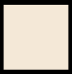
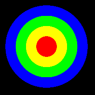
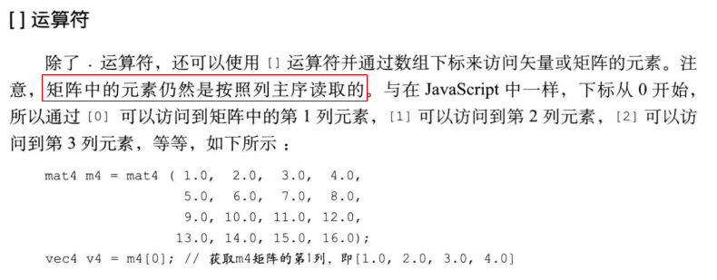

##  前言

之前我们只是对GLSL ES 语言进行了简单介绍，并没有对其中的语法进行系统讲解，之后我们在做案例的时候，也是用到了什么说什么。

接下来，我们就对GLSL ES 语言进行系统讲解。


### 课堂目标  

1. 理解GLSL ES 语言书写规范

2. 可以熟练书写GLSL ES 语言

   

### 知识点  

1. 数据、变量和变量类型
2. 向量、矩阵、结构体、数组、采样器
3. 运算、程序流、函数
4. attribute、uniform和varying 变量
5. 精度限定词
6. 预处理和指令


## 第一章 GLSL ES 语法测试

我在说GLSL ES 语法之前，得先给大家说几个测试GLSL ES 语法的方法，不然大家可能会听得心里没底。


### 1-GLSL ES数据的输出

我现在片元着色器里写了一个4维向量的加法运算，我想把它打印出来看看v 的结果是不是如我想的那样。

```html
<script id="fragmentShader" type="x-shader/x-fragment">
    precision mediump float;
    vec4 v=vec4(1,2,3,4)+vec4(5,6,7,8);
    void main(){
      ……
    }
</script>
```


很多同学可能本能的想这么写：

```html
<script id="fragmentShader" type="x-shader/x-fragment">
    precision mediump float;
    vec4 v=vec4(1,2,3,4)+vec4(5,6,7,8);
    console.log(v);
    void main(){
      ……
    }
</script>
[6, 8, 10, 12]
```


可惜console 只能写在js 中，GLSL ES 语言不认识它。

对于这种问题的解决，我尚没有找到太过官方和权威的资料，所以就自己写了一个，在此只做参考和语法测试，若大家以后有了更牛皮的解决方案，一定要分享一下哦。

我的实现思路是先把GLSL ES 数据画到画布中，然后再从画布的像素数据中解析出GLSL ES 数据。

```html
<script id="fragmentShader" type="x-shader/x-fragment">
    precision mediump float;
    vec4 v=vec4(1,2,3,4)+vec4(5,6,7,8);
    void main(){
      gl_FragColor=v/255.0;
    }
</script>
```

`因为gl_FragColor 中1个单位的分量就相当于canvas画布中255的分量值`，所以我让上面的向量v直接除以255。

注：此方法只适用于向量因子在0-255的数据。我们在此先不考虑太深，先把语法跑通。

我们可以先在画布中画一个点：

```html
<script id="vertexShader" type="x-shader/x-vertex">
    attribute vec4 a_Position;
    void main(){
      gl_Position=a_Position;
      gl_PointSize=512.0;
    }
</script>
<script id="fragmentShader" type="x-shader/x-fragment">
    precision mediump float;
    vec4 v=vec4(1,2,3,4)+vec4(5,6,7,8);
    void main(){
      gl_FragColor=v/255.0;
    }
</script>
```

效果如下：



接下来我们就可以获取canvas 画布中的像素数据了。


### 2-在canvas 画布中获取像素数据

在此先给会canvas 2d 的同学提一下，在我们通过canvas.getContext() 方法获取2d或webgl 上下文对象的同时，也决定了canvas画布的命运。

canvas.getContext(‘2d’) 方法会让canvas画布变成2d画布，2d的canvas画布可以通过ctx.getImageData() 方法获取画布中的像素；

canvas.getContext(‘webgl’) 方法会让canvas画布变成webgl画布，webgl画布需要通过ctx.readPixels() 方法获取画布中的像素。


1.建立一个8位无符号型数组，用于存储一个像素的数据。

```js
const pixel = new Uint8Array(4);
```


2.从画布中采集一个像素出来。

```js
gl.readPixels(
    canvas.width / 2,
    canvas.height / 2,
    1,
    1,
    gl.RGBA,
    gl.UNSIGNED_BYTE,
    pixel
);
```


gl.readPixels(x, y, width, height, format, type, pixels)

- x, y：从哪里采集像素
- width, height：采集多大一块区域的像素
- format：数据格式
- type：数据类型
  - gl.UNSIGNED_BYTE
  - gl.UNSIGNED_SHORT_5_6_5
  - gl.UNSIGNED_SHORT_4_4_4_4
  - gl.UNSIGNED_SHORT_5_5_5_1
  - gl.FLOAT
- pixels：装像素的容器
  - Uint8Array 对应 gl.UNSIGNED_BYTE 
  - Uint16Array 对应 gl.UNSIGNED_SHORT_5_6_5, gl.UNSIGNED_SHORT_4_4_4_4, 或者 gl.UNSIGNED_SHORT_5_5_5_1
  - Float32Array 对应 gl.FLOAT


3.打印pixel

```j&#39;s
console.log(pixel); //Uint8Array(4) [6, 8, 10, 12]
```

利用同样的原理，我们还可以打印多个向量。


### 3-打印多个向量

1.用不同的向量数据画圆环。

```html
<!-- 顶点着色器 -->
<script id="vertexShader" type="x-shader/x-vertex">
    attribute vec4 a_Position;
    void main(){
        gl_Position=a_Position;
        gl_PointSize=512.0;
    }
</script>
<!-- 片元着色器 -->
<script id="fragmentShader" type="x-shader/x-fragment">
    precision mediump float;
    mat4 m=mat4(
      255,0,0,255,
      255,255,0,255,
      0,255,0,255,
      0,0,255,255
    );
    void main(){
      float dist=distance(gl_PointCoord,vec2(0.5,0.5));
      if(dist>=0.0&&dist<0.125){
        gl_FragColor=m[0]/255.0;
      }else if(dist>=0.125&&dist<0.25){
        gl_FragColor=m[1]/255.0;
      }else if(dist>=0.25&&dist<0.375){
        gl_FragColor=m[2]/255.0;
      }else if(dist>=0.325&&dist<0.5){
        gl_FragColor=m[3]/255.0;
      }else{
        discard;
      }
    }
</script>
```

效果如下：




2.按照比例关系从四个圆环中取色

```js
const vw = 512 / 8;
for (let i = 0; i < 4; i++) {
    logPixel(vw * i + vw / 2)
}

function logPixel(offset = 0) {
    //建立像素集合
    let pixel = new Uint8Array(4);
    //从缓冲区读取像素数据，然后将其装到事先建立好的像素集合里
    gl.readPixels(
        canvas.width / 2 + offset,
        canvas.height / 2,
        1,
        1,
        gl.RGBA,
        gl.UNSIGNED_BYTE,
        pixel
    );
    console.log(pixel);
}
```

数据打印如下：

```
Uint8Array(4) [255, 0, 0, 255]
Uint8Array(4) [255, 255, 0, 255]
Uint8Array(4) [0, 255, 0, 255]
Uint8Array(4) [0, 0, 255, 255]
```


注：

我上面这种方式，在特定的一些高分辨率设备上，会出现兼容性问题，画出来的圆会比较小，取样会失败。

所以，若有同学打印出的多个向量和我上面的结果不符，可以使用我下面提供的方式。

当然，打印多个向量的方式并不唯一，大家若感兴趣也可以自己写一个出来。


### 4-打印多个向量-适配不同分辨率的设备

我接下来会基于片元位置和画布的宽高比绘图，然后再基于这样的比例取样。

1.绘制一个充满画布的矩形面

- js

```js
const source = new Float32Array([
    -1, 1,
    -1, -1,
    1, 1,
    1, -1
]);

const rect = new Poly({
    gl,
    source,
    type: 'TRIANGLE_STRIP',
    attributes: {
        a_Position: {
            size: 2,
            index: 0
        }
    },
    uniforms: {
        u_CanvasSize: {
            type: 'uniform2fv',
            value: [canvas.width, canvas.height]
        }
    }
})

gl.clear(gl.COLOR_BUFFER_BIT);
rect.draw()
```


- 着色器，在片元着色器中基于片元在画布中的比例位置绘制棋盘格。

```html
<!-- 顶点着色器 -->
<script id="vertexShader" type="x-shader/x-vertex">
    attribute vec4 a_Position;
    void main(){
      gl_Position=a_Position;
    }
</script>
<!-- 片元着色器 -->
<script id="fragmentShader" type="x-shader/x-fragment">
    precision mediump float;
    uniform vec2 u_CanvasSize;
    float halfW=u_CanvasSize.x/2.0;
    float halfH=u_CanvasSize.y/2.0;
    void main(){
      mat4 m=mat4(
        255,0,0,255,
        255,255,0,255,
        0,255,0,255,
        0,0,255,255
      );
      bool xb= gl_FragCoord.x<halfW;
      bool yb= gl_FragCoord.y<halfH;
      if(yb){
        if(xb){
          gl_FragColor=m[0]/255.0;
        }else{
          gl_FragColor=m[1]/255.0;
        }
      }else{
        if(xb){
          gl_FragColor=m[2]/255.0;
        }else{
          gl_FragColor=m[3]/255.0;
        }
      }
    }
</script>
```

效果如下：


2.用js取上面四个格子的中点

```js
const [w, h] = [2, 2]
for (let y = 0; y < 2; y++) {
    for (let x = 0; x < 2; x++) {
        const px = canvas.width * (x + 0.5) / w
        const py = canvas.height * (y + 0.5) / h
        logPixel(px, py)
    }
}
function logPixel(x, y) {
    const pixel = new Uint8Array(4)
    gl.readPixels(
        x, y,
        1, 1,
        gl.RGBA,
        gl.UNSIGNED_BYTE,
        pixel
    )
    console.log(pixel)
}
```

数据打印如下：

```
Uint8Array(4) [255, 0, 0, 255]
Uint8Array(4) [255, 255, 0, 255]
Uint8Array(4) [0, 255, 0, 255]
Uint8Array(4) [0, 0, 255, 255]
```


## 第二章 GLSL ES 概述和基本规范

GLSL ES是在GLSL（OpenGL着色器语言）的基础上，删除和简化了一部分功能后形成的，ES版本主要降低了硬件功耗，减少了性能开销。

实际上WebGL并不支持GLSL ES的所有特性，所以大家以后在WebGL API里可能会遇到部分参数无效的情况。

GLSL ES 是写在着色器中的，其具备以下基本规范：

1.大小写敏感

2.语句末尾必须要有分号

3.以main函数为主函数

4.注释语法和js 一样

- 单行: //
- 多行: /**/

5.基本数据类型：

- 数字型
  - 浮点型 float，如1.0
  - 整型 int，如1
- 布尔型 bool
  - true
  - false

接下来，咱们再说一下其它规范。


## 第三章 变量

### 1-声明变量的方法

GLSL ES是强类型语言，在声明变量的时候应该指明变量类型，如：

```js
float f=1.0;
int i=1;
bool b=true;
```


### 2-变量命名规范

- 只能包括a-z,A-Z,0-9,_
- 变量名首字母不能是数字
- 不能是GLSL 关键字，如attribute,vec4,bool
- 不能是GLSL 保留字，如cast,class,long
- 不能以下单词开头：gl_, webgl\_, \_webgl\_


### 3-变量的赋值

变量使用等号=赋值，=两侧的数据类型需要一致。

```
int i=8; // ✔
int i=8.0; // ✖
float f=8; // ✖
float f=8.0; // ✔
```


### 4-变量的类型转换

有时候，我们需要将类型a 的数据转成类型b 的数据，交给类型为b 的变量。

比如，我要把整形数字转成浮点型交给浮点型变量：

```js
float f=float(8)
```

上面的float() 方法便是类型转换方法。

基础数据的转换有以下几种：

- 浮点转整数：int(float)
- 布尔转整数：int(bool)
- 整数转浮点：float(int)
- 布尔转浮点：float(bool)
- 整数转布尔：bool(int)
- 浮点转布尔：bool(float)


## 第四章 向量

### 1-向量类型

GLSL ES 支持2、3、4维向量，根据分量的数据类型，向量可以分为3类：

- vec2、vec3、vec4：分量是浮点数
- ivec2、ivec3、ivec4：分量是整数
- bvec2、bvec3、bvec4：分量是布尔值


### 2-向量的创建

在GLSL ES 中，向量占有很重要的地位，所以GLSL ES为其提供了非常灵活的创建方式。

比如：

```js
vec3 v3 = vec3(1.0, 0.0, 0.5);   // (1.0, 0.0, 0.5)
vec2 v2 = vec2(v3);              // (1.0, 0.0) 
vec4 v4 = vec4(1.0);        	 // (1.0,1.0,1.0,1.0)
```

我们还可以将多个向量合在一起：

```js
vec4 v4b=vec4(v2,v4);        	 // (1.0,0.0,1.0,1.0)
```

注：= 两侧的数据类型必须一致，比如下面的写法会报错：

```js
vec4 v4 = vec2(1.0);   //错的    
```


### 3-向量分量的访问

向量分量的访问方式：

- 通过分量属性访问

```js
v4.x, v4.y, v4.z, v4.w  // 齐次坐标
v4.r, v4.g, v4.b, v4.a  // 色值
v4.s, v4.t, v4.p, v4.q  // 纹理坐标
```


- 将分量的多个属性连在一起，可以获取多个向量

```js
vec4 v4 = vec4(1.0,2.0,3.0,4.0); 
v4.xy //(1.0,2.0)
v4.yx //(2.0,1.0)
v4.xw //(1.0,4.0)
```


- 通过分量索引访问

```js
v4[0], v4[1], v4[2], v4[3]
```


用上面的方法访问到向量后，也可以用=号为向量赋值。

如：

```js
v4.x=1.0
v4[0]=1.0
v4.xy=vec2(1.0,2.0)
```


## 第五章 矩阵

### 1-矩阵的类型

GLSL ES 支持2、3、4维矩阵：

- mat2
- mat3
- mat4

矩阵中的元素都是浮点型。


### 2-矩阵的建立

GLSL ES 中的矩阵是列主序的，在建立矩阵的时候，其参数结构有很多种。

- 浮点数，其参数是按照列主序排列的。

```js
mat4 m=mat4(
    1,5,9,13,
    2,6,10,14,
    3,7,11,15,
    4,8,12,16
);
/*
	1,5,9,13,
    2,6,10,14,
    3,7,11,15,
    4,8,12,16
*/
```

- 向量


```js
vec4 v4_1=vec4(1,2,3,4);
vec4 v4_2=vec4(5,6,7,8);
vec4 v4_3=vec4(9,10,11,12);
vec4 v4_4=vec4(13,14,15,16);
mat4 m=mat4(v4_1,v4_2,v4_3,v4_4);
/*
[
	1,2,3,4,
    5,6,7,8,
    9,10,11,12,
    13,14,15,16
]    
*/
```

- 浮点+向量


```js
vec4 v4_1=vec4(1,5,9,13);
vec4 v4_2=vec4(2,6,10,14);
mat4 m=mat4(
    v4_1,
    v4_2,
    3,7,11,15,
    4,8,12,16
);
/*
	1,5,9,13,
    2,6,10,14,
    3,7,11,15,
    4,8,12,16   
*/
```

- 单个浮点数

```
mat4 m=mat4(1);
/*
[
	1, 0, 0, 0,
    0, 1, 0, 0,
    0, 0, 1, 0,
    0, 0, 0, 1,
]    
*/
```


注：如矩阵中的参数数量大于1，小于矩阵元素数量，会报错

```
mat4 m4 = mat4(1.0,2.0);
/*报错*/
```


### 3-矩阵的访问

1.使用[] 可以访问矩阵的某一行。

```js
mat4 m=mat4(
    1,5,9,13,
    2,6,10,14,
    3,7,11,15,
    4,8,12,16
);
m[0]
/*
	1,5,9,13,
*/
```

注：在《WEBGL指南》里，这块知识他说有点让人费解，大家留意一下即可，这本书整体还是很好的，我备课就是参考这本书的思路走的。




2.使用 m\[y]\[x] 方法，可以访问矩阵第y行，第x列的元素。

```js
mat4 m=mat4(
    1,5,9,13,
    2,6,10,14,
    3,7,11,15,
    4,8,12,16
);
m[0][0]
/* 1 */
```


3.m\[y] 可以理解为一个向量，其内部的元素，可以像访问向量元素一样去访问。

```js
mat4 m=mat4(
    1,5,9,13,
    2,6,10,14,
    3,7,11,15,
    4,8,12,16
);
m[0].[0] //1
m[0].x //1
m[0].r //1
m[0].s //1
```


注：我们在此要注意一下[] 中索引值的限制。

[] 中的索引值只能通过以下方式定义：

- 整形字面量，如0，1，2，3

```js
m[0]
m[1]
```

- 用const 修饰的变量

```js
const int y=0;
m[y];
```

注：以下写法是错误的

```js
int y=0;
m[y];
```


- 循环索引

```js
mat4 n=mat4(
    1,5,9,13,
    2,6,10,14,
    3,7,11,15,
    4,8,12,16
);
mat4 m=mat4(1);
void main(){
    for(int i=0;i<4;i++){
        m[i]=n[i];
    }
    ……
}
```


- 前面三项组成的表达式

```js
const int y=0;
m[y+1];
```

 


## 第六章 运算符

GLSL ES 的运算符合js 类似。


### 1-算术运算符

| 运算符 | 描述 | 例子      |
| ------ | ---- | --------- |
| +      | 加法 | x = y + 2 |
| -      | 减法 | x = y - 2 |
| *      | 乘法 | x = y * 2 |
| /      | 除法 | x = y / 2 |
| ++     | 自增 | x = ++y   |
|        |      | x = y++   |
| --     | 自减 | x = --y   |
|        |      | x = y--   |


### 2-赋值运算符

| 运算符 | 描述     | 例子   |
| ------ | -------- | ------ |
| =      | 赋值等于 | x = y  |
| +=     | 加等于   | x += y |
| -=     | 减等于   | x -= y |
| *=     | 乘等于   | x *= y |
| /=     | 除等于   | x /= y |


### 3-比较运算符

| 运算符 | 描述       | 比较   |
| :----- | :--------- | :----- |
| ==     | 等于       | x == 8 |
| !=     | 不等于     | x != 8 |
| >      | 大于       | x > 8  |
| <      | 小于       | x < 8  |
| >=     | 大于或等于 | x >= 8 |
| <=     | 小于或等于 | x <= 8 |


### 4-条件运算符

| 语法          | 例子                 |
| :------------ | :------------------- |
| 布尔 ?值1:值2 | float f=2>3?1.0:2.0; |


### 5-逻辑运算符

| 运算符 | 描述 | 例子                                    |
| :----- | :--- | :-------------------------------------- |
| &&     | 和   | true&&true=true;                        |
| \|\|   | 或   | false\|\|true=true;  true\|\|true=true; |
| !      | 非   | !false=true;                            |
| ^^     | 异或 | false^^true=true; true^^true=false;     |


## 第七章 向量运算

向量可以与以下数据进行各种运算：

- 单独数字
- 向量
- 矩阵


### 1-向量和单独数字的运算

向量可以与单独数字进行加减乘除。

```js
vec4 v=vec4(1,2,3,4);
v+=1.0;
v-=1.0;
v*=2.0;
v/=2.0;
```

vec4 是浮点型向量。

我们上例中，写在vec4() 中的整数可以被vec4() 方法转换成浮点数。

vec4 向量在做四则运算时，其用于运算的数字类型应该是浮点型。

比如，下面的写法会报错：

```js
v+=1;
```

整型向量ivec2、ivec3、ivec4 的运算原理同上。


### 2-向量和向量的运算

1.加减乘除

```js
vec4 p=vec4(1,2,3,4);
vec4 v=vec4(2,4,6,8);
v+=p;
v-=p;
v*=p;
v/=p;
```


2.其它方法

- distance(p0,p1) 向量距离
- dot(p0,p1) 点积
- cross(p0,p1) 叉乘
-  ……


### 3-向量和矩阵的运算

矩阵只能与向量进行乘法运算。

向量乘以矩阵和矩阵乘以向量的结果是不一样的，但数据类型都是向量。

- 矩阵乘以向量

```js
mat4 m=mat4(
    1,5,9,13,
    2,6,10,14,
    3,7,11,15,
    4,8,12,16
);
vec4 p=vec4(1,2,3,4);
vec4 v=m*p;

/*
	[30, 70, 110, 150]
*/
```

以v.x为例说一下其算法：

```js
v.x=m[0][0]*v.x+m[1][0]*v.y+m[2][0]*v.z+m[3][0]*v.w
v.x=1*1+2*2+3*3+4*4
v.x=1+4+9+16
v.x=30
```


- 向量乘以矩阵

  将上面的代码改一下：

```
vec4 v=p*m;

/*
	[90, 100, 110, 120]
*/
```

以v.x为例说一下其算法：

```js
v.x=m[0][0]*v.x+m[1][0]*v.y+m[2][0]*v.z+m[3][0]*v.w
v.x=1*1+2*5+3*9+4*13
v.x=90
```


## 第八章 矩阵运算

矩阵可以与以下数据进行各种运算：

- 单独数字

- 向量

- 矩阵

  

### 1-矩阵和单独数字的运算

```js
mat4 m=mat4(
    1,5,9,13,
    2,6,10,14,
    3,7,11,15,
    4,8,12,16
);
m+=1.0;
m-=1.0;
m*=2.0;
m/=2.0;
```


### 2-矩阵和矩阵的运算

矩阵和矩阵之间可以进行加减乘除。

以下面的两个矩阵为例：

```js
mat4 m=mat4(
    2,16,8,8,
    4,8,8,8,
    8,4,8,8,
    16,8,8,8
);
mat4 n=mat4(
    1,4,1,2,
    2,4,2,1,
    4,4,1,2,
    8,4,2,1
);
```


1.矩阵加法：相同索引位置的元素相加

```js
m+=n;

/*
	3, 20, 9, 10,
	6, 12, 10, 9,
	12, 8, 9, 10,
	24, 12, 10, 9,
*/
```


2.矩阵减法：相同索引位置的元素相减

```js
m-=n;
/*
	1, 12, 7, 6,
	2, 4, 6, 7,
	4, 0, 7, 6,
	8, 4, 6, 7,
*/
```


3.矩阵除法：相同索引位置的元素相除

```
m/=n;
/*
	2, 4, 8, 4,
	2, 2, 4, 8,
	2, 1, 8, 4,
	2, 2, 4, 8,
*/
```


3.矩阵乘法

```js
m*=n;
/*
	58, 68, 64, 64,
	52, 80, 72, 72,
	64, 116, 88, 88,
	64, 176, 120, 120,
*/
```

矩阵乘法规则，我们之前在说复合矩阵的时候说过。

以其结果的的第一列为例，再回顾一下其计算规则：

```
m[0][0]=m[0][0]*n[0][0]+m[1][0]*n[0][1]+m[2][0]*n[0][2]+m[3][0]*n[0][3]
m[0][0]=2*1+4*4+8*1+16*2
m[0][0]=58

m[1][0]=m[0][0]*n[1][0]+m[1][0]*n[1][1]+m[2][0]*n[1][2]+m[3][0]*n[1][3]
m[1][0]=2*2+4*4+8*2+16*1
m[1][0]=52

m[2][0]=m[0][0]*n[2][0]+m[1][0]*n[2][1]+m[2][0]*n[2][2]+m[3][0]*n[2][3]
m[2][0]=2*4+4*4+8*1+16*2
m[2][0]=64

m[3][0]=m[0][0]*n[3][0]+m[1][0]*n[3][1]+m[2][0]*n[3][2]+m[3][0]*n[3][3]
m[3][0]=2*8+4*4+8*2+16*1
m[3][0]=64

```


## 第九章 struct

struct 翻译过来叫结构体，它类似于js 里的构造函数，只是语法规则不一样。

1.struct 的建立

```js
struct Light{
    vec4 color;
    vec3 pos;
};
```

上面的struct 类似于js 的function，color和pos 既是结构体的属性，也使其形参。


2.struct 的实例化

```js
Light l1=Light(
    vec4(255,255,0,255),
    vec3(1,2,3)
);
```

上面的vec4()和vec3()数据是结构体的实参，分别对应color属性和pos属性。


3.访问struct  实例对象中的属性

```js
gl_FragColor=l1.color/255.0;
```


## 第十章 数组

glsl 中的数组具有以下特性：

- 属于类型数组
- 只支持一维数组
- 不支持pop()、push() 等操作


1.在建立某个类型的数组时，在数据类型后面加[]即可，[]中要写数组的长度：

如：

```js
vec4 vs[2];
vs[0]=vec4(1,2,3,4);
vs[1]=vec4(5,6,7,8);
```


2.数组的长度需要按照以下方式定义：

- 整形字面量

```js
vec4 vs[2];
```

- const 限定字修饰的整形变量

```js
const int size=2;
vec4 vs[size];
```

- 不能是函数的参数


3.数组需要显示的通过索引位置一个元素、一个元素的赋值。

```
vs[0]=vec4(1,2,3,4);
vs[1]=vec4(5,6,7,8);
```


4.数组中的元素需要用整形的索引值访问

```js
gl_FragColor=vs[1]/255.0;
```


## 第十一章 程序流程控制

### 1-if 判断

glsl 中的if 判断和js 里的if 写法是一样的。都有一套if、else if、else 判断。

如我们之前打印多个向量时写过的判断逻辑：

```js
float dist=distance(gl_PointCoord,vec2(0.5,0.5));

if(dist>=0.0&&dist<0.125){
    gl_FragColor=m[0]/255.0;
}else if(dist>=0.125&&dist<0.25){
    gl_FragColor=m[1]/255.0;
}else if(dist>=0.25&&dist<0.375){
    gl_FragColor=m[2]/255.0;
}else if(dist>=0.375&&dist<0.5){
    gl_FragColor=m[3]/255.0;
}else{
    discard;
}
```

if 语句写太多会降低着色器执行速度，然而glsl 还没有switch 语句，大家需要注意一下。


### 2-for 循环

glsl 中的for循环和js类似；

for(初始化表达式; 条件表达式; 循环表达式){

​	循环体;

}

for循环的基本规则如下：

- 循环变量只能有一个，只能是int或float 类型。

- 在循环体中也可以使用break或continue，其功能和js一样。

  

我们可以把之前打印多个向量的方法做一下修改：

```js
float dist=distance(gl_PointCoord,vec2(0.5,0.5));
for(int i=0;i<4;i++){
    float r1=0.125*float(i);
    float r2=r1+0.125;
    if(dist>=r1&&dist<r2){
        gl_FragColor=m[i]/255.0;
        break;
    }else if(i==3){
        discard;
    }
}
```


上面的循环变量是整形，我们也可以将其变成浮点型：

```js
for(float f=0.0;f<=4.0;f++){
    float r1=0.125*f;
    float r2=r1+0.125;
    if(dist>=r1&&dist<r2){
        gl_FragColor=m[int(f)]/255.0;
        break;
    }else if(f==3.0){
        discard;
    }
}
```


## 第十二章 函数

### 1-函数的建立

函数类型 函数名(形参){

​	函数内容;

​	return 返回值;

}


### 2-示例

以颜色置灰的方法为例，演示一下函数的用法。

```html
<script id="fragmentShader" type="x-shader/x-fragment">
    precision mediump float;
    float getLum(vec3 color){
      return dot(color,vec3(0.2126,0.7162,0.0722));
    }
    void main(){
      vec3 color=vec3(255,255,0);
      float lum=getLum(color);
      vec4 v=vec4(vec3(lum),255);
      gl_FragColor=v/255.0;
    }
</script>
```

上面getLum() 便是获取颜色亮度值的方法。

让一个以rgb为分量的向量color与一套置灰的系数vec3(0.2126,0.7162,0.0722) 进行点积运算，便可得到一个亮度值。

```
dot(color,vec3(0.2126,0.7162,0.0722));
```

以此亮度值为rgb分量值的颜色便是对初始color 的置灰。

```js
vec3 color=vec3(255,255,0);
float lum=getLum(color);
vec4 v=vec4(vec3(lum),255);
```


### 3-函数的声明

我们也可以将函数体放到其调用方法的后面，不过在调用之前得提前声明函数。

其声明方式如下：

```json
函数类型 函数名(形参类型);
函数名(实参);
函数类型 函数名(形参){
	函数内容;
	return 返回值;
}
```

我们可以基于之前获取亮度的方法写一下：

```js
precision mediump float;
float getLum(vec3);
void main(){
    vec3 color=vec3(255,255,0);
    float lum=getLum(color);
    vec4 v=vec4(vec3(lum),255);
    gl_FragColor=v/255.0;
}
float getLum(vec3 color){
    return dot(color,vec3(0.2126,0.7162,0.0722));
}
```


### 4-参数限定词

我们通过参数限定词，可以更好的控制参数的行为。

参数的行为是围绕参数读写和拷贝考虑的。

我们通过参数的限定词来说一下参数行为：

- in 参数深拷贝，可读写，不影响原始数据，默认限定词

```js
precision mediump float;
void setColor(in vec3 color){
    color.x=0.0;
}
void main(){
    vec3 color=vec3(255);
    setColor(color);
    vec4 v=vec4(color,255);
    gl_FragColor=v/255.0;
}
```

在上面的主函数体中，我先声明了一个颜色color，我要通过setColor() 方法修改颜色。

当setColor() 方法中的形参color 被in 限定时，就相当于对实参进行了深拷贝，无论我在setColor() 方法里对color 做了什么，都不会影响原始的color 数据。

那么如果我想在setColor() 方法里修改原始的color数据，那就得使用out 限定。

-  out 参数浅拷贝，可读写，影响原始数据。

```js
void setColor(out vec3 color){
    color.x=0.0;
}
```

- const in 常量限定词，只读。

比如，下面的写法就是错的：

```js
void setColor(in vec3 color){
    color.x=0.0;
}
```

我们只能读取color 数据：

```js
void setColor(in vec3 color){
    float r=color.r;
}
```

- inout 功能类似于out，用得不多，知道即可。


注：GLSL ES 还有许多内置方法，比如sin(),cos(),tan,atan() 等，建议大家去[官方文档](https://www.khronos.org/registry/OpenGL-Refpages/es3/)看一下。


## 第十三章 变量的作用域

GLSL ES变量的作用域和es6 类似。

可以通过函数或{} 建立块级作用域，块级作用域内建立的变量就是局部变量。

局部变量只在块级作用域有效。

在函数之外建立的变量就是全局变量。

在代码块内可以直接获取其父级定义域的变量。

变量不存在“变量提升”现象，变量在使用时，需提前声明。

变量不能重复声明。

通过attribute、uniform、varying 限定字声明的变量都是全局变量。

const 可以声明常量，常量是只读的。


## 第十四章 精度限定词

精度限定词可以提高着色程序的运行效率，削减内存开支。

### 1-精度的分类

webgl 提供了三种精度：

- highp 高精度
- mediump 中精度
- lowp 低精度

一般中精度用得会比较多，因为高精度太耗性能，而且有时候片元着色器会不支持，而低精度又太low。


### 2-精度的定义方法

我可以为某个变量设置精度，也可以为某种数据类型设置精度。

比如:

设置某个变量的精度：

```
mediump float size;
highp vec4 position;
lowp vec4 color;
```

设置某种数据类型的精度：

```js
precision mediump float;
precision highp int;
```

注：

着色器中，除了片元着色器的float 数据没默认精度，其余的数据都是有默认精度的。

因此，我们在片元着色器里要提前声明好浮点型数据的精度。

关于着色语言，我们就先说到这，接下来咱们说几个案例，来巩固咱们之前所学的着色语言。


