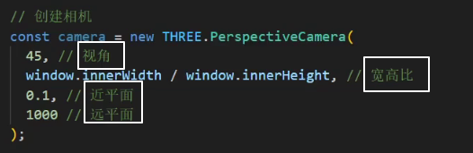

###  threejs部署到本地

npm install 安装依赖

启动 npm run start

ctrl+u查看案例源码

### canvas全屏

canvas是块级元素

### 安装指定版本threejs

yarn add three@0.153

### 相机

### 同一个几何体顶点根据不同的组划分材质

### 透明贴图和光照贴图

2.11

黑色是完全遮挡，白色是完全显示出来

### 加载src目录的资源

### 环境遮挡贴图

2.10

### hdr纹理加载和环境球形加载

2.11