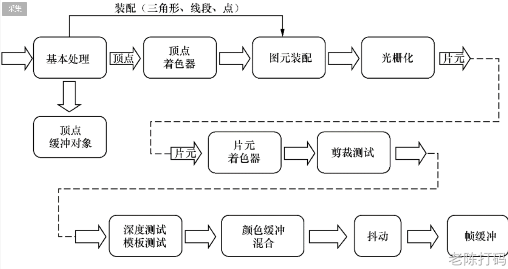
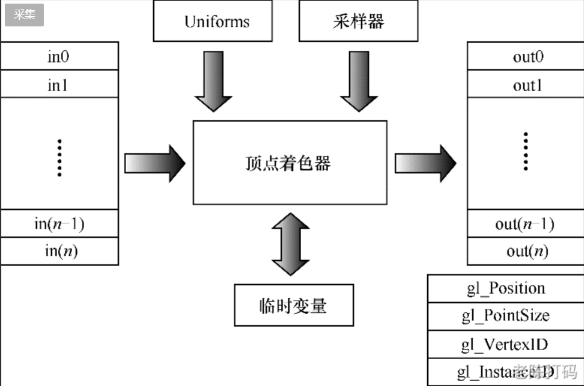
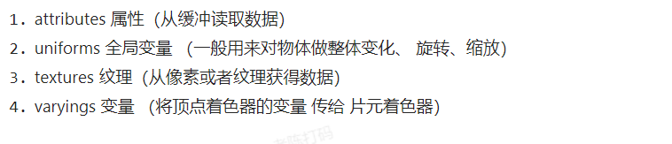
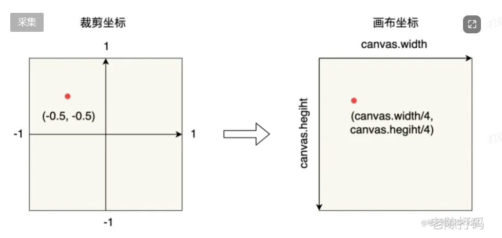

### webgl历史

2011 webgl1.0

 2017 webgl2.0

目前 webgpu

### 渲染管线

又称图形学管线(graphics pipeline)，是计算机将 3D 模型渲染至 2D 屏幕上的一个概念模型。

**渲染管线的作用是将3D模型转换为2维图像**

在早期，渲染管线是不可编程的，叫做**固定渲染管线**

现代的 **GPU** 所包含的渲染管线为**可编程渲染管线**

可以编程 **GLSL 着色器语言** 来控制一些渲染阶段的细节



### 顶点着色器

作用：生成裁剪空间坐标值



```glsl
const vertexShaderSource = `
    attribute vec3 position; //顶点的坐标位置
    void main() {
        gl_Position = vec4(position,1); 
    }
`
```

```js
//（-0.5，-0.5，0，1）
gl_Position//裁剪空间坐标值,-1到1 
```

顶点获取数据的方式



### 裁剪空间坐标



### 图元装配

计算机图形学中的基本绘图单元——图元

图元可以是各种形状，如点、线、多边形或曲线，它们是构成图形的最小可见元素

图元装配：将多个图元组合在一起，以创建更复杂的图形对象或场景的过程

### 光栅化

将矢量图形（如线段、多边形等）转换为栅格图像（像素阵列）的过程

将图元（如三角形）映射到屏幕上的像素网格，以便显示。

### 片元着色器

片元着色器是在光栅化之后的一个阶段，用于确定每个像素的最终颜色。

片元着色器接受由光栅化生成的像素信息，包括颜色、深度等，然后可以应用光照、纹理映射、阴影和其他图形效果