### 着色器

vec4 必须使用浮点数

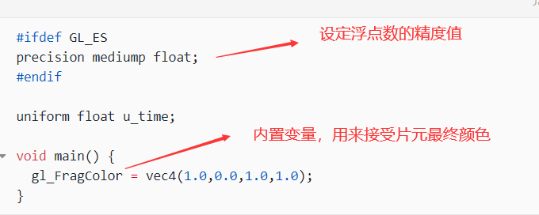

```glsl
gl_Position//顶点位置
gl_FragColor//片元着色器的最终颜色值
```

### 模型矩阵

modelMatrix

用于将局部坐标（对象自身的坐标系）变换为世界坐标。它包括对象的位置、旋转和缩放信息

### 视图矩阵

viewMatrix

将3D坐标从模型空间转换到相机空间。它包括相机的位置和朝向，以便将场景正确投影到相机视角,相机的移动缩放、旋转会改变这个矩阵

由相机位置、相机朝向、相机视角决定

### 投影矩阵

projectionMatrix

将物体从三维空间映射到二维屏幕上。

由投影类型（正交投影或透视投影）和投影平面决定

```glsl
gl_Position = projectionMatrix * viewMatrix * modelMatrix * vec4( position, 1.0 ) ;
```

### shader插件

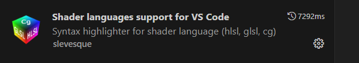

### 原始着色器材质RawShaderMaterial

在shaderMaterial中省略的内容

```glsl
precision lowp float;
attribute vec3 color;
attribute vec3 position;//顶点位置
attribute vec2 uv;//uv

uniform mat4 modelMatrix;
uniform mat4 viewMatrix;
uniform mat4 projectionMatrix;
```

### uv

uv的原点在左下角

### ShaderMaterial

可以添加的属性

```js
  wireframe: true,
  side: THREE.DoubleSide,
```

### 飘摇旗案例

着色器材质

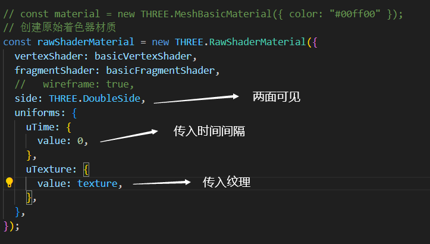

传递时间间隔

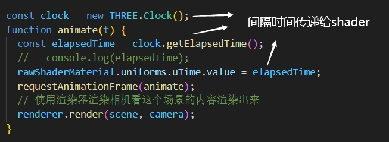

顶点着色器

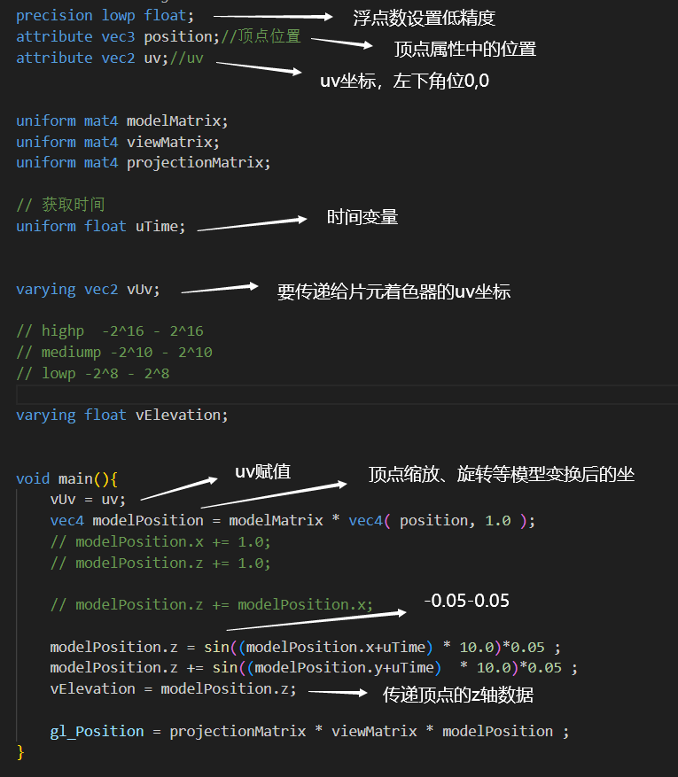

片元着色器

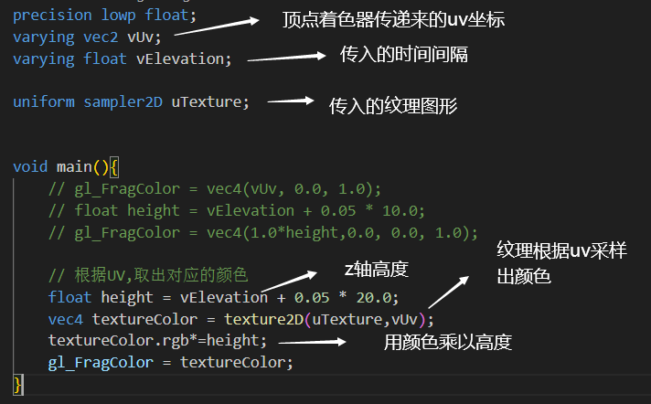

### 渐变

左到右，黑到白渐变

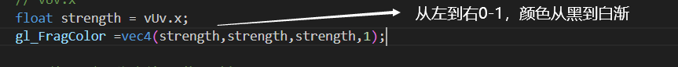

下到上，黑到白渐变


渐变反向

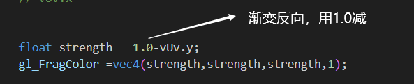

取模mod，做多次渐变

0-0.1区间内放大10倍取余就是0-1,也就是一次黑到白的渐变

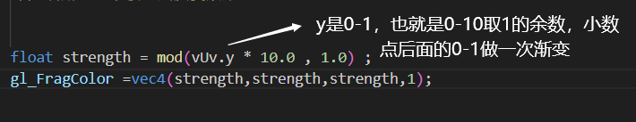

斑马条纹

step函数

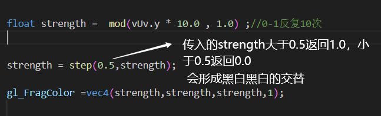

横竖窗户条纹

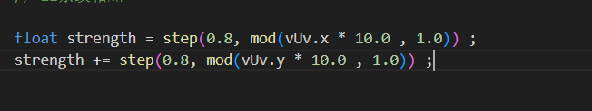

白色点 条纹相乘

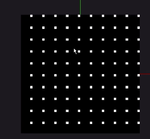

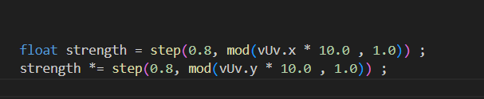

条纹相减 1-0的是白色，其他都是黑色


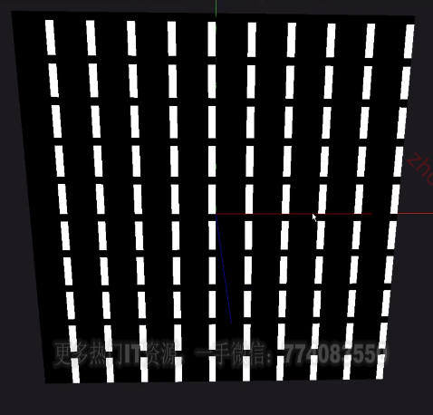

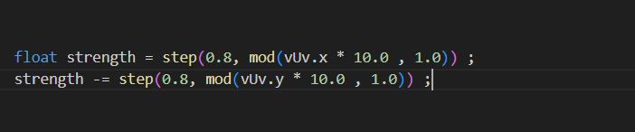

方块条纹 

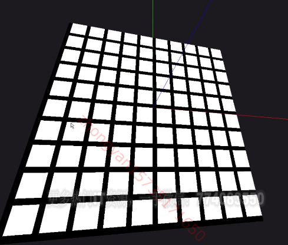

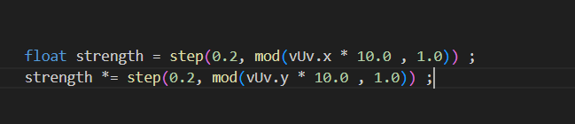

灰黑灰

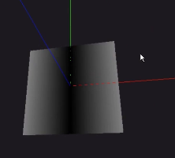

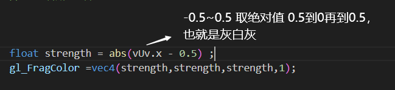

十字

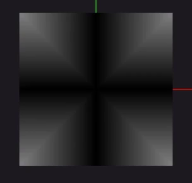

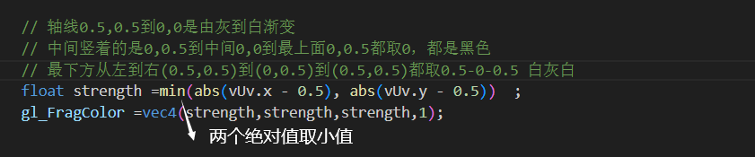

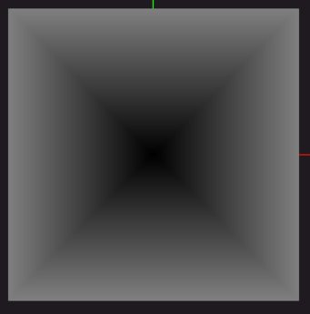

```glsl
// 18 取最大值
float strength =max(abs(vUv.x - 0.5), abs(vUv.y - 0.5)) ;
gl_FragColor =vec4(strength,strength,strength,1);
```

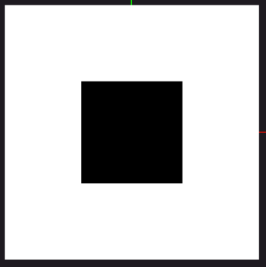

```glsl
// 19 step
float strength =step(0.2,max(abs(vUv.x - 0.5), abs(vUv.y - 0.5)))   ;
gl_FragColor =vec4(strength,strength,strength,1);
```

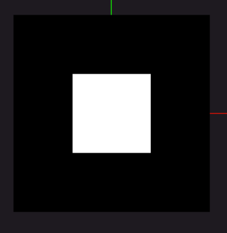

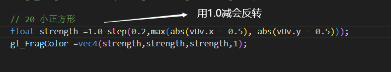

floor向下取整

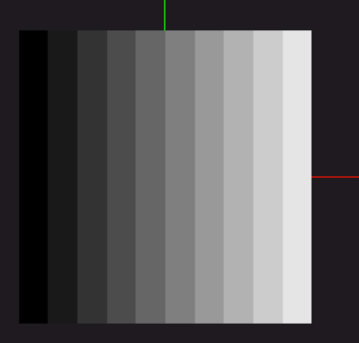

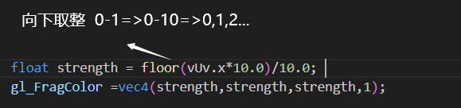

取整相乘

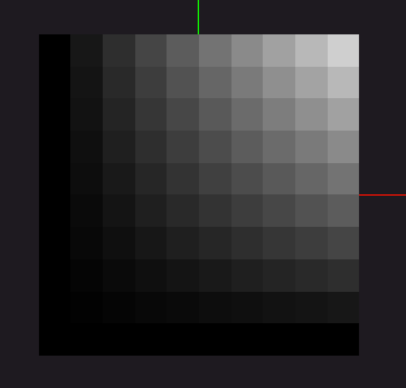

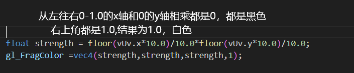

向上取整ceil

```glsl
float strength = ceil(vUv.x*10.0)/10.0*ceil(vUv.y*10.0)/10.0;
    gl_FragColor =vec4(strength,strength,strength,1);
```

https://thebookofshaders.com/10/?lan=ch

随机函数 生成0-1的随机数

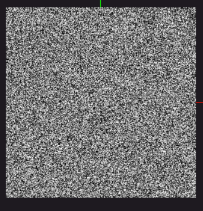

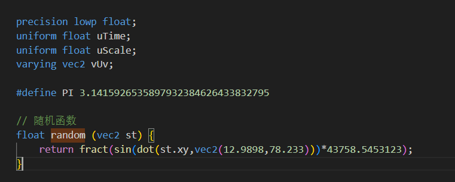

```glsl
// 随机函数
float random (vec2 st) {
    return fract(sin(dot(st.xy,vec2(12.9898,78.233)))*43758.5453123);
}
```

随机格子

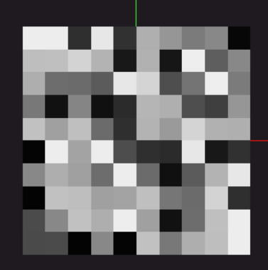

```glsl
float strength = ceil(vUv.x*10.0)/10.0*ceil(vUv.y*10.0)/10.0;
    strength = random(vec2(strength,strength));
    gl_FragColor =vec4(strength,strength,strength,1);
```

length

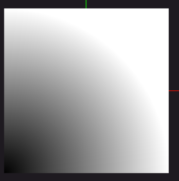

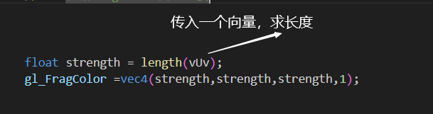

distance

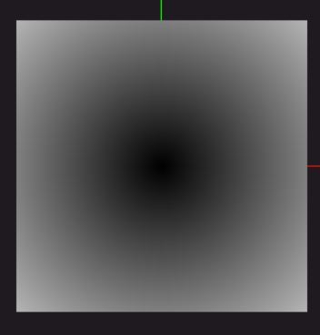

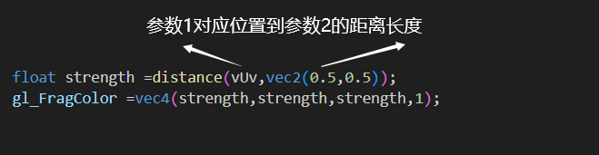

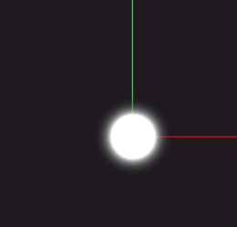

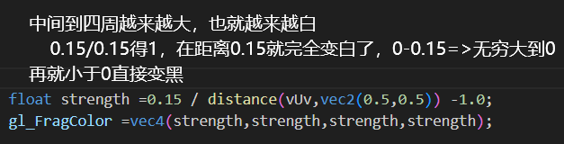


压扁星星

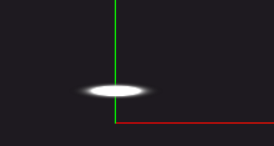

```glsl
float strength =0.15 / distance(vec2(vUv.x,(vUv.y-0.5)*5.0),vec2(0.5,0.5)) - 1.0;
    gl_FragColor =vec4(strength,strength,strength,strength);

```

十字星星


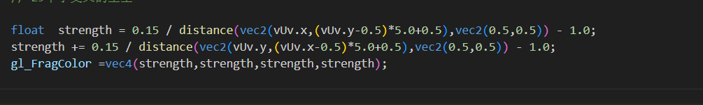

旋转函数


```glsl
// 旋转函数
vec2 rotate(vec2 uv, float rotation, vec2 mid)
{
    return vec2(
      cos(rotation) * (uv.x - mid.x) + sin(rotation) * (uv.y - mid.y) + mid.x,
      cos(rotation) * (uv.y - mid.y) - sin(rotation) * (uv.x - mid.x) + mid.y
    );
}
```

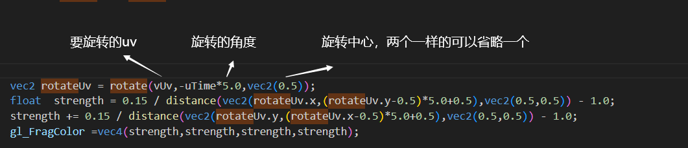

圆形

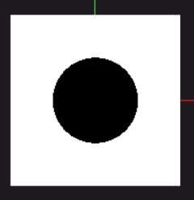

```glsl
 float strength = step(0.5,distance(vUv,vec2(0.5))+0.25) ;
    gl_FragColor =vec4(strength,strength,strength,1);
```

圆形

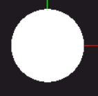

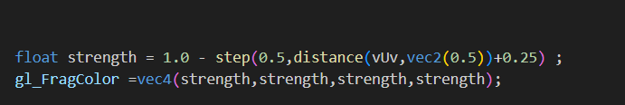


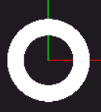

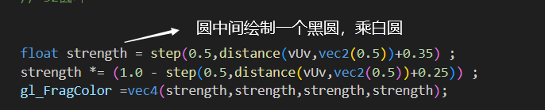

渐变环

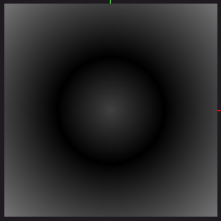


```glsl
float strength = step(0.1,abs(distance(vUv,vec2(0.5))-0.25));
    gl_FragColor =vec4(strength,strength,strength,1);
```

波浪环

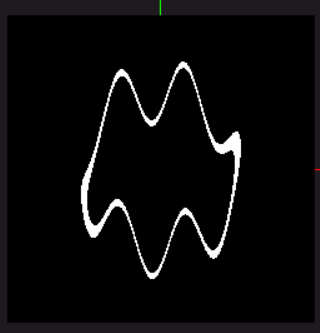

```glsl
 vec2 waveUv = vec2(
        vUv.x,
        vUv.y+sin(vUv.x*30.0)*0.1
    );


    float strength = 1.0 - step(0.01,abs(distance(waveUv,vec2(0.5))-0.25))   ;
    gl_FragColor =vec4(strength,strength,strength,1);
```

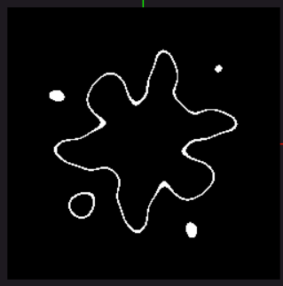

```glsl
vec2 waveUv = vec2(
        vUv.x+sin(vUv.y*30.0)*0.1,
        vUv.y+sin(vUv.x*30.0)*0.1
    );
    float strength = 1.0 - step(0.01,abs(distance(waveUv,vec2(0.5))-0.25))   ;
    gl_FragColor =vec4(strength,strength,strength,1);
```

atan返回的是弧度值

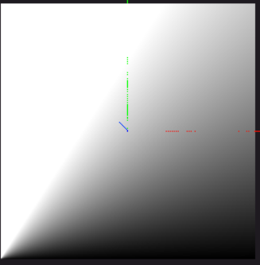


雷达旋转

```glsl
vec2 rotateUv = rotate(vUv,-uTime*5.0,vec2(0.5));
float alpha =  1.0 - step(0.5,distance(vUv,vec2(0.5)));
float angle = atan(rotateUv.x-0.5,rotateUv.y-0.5);
float strength = (angle+3.14)/6.28;
gl_FragColor =vec4(strength,strength,strength,alpha);
```


定义常量

```glsl
#define PI 3.1415926535897932384626433832795
```


噪音函数


```glsl
float noise (in vec2 _st) {
    vec2 i = floor(_st);
    vec2 f = fract(_st);

    // Four corners in 2D of a tile
    float a = random(i);
    float b = random(i + vec2(1.0, 0.0));
    float c = random(i + vec2(0.0, 1.0));
    float d = random(i + vec2(1.0, 1.0));

    vec2 u = f * f * (3.0 - 2.0 * f);

    return mix(a, b, u.x) +
            (c - a)* u.y * (1.0 - u.x) +
            (d - b) * u.x * u.y;
}

```


mix混合 0前一个颜色，1后一个颜色

```glsl
vec3 mixColor =  mix(greenColor,purpleColor,1.0);
```

### 孔明灯案例

着色器材质设置


顶点着色器


片元着色器

gl_FrontFacing 判断是正面还是反面

