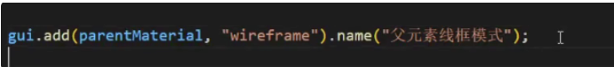

### 坐标辅助器

```js
const axesHelper = new THREE.AxesHelper(5):
scene.add (axesHelper);
```

### 轨道控制器


### 物体位移

```js
cube.position.x = 2;
cube.position.set(3, 0, 0);
```

### 缩放

```js
cube.scale.set(2,2, 2);
```

### 旋转

旋转会改变欧拉角的值,并且自身的坐标系会跟随旋转

```js
cube.rotation.x = Math.PI / 4:
```

### 父子模型的关系

> 父元素的旋转缩放平移都会带动子元素一起变化

### 画布大小自适应

```js
// 监听窗口变化
window.addEventListener("resize"，0 =>{
// 重置染器宽高比
renderer.setSize(window.innerWidth, window.innerHeight).
// 重置相机宽高比
camera.aspect = window.innerWidth / window.innerHeight
// 更新相机投影矩阵
camera.updateProjectionMatrix();
});
```

### 全屏和退出全屏

```js
document.body.requestFullscreen0://全屏
document.exitFullscreen0;// 退出全屏
```

### gui使用

```js
// 导入lil.gui
import { GUl ) from "three/examples/jsm/libs/lil-qui.module.min.is";
```

使用方法

> 如果属性值是布尔值,就是勾选框
> gui.add(对象,属性).min(最小值).max(最大值).step(每步变化
> 值).name("这个滑块名称").onChange((val) => [
> 每次值变化执行打印这个值
> console.log(val);
> ).onFinishChange((val) => (
> 值拖动完才打印
> console.log("立方体y轴位置"，val);
> 1)

全屏和退出全屏按钮


```js
let eventObj = {
	Fullscreen: function (){
	// 全屏
	document.body.requestFullscreen()
	console.log("全屏");
},
ExitFullscreen: function (){
	document.exitFullscreen();
	console.log("退出全屏")
	},
 }:
// 创建GUI
const gui = new GUl():
// 添加按钮
gui.add(eventObj"Fullscreen").name("全屏")
gui.add(eventObj,"ExitFullscreen").name("退出全屏");
```

范围滑块

```js
gui.add(cube.position,"x"，-5,5).name("立方体x轴位置");
```

折叠块


颜色


勾选框

线框模式




### 自定义创建三角形

逆时针为正面


### 使用索引绘制2个三角形

通过索引设置点的顺序


给一个物体的两个平面分别设置不同材质


给立方体每个面设置不同材质


## 材质

### 图片等资源访问

public的资源使用./访问


### 基础网格材质

不受光照影响

性能最好

### 标准网格材质

需要光照才会显示对应颜色

## 贴图

### 普通贴图


### 透明贴图

黑色是完全透明(物体可以直接看见后面的物体)
白色是完全不透明(物体完好显示)


### 环境贴图

物体会反射贴图中的画面

hdr需要设置球形映射,否者就作为平面背景


### 高光贴图

白色对应高光区域

黑色对应粗糙区域


### 光照贴图

窗户贴纸一样的光照贴图


### 环境光遮蔽贴图

黑色缝隙等光照不到的地方会变黑


### 色彩空间


THREE.SRGBColorSpace

提供了更多的颜色级别

按人眼强度计算

THREE.LinearSRGColorSpace(默认)

进行计算和处理时，可以提供更精确的结果,可能使颜色在暗区看着很暗

按光照强度来计算

THREE.NoColorSpace按线性空间设置

用于已经处于颜色空间中的纹理


更新纹理

中途需要更新纹理空间时需要调用


### 雾

线性雾会比较均匀

指数雾会突然变浓


### gltf加载

glb是二进制格式

gltf是json格式


通过环境贴图给物体上色

标准网格材质也能上色


### draco压缩


### group

group对象是继承object3D对象的

### 射线拾取

射线拾取的第一个物体就是距离最近的物体


### tween

补间动画


缓动网站：https://tweenjs.github.io/tween.js/examples/03_graphs.html


