### UV

用来确定贴图的位置
(0,1)
是几何体的属性之一

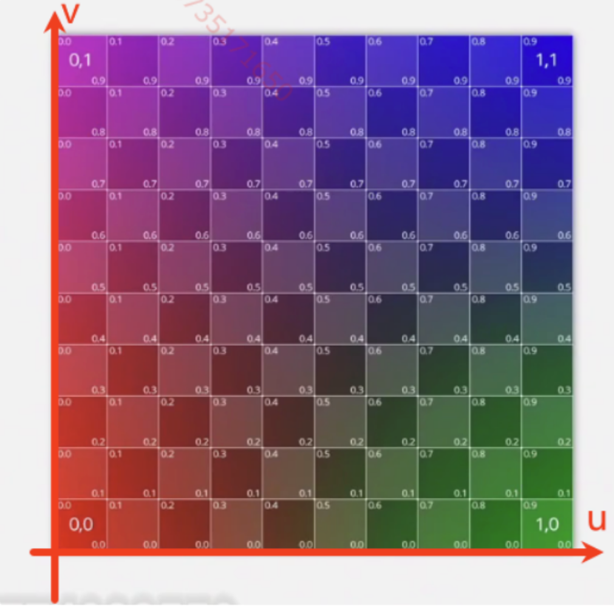

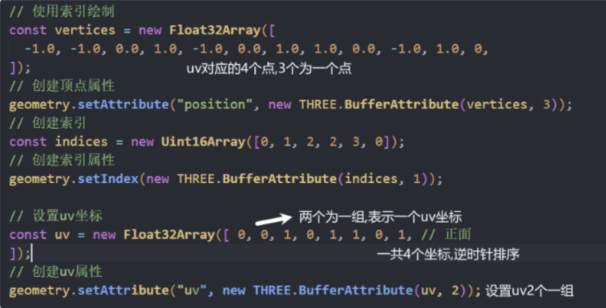

### 法向量

normal
用于计算光的反射,环境贴图的反射

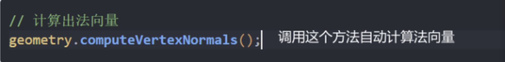

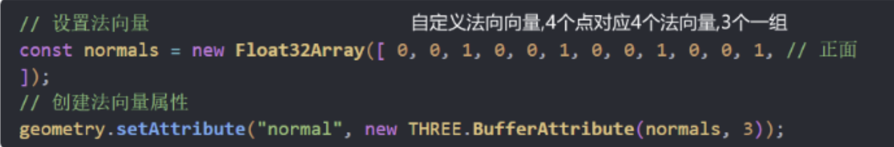

法向量辅助器

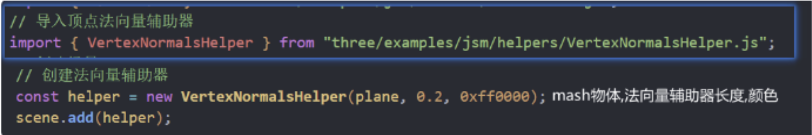

### 位置

物体的位置由几何体顶点位置和物体position属性的和决定
如果物体加载进来中心点不在原地,就是用顶点移动
单纯的移动物体，使用position属性移动
几何体变换

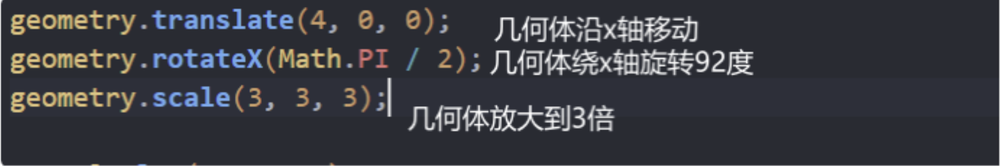

### 包围盒

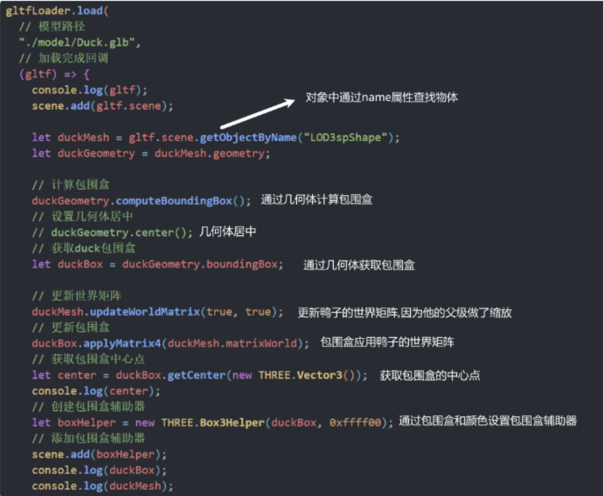

包围球

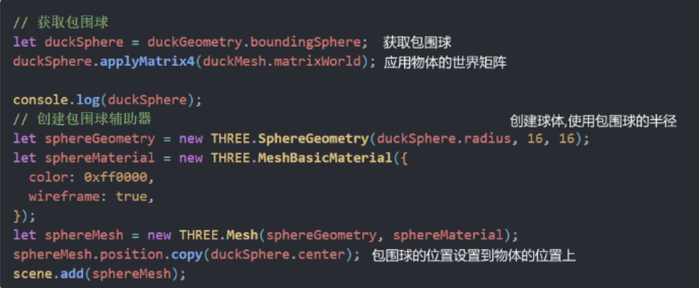

### 多个物体求中心

box3继承自BufferGeometry

方法二
会自动计算物体的世界坐标(更加好用)

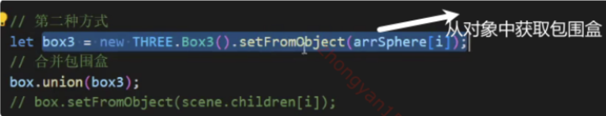

### 线框物体

EdgesGeometry
边缘几何体
是四边形线框

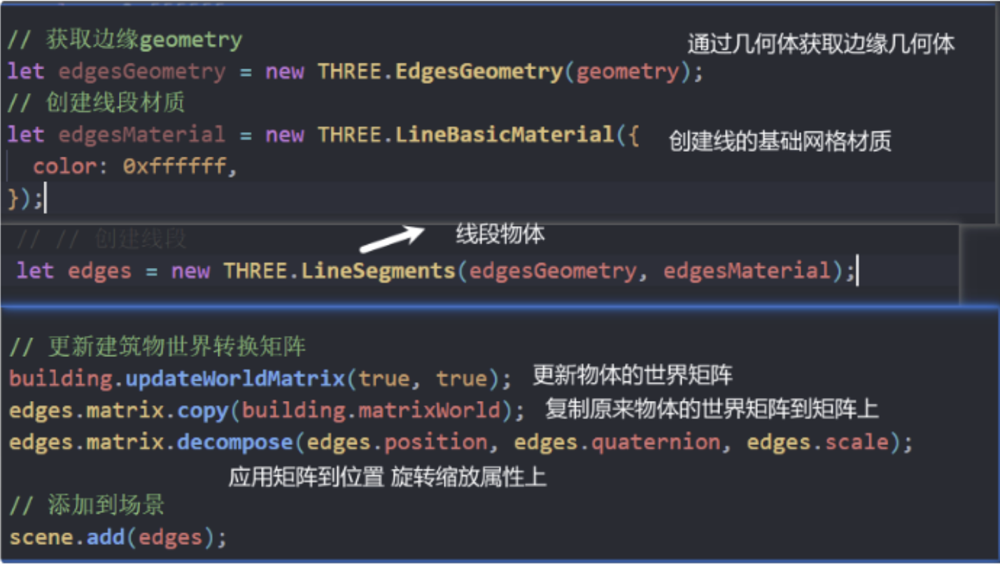

三角形线框
wireframeGeometry

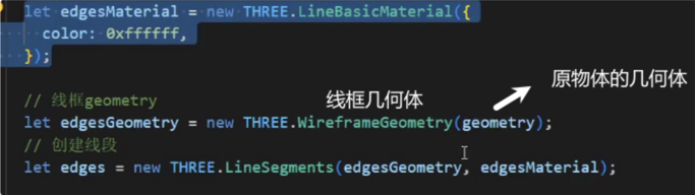

### 遍历物体

traverse

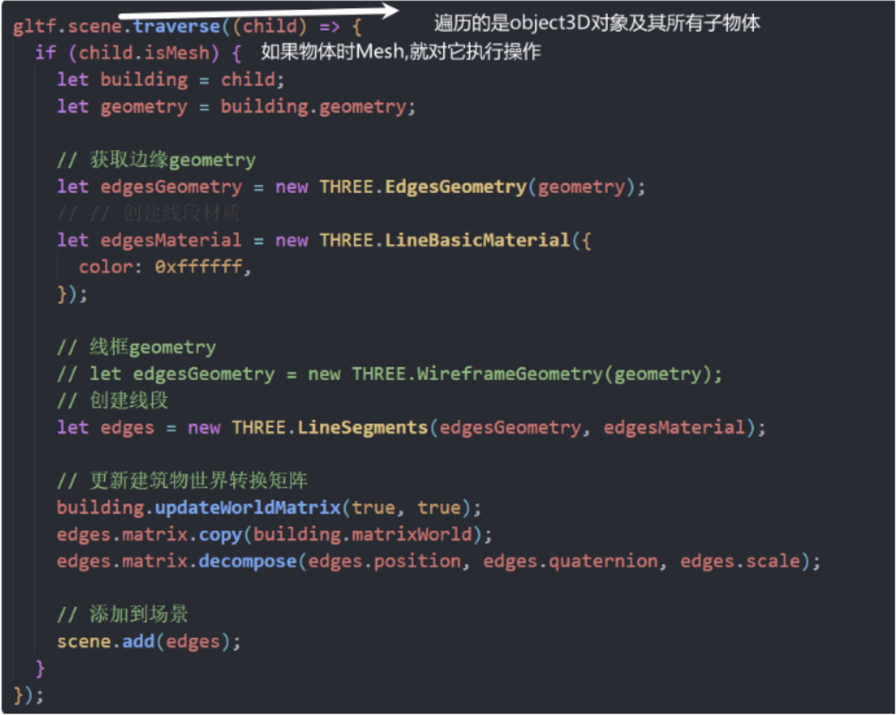