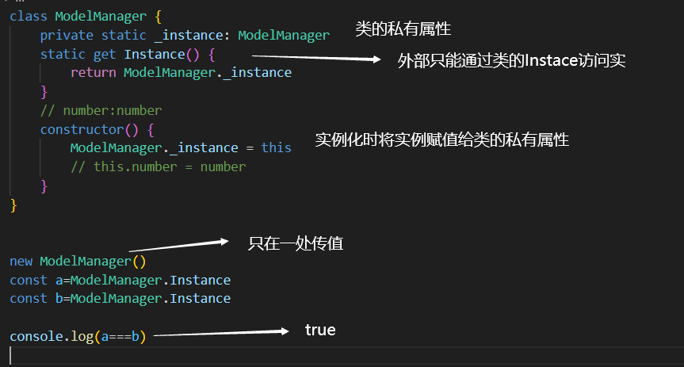

单例模型



```js
class ModelManager {
    private static _instance: ModelManager
    static get Instance() {
        return ModelManager._instance
    }
    // number:number
    constructor() {
        ModelManager._instance = this
        // this.number = number
    }
}


new ModelManager()
const a=ModelManager.Instance
const b=ModelManager.Instance

console.log(a===b)
```

