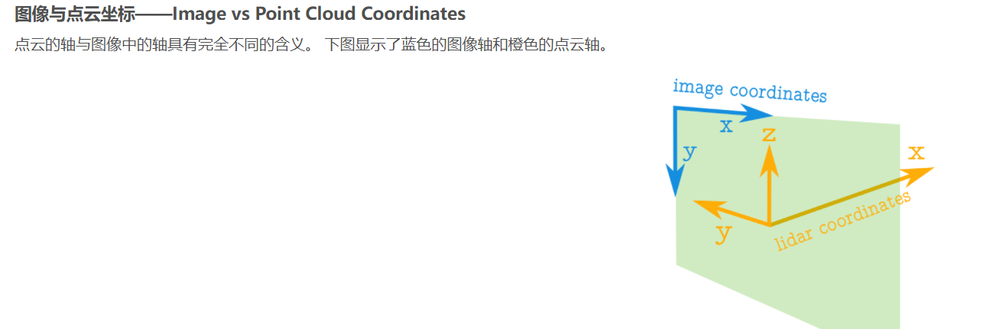

### git上如何获取好项目

in:readme webgl stars>2000

### 单例模式

实例储存在私有属性中，只能通过暴露的get访问实例


### depthWrite

深度写入

设置为false就不会遮挡后面的元素

大场景需要优化时可能需要开启深度写入

depthTest

深度测试

设置为false防止被遮挡

### 混合属性

[three.js examples](https://link.juejin.cn?target=https%3A%2F%2Fthreejs.org%2Fexamples%2F%23webgl_materials_blending_custom)

混合（Blending）是指将场景中的不同像素的颜色值按照一定规则进行组合，从而产生新的颜色效果。混合常用于处理透明度（alpha）和实现各种视觉效果，如半透明、发光、颜色混合等。

为了更好地理解混合过程，以下是一些相关的概念的介绍：

1. 混合因子（Blending Factors）：混合因子是用于控制混合过程中源像素和目标像素的颜色权重的系数。在 Three.js 中，混合因子通过 `blendSrc` 和 `blendDst` 属性来设置。`blendSrc` 表示源像素的混合因子，`blendDst` 表示目标像素的混合因子。不同的混合因子会产生不同的混合效果。
2. 源像素（Source Pixel）：在混合过程中，源像素是指要进行混合的像素，通常是当前正在渲染的像素。对于 Three.js 中的材质（Material），源像素指的是当前材质的像素颜色。
3. 目标像素（Destination Pixel）：在混合过程中，目标像素是指已经存在于渲染目标（例如帧缓冲区）中的像素。它是源像素要混合到的像素，通常是已经渲染在场景中的像素颜色。
4. 混合方程式（Blending Equation）：混合方程式定义了源像素和目标像素如何进行混合。在 Three.js 中，混合方程式可以通过 `blendEquation` 属性来设置。默认情况下，混合方程式是标准的加法混合。

在混合过程中，源像素的颜色值根据混合因子进行加权，然后与目标像素的颜色值按照一定规则混合，最终产生混合后的颜色效果。混合过程可以用来实现透明效果、发光效果、颜色混合等，为 Three.js 场景的渲染增添了灵活性和创造性。

Material 所涉及的与混合相关的属性如下：

- `blending: Blending`

属性用于控制材质的混合（blending）模式。它决定了材质如何与场景中的其他像素进行混合，从而影响材质的渲染效果。

这个属性的值是一个枚举类型，可以设置为以下几种模式之一：

- `THREE.NoBlending`（默认）：不进行混合，材质完全覆盖之前的像素。即使材质的透明度（alpha）小于 1，也不会产生透明效果。
- `THREE.NormalBlending`：普通混合模式，使用标准的 alpha 混合。材质的透明度小于 1 的像素将进行混合，产生半透明效果。
- `THREE.AdditiveBlending`：加法混合模式，将像素的颜色值相加。适用于实现发光或增亮效果。
- `THREE.SubtractiveBlending`：减法混合模式，将像素的颜色值相减。用于实现颜色相减效果。
- `THREE.MultiplyBlending`：乘法混合模式，将像素的颜色值相乘。用于实现颜色混合效果。
- `THREE.CustomBlending`：自定义混合模式，允许使用自定义的混合方程式。这时，你可以通过设置 `material.blendSrc` 和 `material.blendDst` 来定义源像素和目标像素的混合因子，以及通过设置 `material.blendEquation` 来定义混合方程式。
- `blendSrc: BlendingSrcFactor | BlendingDstFactor`

用于定义混合（blending）过程中源像素的混合因子。混合因子决定了源像素的颜色在混合过程中的权重，从而影响最终混合后的像素颜色。

- `blendDst: BlendingDstFactor`

用于定义混合（blending）过程中目标像素的混合因子。

- `blendSrcAlpha: number | null`

`blendSrc` 的透明度。默认值为 null。

- `blendDstAlpha: number | null`

`blendDst` 的透明度。默认值为 null。

- `blendEquation: BlendingEquation`

用于设置混合（blending）过程中混合方程式的类型。混合方程式决定了源像素和目标像素如何进行混合操作，从而影响最终混合后的像素颜色。


作者：kg
链接：https://juejin.cn/post/7258896295616184378
来源：稀土掘金
著作权归作者所有。商业转载请联系作者获得授权，非商业转载请注明出处。

### isMaterial

检查这个对象是否为材质Material

### |和&

|按位或操作

它将两个数的每个对应位上的值进行或运算，结果中的每个位都是两个操作数中对应位上值的逻辑或

```js
let a = 5;  // 二进制表示为 0101
let b = 3;  // 二进制表示为 0011

let result = a | b;  // 进行按位或操作

console.log(result); // 输出结果为 7，二进制表示为 0111
```

### 点云的轴



### 贴图颜色问题

webgl THREE.LinearEncoding

### 贴图`THREE.sRGBEncoding`

### colorspace

renderer **outputColorSpace**: "srgb"

```js

renderer默认值
renderer.outputEncoding = THREE.sRGBEncoding;

texture.colorSpace  = THREE.LinearSRGBColorSpace;//设置为SRGB颜色空间
```

### threejs指定对象旋转中心

```js
//通过x,y,z指定旋转中心，obj是要旋转的对象
function changePivot(x,y,z,obj){
   let wrapper = new THREE.Object3D();
         wrapper.position.set(x,y,z);
        wrapper.add(obj);
        obj.position.set(-x,-y,-z);
        return wrapper;
}
```

