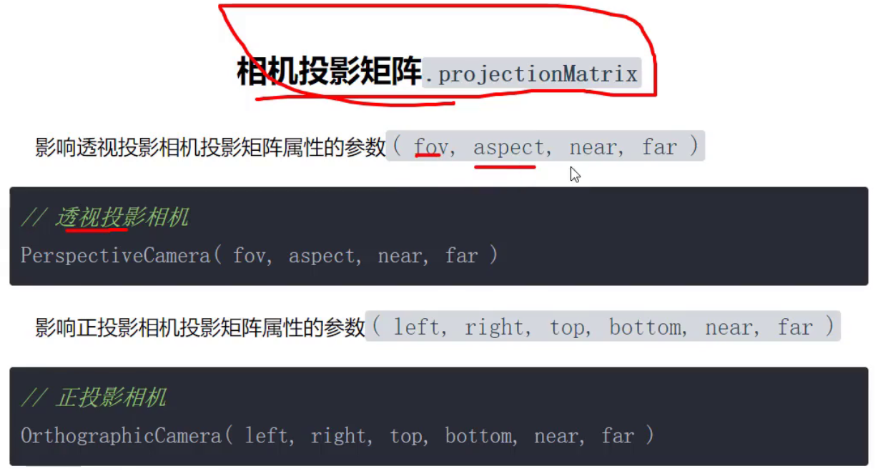
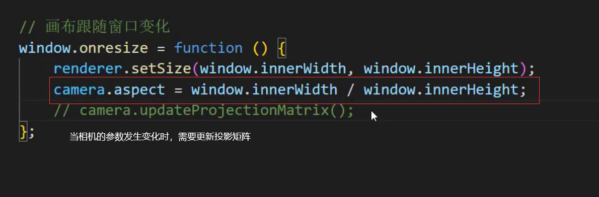
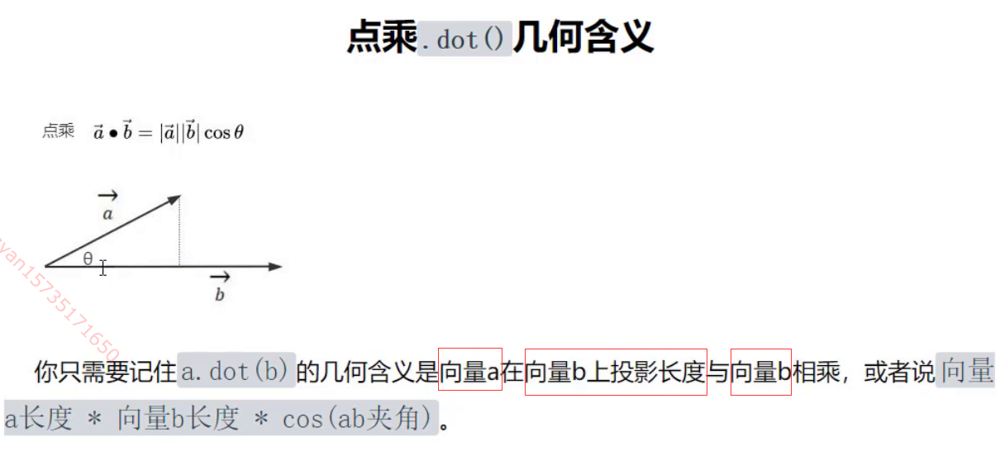
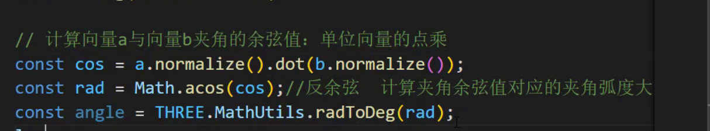

1、两个物体的中心点；

box3包围盒的.getCenter()

```js
const geometry = new THREE.BoxGeometry(1, 1, 1); // 创建一个立方体几何形状
geometry.computeBoundingBox(); // 计算边界框

const center = new THREE.Vector3();
geometry.boundingBox.getCenter(center); // 获取边界框的中心点坐标

console.log(center); // 输出中心点的坐标
```

xyz轴分别相加除2

2、怎么判断两个物体是否会相交；

box3有intersectsBox方法，检测相交

可以使用碰撞检测算法

3、物体有多少个面相交；

通过射线检测，将物体添加到需要检测物体中，返回的length也就是相交面的数量

4、怎么做到中心点的判断；
5、具体的实现；
6、3D模型的面切开，怎么实现看横切面；

利用plane

在物体材质或者渲染器添加剖切平面

3D设计的一个系统，；

1、链表、数组、MAP的区别？

链表：内存大小可以变化 删除和增加只需要移动指针就可以 查找效率低


数组具有顺序 元素可以重复 必须有连续的内存空间

set不能重复

对象键必须是字符或者symbol 用for in（键）遍历 forof（值）可迭代数据 遍历报错

Map可以for of遍历


 

2、控制一扇门，怎么去做？

将物体添加到group或者Object3d中，通过物体和组向相反方向移动来实现旋转轴的移动

射线选中物体，改变rotate属性

3、怎么实现一幅画挂在墙上？
4、怎么实现爆炸图？

物理碰撞-用一个物体去从内部撞开物体 Cannon.js

或者让物体沿从所有的物体中心到当前物体中心方向移动

5、在墙上挖一个洞？

threeBSP 布尔切割

用shape的holes，然后用拉伸几何体形成墙面

6、怎么实现物体旋转？

rotate属性，欧拉角或者四元数

7、三位引擎有没有了解过？

threejs Cesium/ˈsiːziəm/

8、给微信头像加个帽子？

绝对定位

9、求旋转的分量？

10、矩阵变化 

### 向量的点乘和叉乘


- 欧拉、四元素
- 正交相机、透视相机
- WebGL渲染流程
- three.js中的WebGLRenderer渲染过程
- PBR材质
- 法线贴图
- 后处理
- 着色器，比如抗锯齿、转场、体积云等

当前公司在实战中遇到的问题点和技术点：

- 深度冲突问题
- 多层透明度问题
- 单面材质的背面可见(不使用双面)
- 图形的镂空
- 渲染时的性能优化
- 开发大场景项目时的性能优化，比如LOD

考察知识面的题：

- 软阴影
- 光线追踪
- 环境光SSAO，SSDO

### 矩阵，如模型矩阵、视图矩阵、投影矩阵等

视图矩阵由相机的position lookAt up属性决定




更新投影矩阵的实例--改变窗口大小



### 点乘

点乘得到的是值



1.利用向量归一化计算两个向量的夹角

2.向量归一化会改变原向量，可以使用clone



### 叉乘

叉乘得到的是一个向量

方向是同时垂直于这两个向量

同时配合右手螺旋定则判断向量的朝向，由第一个向第二个

长度是两个向量的长度相乘乘以sin夹角

叉乘不满足交换律

叉乘用来判断一个物体是在人的左侧还是右侧

